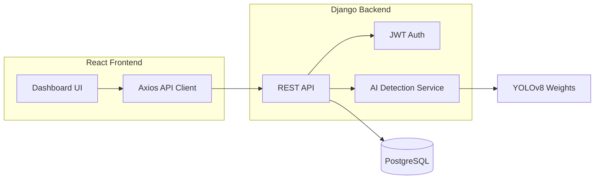

# CamTraffic — AI-Based Traffic Sign Detection & Law Enforcement System (Cambodia)

Final year project: an AI-powered traffic management platform for Cambodia with role-based access for **Admin**, **Traffic Police**, and **Drivers**.

## Architecture

```
CamTraffic/
├── backend/             # Django + DRF + JWT + PostgreSQL
├── frontend-user/       # Driver & police portal (:5173)
│   ├── user/            # User-only pages & layout
│   └── shared/          # Shared UI, API client, styles
├── frontend-admin/      # Administrator portal (:5174)
│   ├── admin/           # Admin-only pages & layout
│   └── shared/          # Shared UI, API client, styles
├── ai/                  # YOLOv8 training & inference
└── docs/                # API, schema, deployment
```



## Features

- JWT authentication with role-based access control
- Driver: vehicles, fines, AI sign detection, learning module, chatbot
- Police: driver lookup, digital fines, evidence upload, reports
- Admin: user management, analytics dashboard, AI logs
- YOLOv8 traffic sign detection (mock mode for demos without GPU)
- PDF fine export, notifications, password reset

## GitHub (manual push only)

Code is stored with **Git** locally. Nothing uploads to GitHub automatically — push only when you ask.

See **[docs/GITHUB.md](docs/GITHUB.md)** for linking a new GitHub repo and running `git push`.

---

## Quick start

### 1. Backend

```bash
cd backend
python -m venv venv
venv\Scripts\activate          # Windows
pip install -r requirements.txt
copy .env.example .env         # USE_SQLITE=True by default
python manage.py migrate
python manage.py create_admin    # you choose admin email + password
python manage.py seed_data       # traffic signs only (no demo logins)
python manage.py runserver
```

### 2. Frontend

```bash
# From project root — both portals
npm run install:frontends
npm run dev
```

Or run one portal:

```bash
cd frontend-user && npm install && npm run dev   # http://localhost:5173
cd frontend-admin && npm install && npm run dev  # http://localhost:5174
```

| Portal | URL |
|--------|-----|
| User (driver / police) | http://localhost:5173 |
| Admin | http://localhost:5174 |

Run **both** frontends (`npm run dev` from project root). Each portal keeps its own login session, so opening the user portal after signing in as admin will not show the admin dashboard.

### Password policy

All new and changed passwords must be **at least 8 characters** and include an **uppercase letter**, a **number**, and a **special character** (enforced on the API).

### Create your own accounts (no demo logins in seed)

| Role | How to create |
|------|----------------|
| **Admin** | `python manage.py create_admin` — prompts for your email, name, and password |
| **Police** | Sign in as admin → **Users** → Add user (role: Traffic Police) — you set email and password |
| **Driver** | User portal → **Create an account** (`/register`) — self-registration |

`seed_data` only loads traffic signs (and optional sample fines if you already have police/driver users). It does **not** create users or passwords.

**First administrator example:**

```bash
cd backend
python manage.py create_admin
# Admin email: you@yourdomain.com
# Full name: Your Name
# Password: (hidden prompt — must meet policy above)
```

Then open http://localhost:5174 and sign in with that email and password.

**Role-based login:** Each portal checks email + password against the account’s role. Admin portal (`5174`) only accepts `admin` users. User portal (`5173`) accepts `police` or `driver` and matches the **Officer** / **Driver** tab you selected.

### Environment

- **Frontend:** `frontend-user/.env` and `frontend-admin/.env` → `VITE_API_URL=/api` (Vite proxies to Django in dev), `VITE_USE_MOCK=false`
- **Backend:** `backend/.env` → include **both** portal ports in `CORS_ALLOWED_ORIGINS` (`5173` user, `5174` admin). Restart `runserver` after changing `.env`.
- **Mock-only UI:** set `VITE_USE_MOCK=true` (no backend required)

### Google / GitHub login (user portal)

**Step-by-step guides:**

- Google: [docs/GOOGLE_OAUTH_SETUP.md](docs/GOOGLE_OAUTH_SETUP.md)
- GitHub: [docs/GITHUB_OAUTH_SETUP.md](docs/GITHUB_OAUTH_SETUP.md)

1. Create OAuth apps:
   - **Google:** [Google Cloud Console](https://console.cloud.google.com/) → **Credentials** → **OAuth client ID** (Web application). Redirect URI: `http://localhost:5173/auth/oauth/callback`
   - **GitHub:** [GitHub Developer settings → OAuth Apps](https://github.com/settings/developers). Authorization callback URL: `http://localhost:5173/auth/oauth/callback`
2. Add to `backend/.env` (see `backend/.env.example`):
   ```
   GOOGLE_OAUTH_CLIENT_ID=...
   GOOGLE_OAUTH_CLIENT_SECRET=...
   GITHUB_OAUTH_CLIENT_ID=...
   GITHUB_OAUTH_CLIENT_SECRET=...
   OAUTH_FRONTEND_CALLBACK_URL=http://localhost:5173/auth/oauth/callback
   ```
3. Restart Django. On the user login page, use **Google** or **GitHub**. New accounts are created as **drivers**.

### Forgot password (Resend)

Password reset emails are sent via [Resend](https://resend.com). See [docs/RESEND_EMAIL_SETUP.md](docs/RESEND_EMAIL_SETUP.md).

```env
RESEND_API_KEY=re_...
RESEND_FROM_EMAIL=CamTraffic <onboarding@resend.dev>
FRONTEND_PASSWORD_RESET_URL=http://localhost:5173/reset-password
```

Restart Django, then use **Forgot password** on the user login page (resend uses the same API).

## PostgreSQL

Set in `backend/.env`:

```
USE_SQLITE=False
DB_NAME=camtraffic_db
DB_USER=postgres
DB_PASSWORD=your_password
DB_HOST=localhost
DB_PORT=5432
```

Create database: `createdb camtraffic_db` then `python manage.py migrate`

## AI module

See [ai/README.md](ai/README.md). The project can train on **232 Cambodia signs** from your reference folder (`ស្លាកសញ្ញាចរាចរណ៏`).

```bash
cd ai
..\backend\venv\Scripts\python.exe build_dataset.py
..\backend\venv\Scripts\python.exe train.py --epochs 30 --device cpu
cd ..\backend
python manage.py import_cambodia_signs --update
```

Then set `AI_USE_MOCK=False` and `AI_MODEL_PATH=../ai/weights/best.pt` in `backend/.env`.

## Documentation

- [API Reference](docs/API.md)
- [Database Schema](docs/SCHEMA.sql)
- [Deployment](docs/DEPLOYMENT.md)

## Tech stack

| Layer | Technology |
|-------|------------|
| Backend | Django 4.2, DRF, SimpleJWT |
| Frontend | React 18, Vite, Tailwind CSS 4 |
| Database | PostgreSQL (SQLite for dev) |
| AI | YOLOv8, OpenCV, Ultralytics |
| State | React Context API |

## License

Academic / thesis project — CamTraffic © 2024–2026
