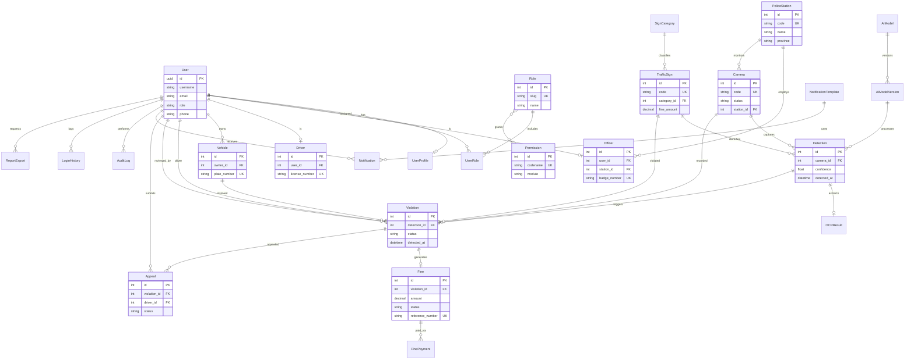

# CamTraffic — Entity Relationship Diagram

> **Task 005** — Database Design

## Full ER Diagram



## Table Summary

| Table | App | Description |
|-------|-----|-------------|
| `accounts_user` | accounts | Custom user (AUTH_USER_MODEL) |
| `users_profile` | users | Extended profile & locale |
| `rbac_role` | rbac | RBAC roles |
| `rbac_permission` | rbac | Granular permissions |
| `rbac_user_role` | rbac | User-role assignments |
| `officers_police_station` | officers | Police stations |
| `officers_officer` | officers | Officer profiles |
| `drivers_driver` | drivers | Driver profiles |
| `vehicles_vehicle` | vehicles | Registered vehicles |
| `cameras_camera` | cameras | Traffic cameras |
| `traffic_signs_category` | traffic_signs | Sign categories |
| `traffic_signs_sign` | traffic_signs | Sign catalog |
| `ai_models_model` | ai_models | AI model registry |
| `ai_models_version` | ai_models | Model versions |
| `detections_detection` | detections | AI detection events |
| `ocr_result` | ocr | OCR plate results |
| `violations_violation` | violations | Traffic violations |
| `fines_fine` | fines | Issued fines |
| `fines_payment` | fines | Payment records |
| `appeals_appeal` | appeals | Violation appeals |
| `notifications_template` | notifications | Notification templates |
| `notifications_notification` | notifications | User notifications |
| `audit_log` | audit | System audit trail |
| `audit_login_history` | audit | Login history |
| `system_setting` | system | Key-value settings |
| `system_backup` | system | Backup records |
| `reports_export` | reports | Report export jobs |

## Relationships Flow

```text
Camera → Detection → Violation → Fine → FinePayment
                    ↘ Appeal
         OCRResult ↗
TrafficSign → Detection
AIModelVersion → Detection
User (driver) → Vehicle → Violation
User (officer) → reviews → Violation
```

## Key Field Types

| Table | Field | Type | Constraint |
|-------|-------|------|-----------|
| `accounts_user` | `id` | UUID | PK |
| `vehicles_vehicle` | `plate_number` | VARCHAR(20) | UNIQUE |
| `detections_detection` | `confidence` | FLOAT | — |
| `detections_detection` | `detected_at` | TIMESTAMPTZ | — |
| `violations_violation` | `status` | VARCHAR(20) | choices: pending, approved, rejected, appealed |
| `fines_fine` | `amount` | DECIMAL(12,2) | — |
| `fines_fine` | `due_date` | DATE | — |
| `cameras_camera` | `status` | VARCHAR(20) | choices: online, offline, maintenance, error |

## Phase 11 Integration

The `backend/apps/integration/` package adds no new tables. It orchestrates writes
across the existing tables as follows:

```text
process_camera_frame (Celery task)
  ├── creates  detections_detection
  ├── creates  ocr_result          (if plate recognized)
  ├── creates  violations_violation (if plate matches vehicle)
  └── creates  notifications_notification (for officers + driver)
```
