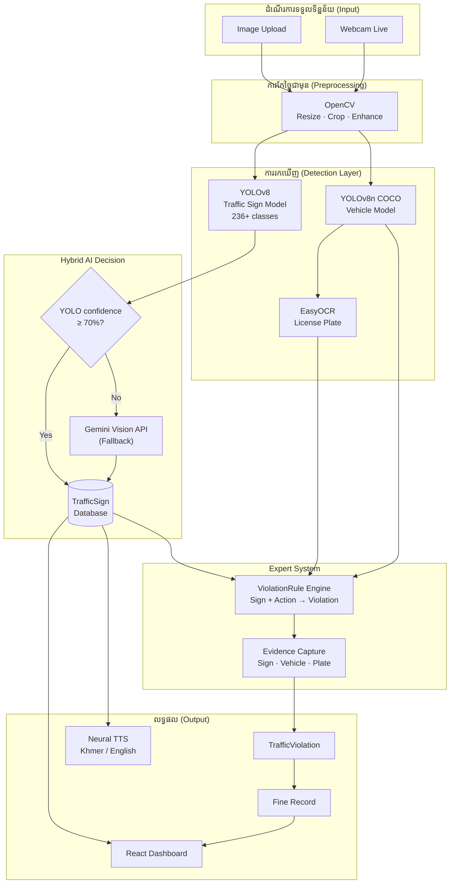
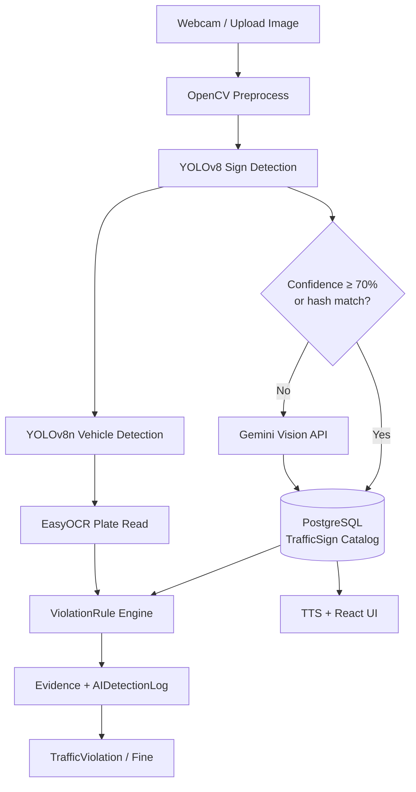
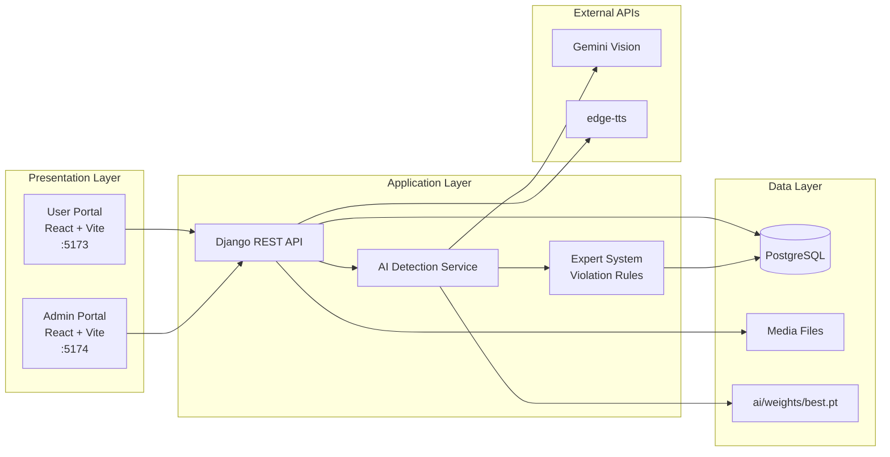

# ២.៣.៦. Architecture — CamTraffic AI Architecture

**Thesis section:** 2.3.6 Architecture (AI Architecture)  
**Status:** Mostly aligned with current system — **with corrections and additions below**

---

## 1. Does Your Text Match the Current System?

| Statement in your text | Correct? | Notes |
|------------------------|----------|-------|
| Image Upload + Webcam input | ✅ Yes | `AIDetectionPage.tsx`, `useWebcamDetection.ts` |
| OpenCV preprocessing | ✅ Yes | `backend/ai_detection/services.py` |
| YOLOv8 for signs and vehicles | ⚠️ Partial | **Two models:** YOLOv8 (signs) + YOLOv8n COCO (vehicles) |
| EasyOCR for license plates | ✅ Yes | `backend/ai_detection/plate_ocr.py` |
| Send results to Gemini for analysis | ⚠️ Partial | Gemini is **fallback only** when YOLO confidence &lt; 70% (upload), not always |
| Django + DRF backend | ✅ Yes | `backend/` |
| PostgreSQL database | ✅ Yes | SQLite used in development |
| React frontend | ✅ Yes | Two portals: User (`5173`) + Admin (`5174`) |
| Real-time detection | ⚠️ Partial | Webcam is near real-time; full pipeline includes server-side steps |

### Missing from your text (should add)

| Missing topic | Why important |
|---------------|---------------|
| **Hybrid AI architecture** | YOLO first → Gemini only if low confidence |
| **TrafficSign database lookup** | After detection, sign info from PostgreSQL |
| **Violation Rule Engine** | Expert system — sign + action → violation |
| **Evidence capture** | Store sign, vehicle, plate snapshots |
| **Separate sign/vehicle models** | Not one YOLO for both tasks |
| **Khmer TTS (edge-tts)** | Bilingual speech output |

---

## 2. Updated Khmer Text (for thesis — copy to Word)

### ២.៣.៦. Architecture

AI Architecture គឺជារចនាសម្ព័ន្ធសរុបនៃប្រព័ន្ធបញ្ញាសិប្បនិម្មិត ដែលកំណត់ពីសមាសធាតុសំខាន់ៗ លំហូរទិន្នន័យ និងរបៀបដែលម៉ូឌុលនីមួយៗធ្វើអន្តរកម្មគ្នា ដើម្បីសម្រេចបាននូវគោលបំណងរបស់ប្រព័ន្ធ។ ស្ថាបត្យកម្មនេះជួយធានាថាប្រព័ន្ធមានប្រសិទ្ធភាព ភាពត្រឹមត្រូវ ភាពងាយស្រួលក្នុងការថែទាំ និងអាចពង្រីកបន្ថែមនាពេលអនាគតបាន។

សម្រាប់គម្រោង CamTraffic ស្ថាបត្យកម្ម AI ត្រូវបានរៀបចំជា **លំហូរទិន្នន័យ Hybrid (បញ្ចូលគ្នា)** ចាប់ពីការទទួលរូបភាពពី **ការបញ្ចូលរូបភាព (Image Upload)** ឬ **កាមេរ៉ាផ្ទាល់ (Webcam)**។ ទិន្នន័យដែលទទួលបានត្រូវឆ្លងកាត់ **ការកែច្នៃជាមុន (Preprocessing)** ដោយប្រើ **OpenCV** ដើម្បីបង្កើនគុណភាពរូបភាព និងរៀបចំទិន្នន័យសម្រាប់ការវិភាគ។

បន្ទាប់មក ម៉ូឌែល **YOLOv8** ត្រូវបានប្រើសម្រាប់ **ការរកឃើញ និងសម្គាល់ស្លាកសញ្ញាចរាចរណ៍** (ប្រហែល ២៣៦+ ប្រភេទសញ្ញាកម្ពុជា) ខណៈដែលម៉ូឌែល **YOLOv8n (COCO)** ត្រូវបានប្រើដោយឡែកសម្រាប់ **ការរកឃើញយានយន្ត** (រថយន្ត ម៉ូតូ ឡានក្រុង ឡានដឹកទំនិញ)។ ក្នុងករណីដែល **YOLOv8 មានកម្រិត confidence ទាបជាង ៧០%** (សម្រាប់ upload) ប្រព័ន្ធនឹងប្រើ **Gemini Vision API** ជា **Fallback** ដើម្បីវិភាគ និងបកស្រាយសញ្ញាបន្ថែម។

សម្រាប់ **ស្លាកលេខរថយន្ត** ប្រព័ន្ធប្រើ **EasyOCR** ដើម្បីទាញយកអត្ថបទ (ឧ. 2A-1234) ពីរូបភាព។ លទ្ធផលដែលបានរកឃើញត្រូវបាន **ប្រៀបធៀបជាមួយមូលដ្ឋានទិន្នន័យ TrafficSign** (PostgreSQL) ដើម្បីទាញយកឈ្មោះ ការពិពណ៌នា និងច្បាប់ចរាចរណ៍ពាក់ព័ន្ធជាភាសាខ្មែរ និងអង់គ្លេស។

ផ្នែក **Expert System** របស់ប្រព័ន្ធ ប្រើ **ViolationRule Engine** ដើម្បីវាយតម្លៃថាតើសកម្មភាពណាមួយ (ឧ. បត់ឆ្វេង) បំពានច្បាប់ដែលពាក់ព័ន្ននឹងសញ្ញាដែលបានរកឃើញ (ឧ. No Left Turn) ឬទេ។ បើមានការបំពាន ប្រព័ន្ធអាច **រក្សាទុកភស្តុតាង (Evidence)** និង **បង្កើតកំណត់ត្រារំលោភ (TrafficViolation)** និង **កំរិតពិន័យ (Fine)** ដោយស្វ័យប្រវត្តិ។

ផ្នែក **Backend** ត្រូវបានអភិវឌ្ឍដោយ **Django** និង **Django REST Framework (DRF)** សម្រាប់ Business Logic និង REST API។ **Frontend** ត្រូវបានអភិវឌ្ឍដោយ **React + Vite + TypeScript** ជា **ពីរច្រក (Portal)** — User Portal (អ្នកបើកបរ/ប៉ូលីស) និង Admin Portal (អ្នកគ្រប់គ្រង)។ ទិន្នន័យត្រូវបានរក្ទុកក្នុង **PostgreSQL** (Production) ឬ **SQLite** (Development)។ ប្រព័ន្ធក៏គាំទ្រ **Neural TTS (edge-tts)** សម្រាប់អានព័ត៌មានសញ្ញាជាភាសាខ្មែរ និងអង់គ្លេស។

តាមរយៈស្ថាបត្យកម្ម Hybrid AI Architecture នេះ CamTraffic អាចរកឃើញស្លាកសញ្ញាចរាចរណ៍ សម្គាល់យានយន្ត អានស្លាកលេខ វាយតម្លៃរំលោភច្បាប់ និងគាំទ្រការអនុវត្តច្បាប់ចរាចរណ៍ឆ្លាតវៃនៅកម្ពុជា។

---

## 3. AI Architecture Diagram

### Figure A — Overall AI Pipeline (recommended for thesis)



### Figure B — Hybrid Sign Detection (detail)



### Figure C — Three-Layer System Architecture



---

## 4. Text Diagram (for Word if Mermaid not available)

```text
┌─────────────────────────────────────────────────────────────────┐
│                    INPUT LAYER                                   │
│         Image Upload  │  Webcam (getUserMedia)                   │
└────────────────────────────┬────────────────────────────────────┘
                             ▼
┌─────────────────────────────────────────────────────────────────┐
│                 PREPROCESSING — OpenCV                           │
└────────────────────────────┬────────────────────────────────────┘
                             ▼
┌─────────────────────────────────────────────────────────────────┐
│                 DETECTION LAYER                                  │
│  ┌─────────────────┐  ┌─────────────────┐  ┌─────────────────┐  │
│  │ YOLOv8          │  │ YOLOv8n COCO    │  │ EasyOCR         │  │
│  │ Traffic Signs   │  │ Vehicles        │  │ License Plates  │  │
│  └────────┬────────┘  └────────┬────────┘  └────────┬────────┘  │
└───────────┼─────────────────────┼─────────────────────┼──────────┘
            ▼                     │                     │
┌───────────────────────┐         │                     │
│ HYBRID DECISION       │         │                     │
│ conf ≥ 70%? ──Yes──►  │         │                     │
│      │                │         │                     │
│      No               │         │                     │
│      └──► Gemini API  │         │                     │
└───────────┬───────────┘         │                     │
            ▼                     ▼                     ▼
┌─────────────────────────────────────────────────────────────────┐
│              DATABASE LOOKUP — TrafficSign (PostgreSQL)          │
└────────────────────────────┬────────────────────────────────────┘
                             ▼
┌─────────────────────────────────────────────────────────────────┐
│              EXPERT SYSTEM — ViolationRule Engine              │
│         detected sign + vehicle action → violation?            │
└────────────────────────────┬────────────────────────────────────┘
                             ▼
┌─────────────────────────────────────────────────────────────────┐
│              OUTPUT — Evidence · Violation · Fine · TTS · UI   │
└─────────────────────────────────────────────────────────────────┘
```

---

## 5. Pipeline Steps (actual code order)

From `backend/ai_detection/pipeline.py`:

| Step | ID | Description |
|------|-----|-------------|
| 1 | upload | Receive image |
| 2 | vehicle_detect | YOLOv8n vehicle detection |
| 3 | plate_detect | Locate plate region |
| 4 | plate_ocr | EasyOCR read plate |
| 5 | show_vehicle | Display vehicle info |
| 6 | show_plate | Display plate info |
| 7 | violation_check | ViolationRule engine |
| 8 | evidence_capture | Save snapshots |
| 9 | save_record | AIDetectionLog + DB |

Sign detection (YOLOv8 + optional Gemini) runs inside `detect_traffic_sign()` before/during this pipeline.

---

## 6. Key Settings (for thesis table)

| Setting | Default | Meaning |
|---------|---------|---------|
| `AI_HYBRID_CONFIDENCE_THRESHOLD` | 70 | YOLO % below this → try Gemini (upload) |
| `AI_LIVE_YOLO_FLOOR` | 10 | Minimum YOLO % for webcam |
| `AI_VEHICLE_MODEL` | yolov8n.pt | COCO pretrained for vehicles |
| `AI_MODEL_PATH` | ai/weights/best.pt | Custom Cambodia sign model |
| `AI_PLATE_OCR_ENABLED` | True | EasyOCR on/off |
| `GEMINI_ENABLED` | True | Gemini fallback on/off |

---

## 7. Figure Captions (Khmer + English)

**English:**  
Figure X: Hybrid AI Architecture of the CamTraffic system showing image input, OpenCV preprocessing, YOLOv8 sign detection, YOLOv8n vehicle detection, EasyOCR plate recognition, Gemini Vision fallback, expert-system violation evaluation, and database storage.

**Khmer:**  
រូបភាព X៖ ស្ថាបត្យកម្ម Hybrid AI Architecture របស់ប្រព័ន្ធ CamTraffic បង្ហាញការទទួលរូបភាព ការកែច្នៃ OpenCV ការរកឃើញសញ្ញាដោយ YOLOv8 ការរកឃើញយានយន្តដោយ YOLOv8n ការអានស្លាកលេខ EasyOCR Gemini Fallback ការវាយតម្លៃរំលោភ Expert System និងការរក្ទុកទិន្នន័យ។

---

## 8. How to Export Diagram as Image

1. Open [https://mermaid.live](https://mermaid.live)
2. Paste **Figure A** or **Figure B** mermaid code
3. Export as **PNG** or **SVG**
4. Insert into Word thesis Chapter 2, section 2.3.6

---

## 9. Related Documents

| File | Purpose |
|------|---------|
| [hybrid_detection_flow.md](./hybrid_detection_flow.md) | Hybrid YOLO + Gemini rules |
| [SYSTEM_ARCHITECTURE.md](./SYSTEM_ARCHITECTURE.md) | Full system architecture |
| [CHAPTER4_IMPLEMENTATION.md](./CHAPTER4_IMPLEMENTATION.md) | Implementation mapping |
| `backend/ai_detection/pipeline.py` | Pipeline source code |

---

*Section 2.3.6 AI Architecture — CamTraffic, aligned with codebase.*
