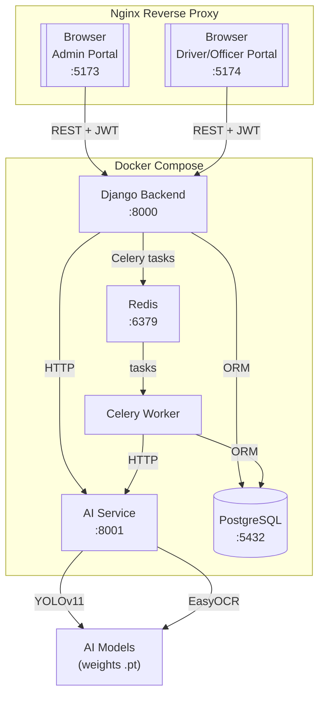
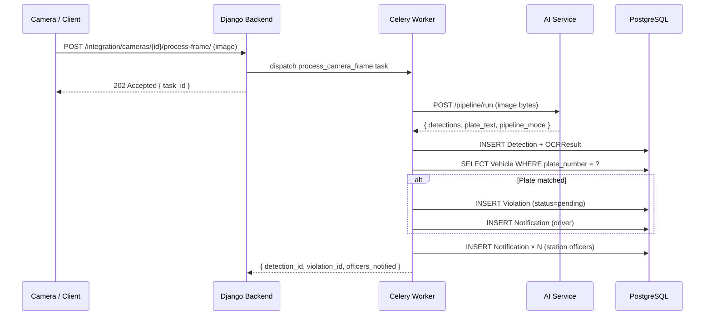
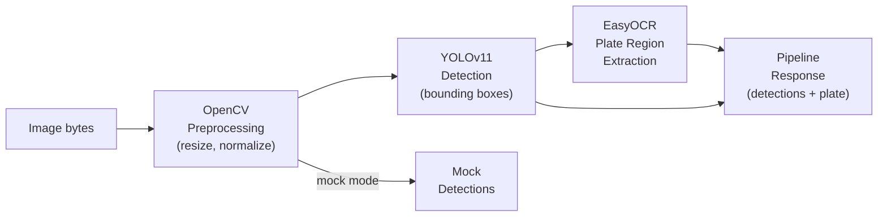
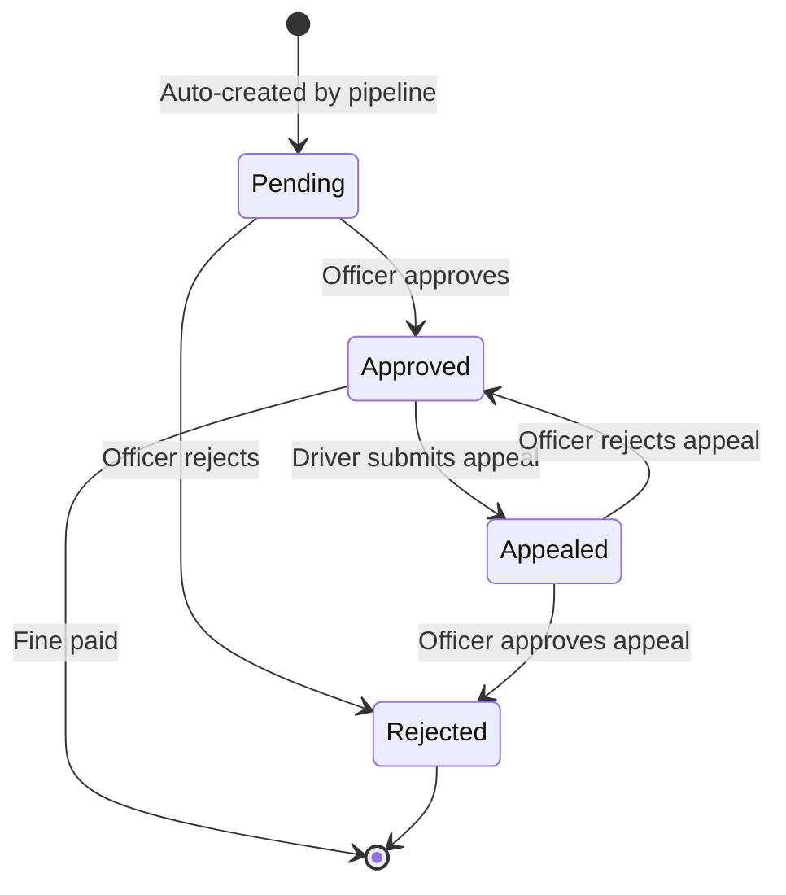
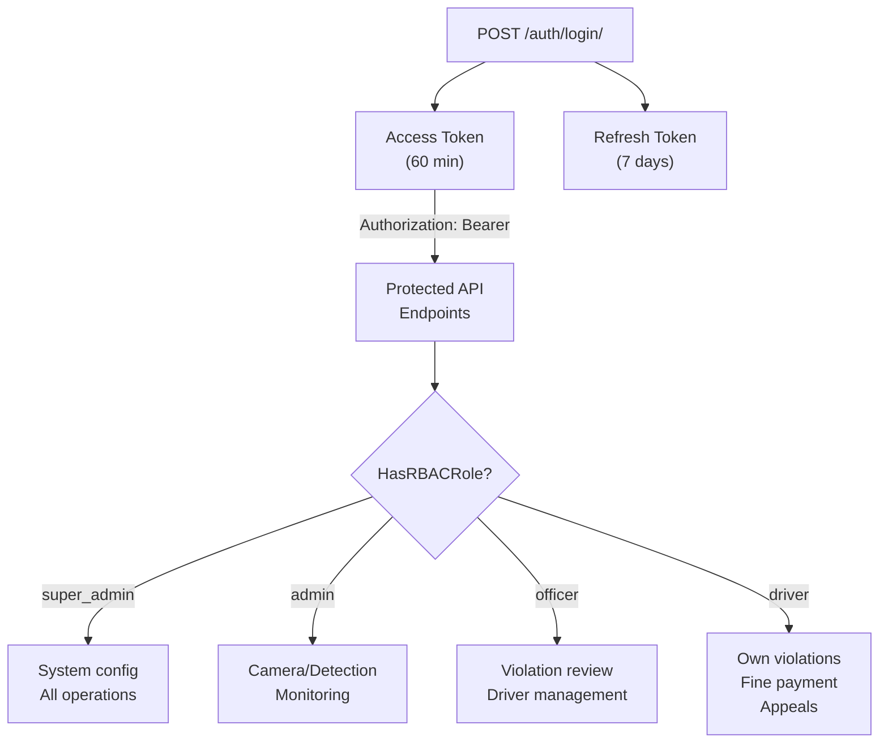
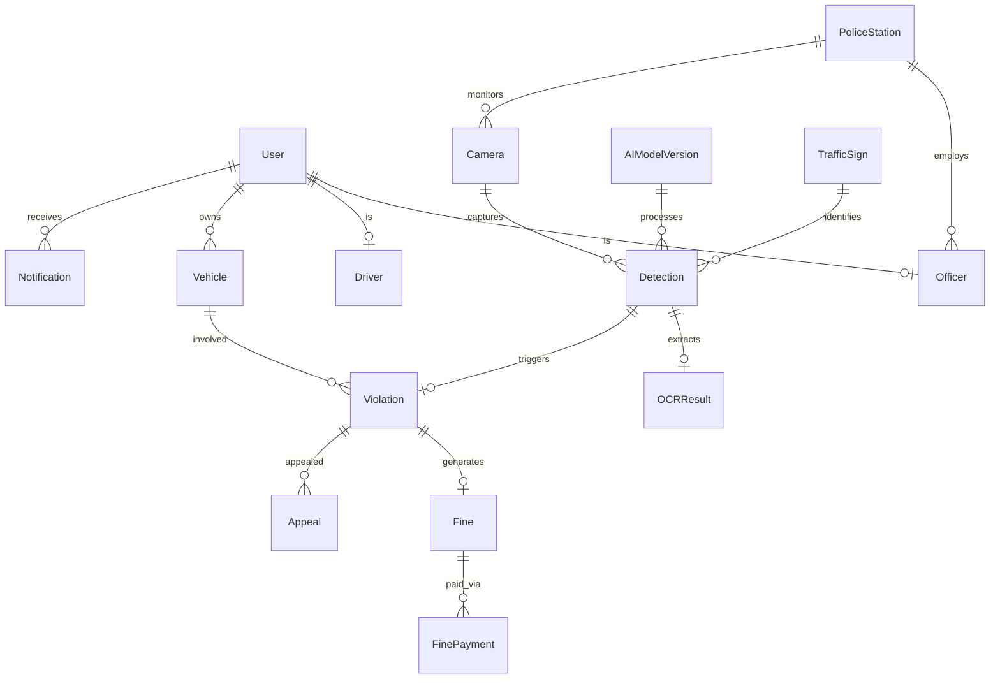
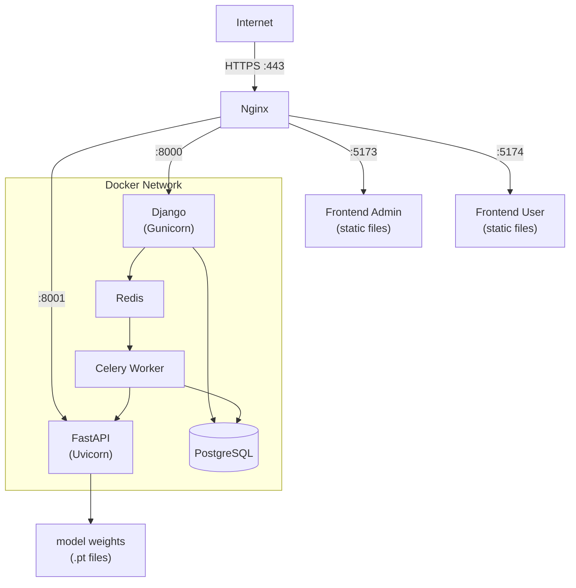
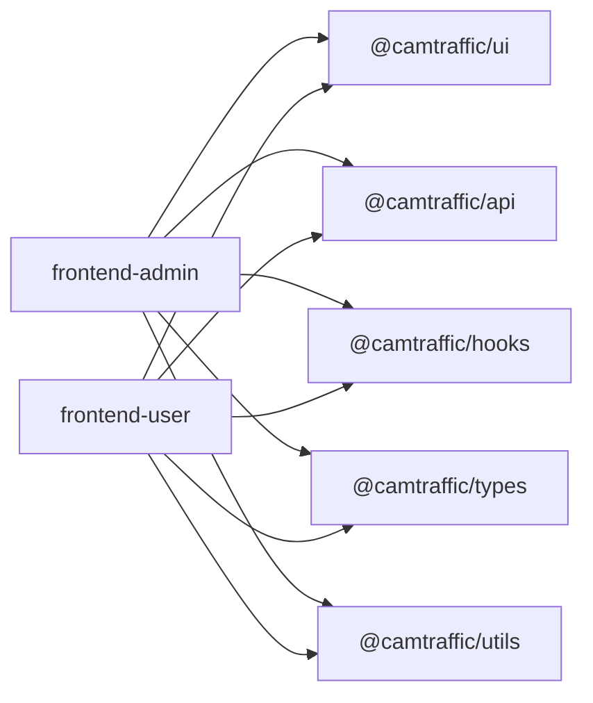

# Architecture Diagrams

**Task 150 — Phase 12 Documentation**

All diagrams use [Mermaid](https://mermaid.js.org/) syntax and render natively in GitHub and modern Markdown viewers.

---

## 1. High-Level System Architecture

---

## 2. End-to-End Detection Pipeline

---

## 3. AI Service Internal Pipeline

---

## 4. Violation Workflow

---

## 5. Authentication & RBAC

---

## 6. Database Entity Map

---

## 7. Deployment Architecture

---

## 8. Monorepo Package Structure

