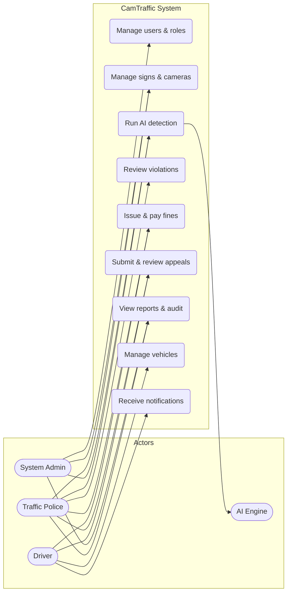
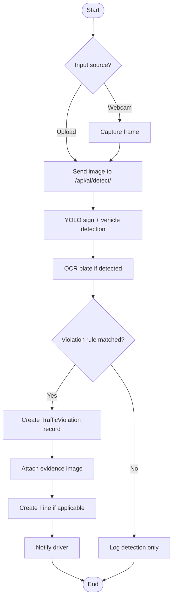
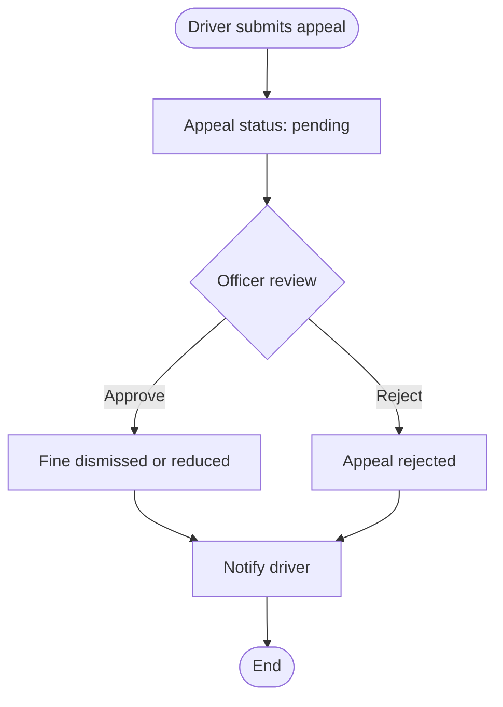
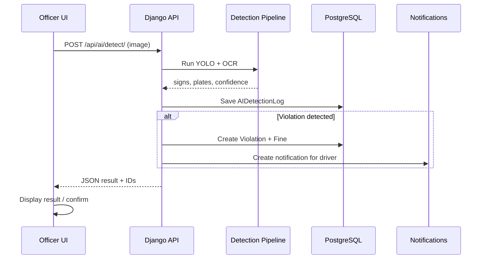
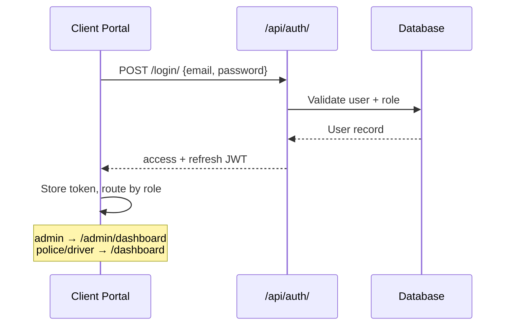
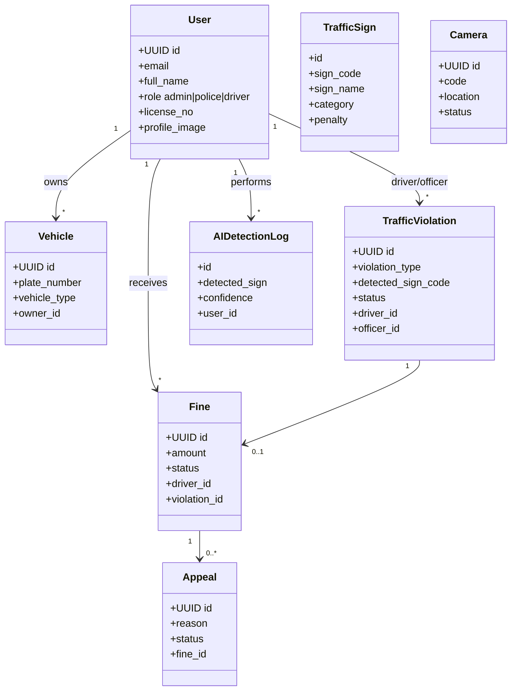
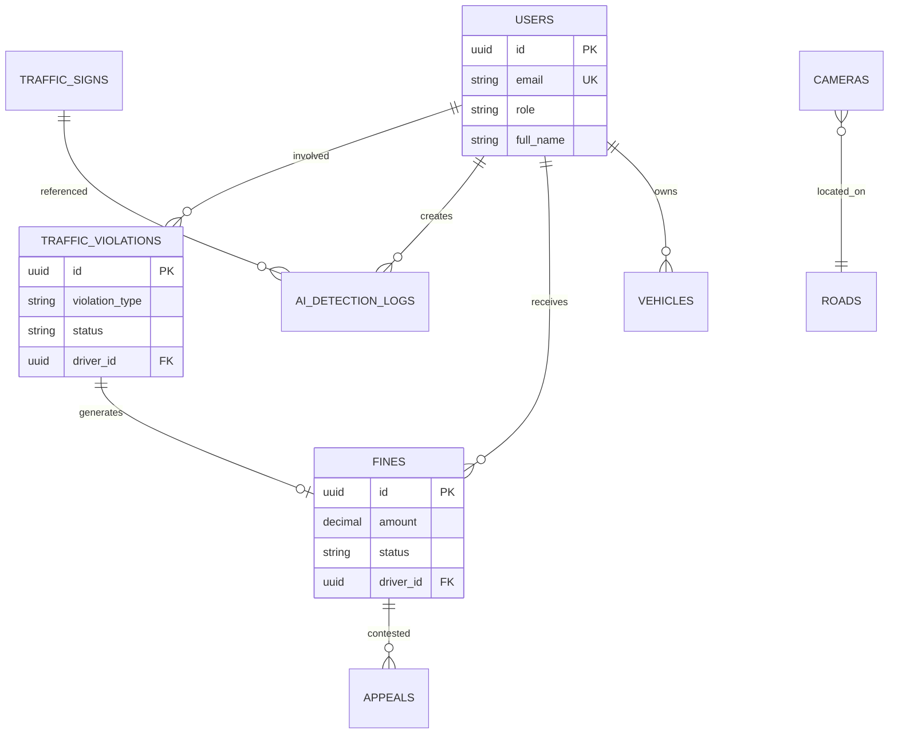

# CamTraffic — Architecture Diagrams

**Version:** 1.0 · **Date:** July 2026

UML-style diagrams for Phase 0 planning (P009–P012). Render Mermaid in GitHub, VS Code, or Cursor preview.

---

## 1. Use Case Diagram (P009)

---

## 2. Activity Diagram — Detection to Fine (P010)

---

## 3. Activity Diagram — Appeal Flow (P010)

---

## 4. Sequence Diagram — Camera to Notification (P011)

---

## 5. Sequence Diagram — Login (P011)

---

## 6. Class Diagram — Core Domain (P012)

---

## 7. Entity-Relationship Overview (P013)

Full SQL DDL: **`docs/SCHEMA.sql`**

> **Note:** Production Django models use UUID primary keys (`core.models.UUIDPrimaryKeyModel`). Legacy `SCHEMA.sql` may show BIGINT for early reference — migrations in `backend/*/migrations/` are authoritative.

---

## 8. Deployment Diagram (reference)

See deployment section in `docs/ARCHITECTURE.md` and `docker-compose.yml`.

---

## 9. Document Index

| Task | Diagram | Section |
|------|---------|---------|
| P009 | Use case | §1 |
| P010 | Activity | §2, §3 |
| P011 | Sequence | §4, §5 |
| P012 | Class | §6 |
| P013 | ER | §7 + SCHEMA.sql |
| P014 | Architecture narrative | `ARCHITECTURE.md` |
| P015 | Tech stack table | `ARCHITECTURE.md` §4 |
