# Chapter 3 — System Design (CamTraffic)

**Thesis:** Design and Development of an AI-Based Traffic Sign Detection and Traffic Law Enforcement System in Cambodia

Sections **3.10 – 3.18** — diagrams, descriptions, and codebase mapping for thesis Chapter 3.

**Export diagrams:** Paste Mermaid blocks into [mermaid.live](https://mermaid.live) → Export PNG/SVG for Word.

**Related docs:** [ERD.md](./ERD.md) · [AI_ARCHITECTURE.md](./AI_ARCHITECTURE.md) · [SYSTEM_ARCHITECTURE.md](./SYSTEM_ARCHITECTURE.md)

---

## 3.10 Use Case Diagram

### 3.10.1 Actors

| Actor | Description | Portal |
|-------|-------------|--------|
| **Administrator** | Manages users, signs, cameras, system analytics | Admin (`:5174`) |
| **Traffic Police** | Enforces law, issues fines, reviews violations & evidence | User (`:5173`) |
| **Driver** | Learns signs, runs AI detection, views fines & vehicles | User (`:5173`) |
| **AI Detection System** | YOLOv8, EasyOCR, Gemini (automated subsystem) | Backend |
| **External Services** | Gemini API, Resend email, Google/GitHub OAuth | Cloud |

### 3.10.2 Use Case Diagram (Mermaid)

```mermaid
flowchart TB
    subgraph Actors
        ADM((Administrator))
        POL((Traffic Police))
        DRV((Driver))
        AI((AI System))
        EXT((External Services))
    end

    subgraph Auth["Authentication"]
        UC1[Login / Logout]
        UC2[Register Account]
        UC3[OAuth Login]
        UC4[Reset Password]
    end

    subgraph AdminUC["Administration"]
        UC5[Manage Users]
        UC6[View Admin Dashboard]
        UC7[Manage Cameras & Roads]
        UC8[Manage Traffic Signs]
        UC9[View AI Logs & Reports]
    end

    subgraph Enforcement["Law Enforcement"]
        UC10[Run AI Sign Detection]
        UC11[Detect Vehicles & Plates]
        UC12[Evaluate Violation Rules]
        UC13[Create Violation Record]
        UC14[Issue Fine]
        UC15[Export Fine PDF]
        UC16[Search Driver / Plate]
        UC17[Review Evidence Archive]
    end

    subgraph DriverUC["Driver Services"]
        UC18[Browse Traffic Signs]
        UC19[Use Sign Chatbot]
        UC20[Manage My Vehicles]
        UC21[View My Fines]
        UC22[Listen Khmer TTS]
    end

    subgraph Shared["Shared"]
        UC23[View Notifications]
        UC24[Update Profile]
        UC25[View Violations]
    end

    ADM --> UC1
    ADM --> UC5
    ADM --> UC6
    ADM --> UC7
    ADM --> UC8
    ADM --> UC9
    ADM --> UC10
    ADM --> UC14
    ADM --> UC17
    ADM --> UC23

    POL --> UC1
    POL --> UC10
    POL --> UC14
    POL --> UC15
    POL --> UC16
    POL --> UC17
    POL --> UC25
    POL --> UC23
    POL --> UC24

    DRV --> UC1
    DRV --> UC2
    DRV --> UC3
    DRV --> UC4
    DRV --> UC10
    DRV --> UC18
    DRV --> UC19
    DRV --> UC20
    DRV --> UC21
    DRV --> UC22
    DRV --> UC23
    DRV --> UC24

    UC10 --> AI
    UC11 --> AI
    UC12 --> AI
    UC3 --> EXT
    UC4 --> EXT
    AI --> EXT
```

### 3.10.3 Use Case Table

| ID | Use Case | Actor | API / Page |
|----|----------|-------|------------|
| UC-01 | Login | All | `POST /api/auth/login/` |
| UC-02 | Register (driver) | Driver | `POST /api/auth/register/` |
| UC-03 | OAuth login | Driver | `/auth/oauth/callback` |
| UC-04 | AI sign detection | Admin, Driver | `POST /api/ai/detect/`, `/ai-detection` |
| UC-05 | Manage users | Admin | `/admin/users` |
| UC-06 | Manage signs | Admin | `/admin/signs` |
| UC-07 | Issue fine | Admin, Police | `POST /api/fines/` |
| UC-08 | View violations | Police, Driver | `/dashboard/violations` |
| UC-09 | Sign chatbot | Driver | `POST /api/signs/chatbot/` |
| UC-10 | Evidence archive | Admin, Police | `/dashboard/evidence` |

### 3.10.4 Khmer Summary (for thesis)

**៣.១០ Use Case Diagram** — ប្រព័ន្ធ CamTraffic មានអ្នកប្រើប្រាស់ ៣ ប្រភេទ៖ **Administrator** (គ្រប់គ្រងប្រព័ន្ធ) **Traffic Police** (អនុវត្តច្បាប់) និង **Driver** (អ្នកបើkiបរ)។ Use Case សំខាន់ៗរួមមានការចូលប្រើប្រាស់ ការរកឃើញសញ្ញាដោយ AI ការវាយតម្លៃរំលោភ ការចេញកំរិតពិន័យ និងការគ្រប់គ្រងទិន្នន័យ។

---

## 3.11 Data Flow Diagram (DFD)

### 3.11.1 Context Diagram (Level 0)

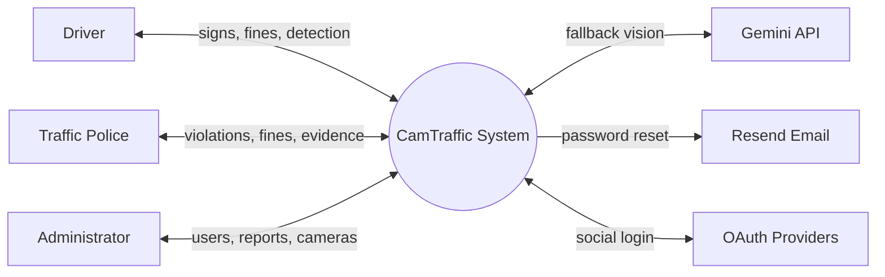

### 3.11.2 Level 1 DFD — Main Processes

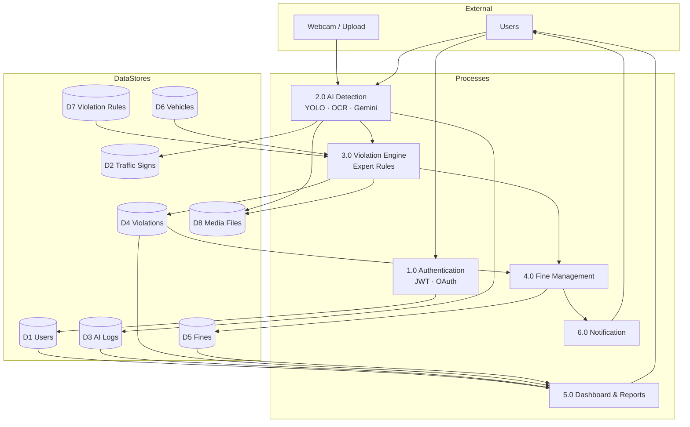

### 3.11.3 Level 2 DFD — AI Detection Process (2.0)

```text
Image Input
    │
    ▼
[2.1 Validate & Store Upload] ──► D8 Media
    │
    ▼
[2.2 OpenCV Preprocess]
    │
    ├──► [2.3 YOLOv8 Sign Detect] ──► D2 Traffic Signs (lookup)
    │         │
    │         └── (conf < 70%) ──► [2.4 Gemini Fallback]
    │
    ├──► [2.5 YOLOv8n Vehicle Detect]
    │
    └──► [2.6 EasyOCR Plate Read] ──► D6 Vehicles (match)
    │
    ▼
[2.7 Compose Result & TTS]
    │
    ▼
[2.8 Save AIDetectionLog] ──► D3 AI Logs
    │
    └──► Process 3.0 Violation Engine
```

### 3.11.4 Data Flow Table

| From | To | Data |
|------|-----|------|
| User | AI Detection | Image file (multipart) |
| AI Detection | Traffic Signs DB | Sign code / class_key lookup |
| AI Detection | AI Logs | Detection result, confidence, plate |
| Violation Engine | Violations DB | Violation type, evidence paths |
| Fine Management | Fines DB | Amount, driver, status |
| Fine Management | Notifications | Fine alert message |

---

## 3.12 Entity Relationship Diagram (ERD)

> Full ERD with 20 entities: see **[ERD.md](./ERD.md)** and **[ERD_UPDATED.md](./ERD_UPDATED.md)**.

### 3.12.1 Core ERD (Thesis figure)

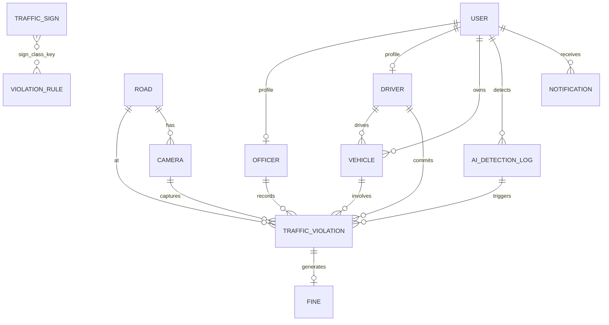

### 3.12.2 Entity count

| Domain | Entities |
|--------|----------|
| Users & security | User, Officer, Driver, UserPreference, LoginEvent, Role, Permission, RolePermission, UserRole |
| Knowledge | TrafficSign, ViolationRule |
| Enforcement | TrafficViolation, Fine, Vehicle |
| AI | AIDetectionLog, VehicleTrackingLog |
| Infrastructure | Road, Camera, TrafficSignal |
| Alerts | Notification |

**Source:** `backend/**/models.py` · `docs/SCHEMA.sql` (partial)

---

## 3.13 AI Processing Architecture

> Full detail: **[AI_ARCHITECTURE.md](./AI_ARCHITECTURE.md)**

### 3.13.1 Hybrid AI Pipeline

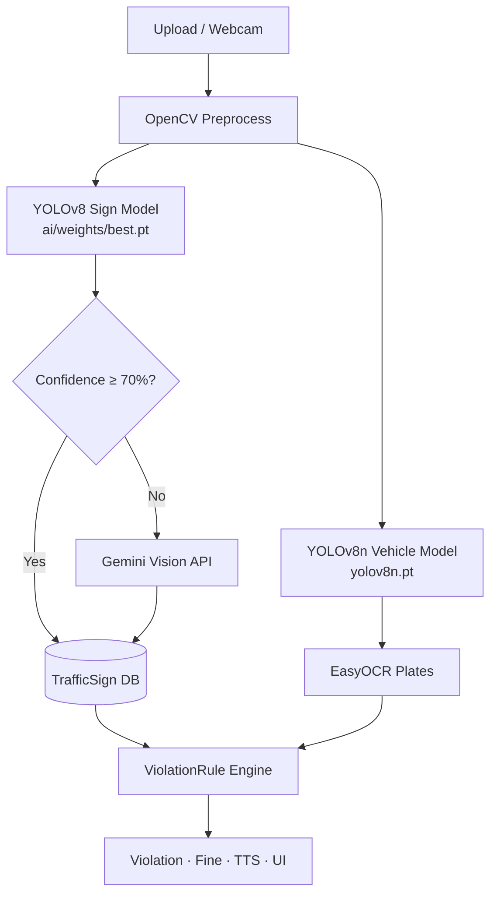

### 3.13.2 Pipeline steps (code)

| Step | Module | Function |
|------|--------|----------|
| Sign detect | `ai_detection/services.py` | `detect_traffic_sign()` |
| Gemini fallback | `ai_detection/gemini_service.py` | Gemini Vision API |
| Vehicle detect | `ai_detection/vehicle_detection.py` | `detect_vehicles()` |
| Plate OCR | `ai_detection/plate_ocr.py` | `recognize_plate()` |
| Violation check | `ai_detection/pipeline_enforcement.py` | `evaluate_and_record()` |
| Full pipeline | `ai_detection/pipeline.py` | `build_pipeline_steps()` |

### 3.13.3 AI components table

| Component | Technology | Purpose |
|-----------|------------|---------|
| Sign detection | YOLOv8 (Ultralytics) | 236+ Cambodia traffic signs |
| Vehicle detection | YOLOv8n COCO | Car, motorcycle, bus, truck |
| Plate OCR | EasyOCR | Cambodia plate format (2A-1234) |
| Fallback | Gemini 2.5 Flash | Low-confidence sign identification |
| Preprocessing | OpenCV | Resize, crop, enhance |
| Speech | edge-tts | Khmer + English neural TTS |
| Expert rules | ViolationRule engine | Sign + action → violation |

---

## 3.14 Database Design

### 3.14.1 Database technology

| Environment | Engine | Config |
|-------------|--------|--------|
| Development | SQLite | `USE_SQLITE=True` |
| Production | PostgreSQL 14+ | `USE_SQLITE=False` |

**ORM:** Django ORM · **Timezone:** Asia/Phnom_Penh

### 3.14.2 Core tables

| Table | Primary purpose | Key fields |
|-------|-----------------|------------|
| `users` | Accounts (admin/police/driver) | email, role, full_name, auth_provider |
| `traffic_signs` | Sign catalog (bilingual) | sign_code, sign_name_km, category, rules |
| `violation_rules` | Expert system rules | sign_class_key, prohibited_action, violation_type |
| `ai_detection_logs` | AI session records | detected_sign, confidence, detected_plate |
| `traffic_violations` | Violation records | violation_type, status, evidence images |
| `fines` | Penalty records | amount, status, driver_id, violation_id |
| `vehicles` | Registered vehicles | plate_number, owner_id, driver_id |
| `roads` | Road infrastructure | name, road_type, speed_limit |
| `cameras` | Traffic cameras | road_id, code, camera_type |
| `notifications` | User alerts | title, type, is_read |

### 3.14.3 Normalization

- **3NF** — No repeating groups; FK relationships for users, vehicles, violations
- **JSON fields** — `traffic_signs.rules`, `ai_detection_logs.detected_vehicles` for flexible arrays
- **Media files** — Stored in `backend/media/`; DB holds file paths only

### 3.14.4 Indexes (performance)

| Index | Table | Columns |
|-------|-------|---------|
| `idx_users_role` | users | role |
| `idx_vehicles_plate` | vehicles | plate_number |
| `idx_fines_driver_status` | fines | driver_id, status |
| `idx_violation_status_date` | traffic_violations | status, violation_date |

---

## 3.15 Security Design

### 3.15.1 Security architecture

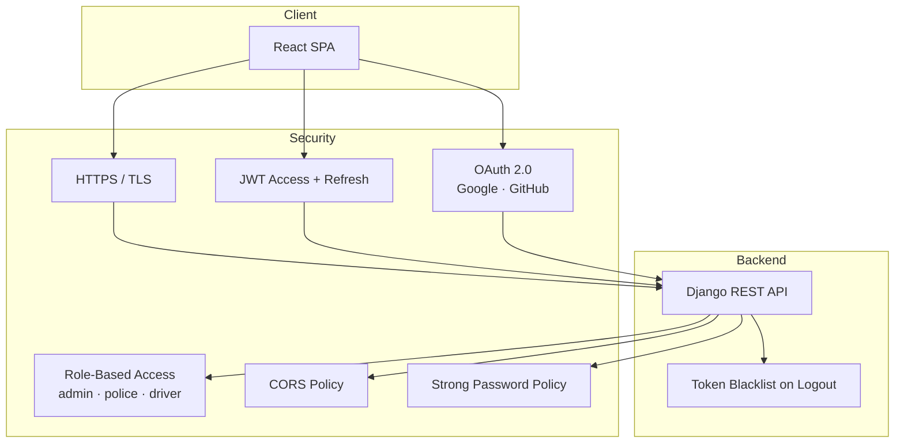

### 3.15.2 Security controls

| Control | Implementation | Location |
|---------|----------------|----------|
| Authentication | JWT (SimpleJWT) | `rest_framework_simplejwt` |
| Token lifetime | Access 60 min, Refresh 7 days | `settings.py` SIMPLE_JWT |
| Logout | Refresh token blacklist | `POST /api/auth/logout/` |
| Authorization | Role checks per portal & API | `rbac/`, view permissions |
| Password policy | 8+ chars, upper, number, special | `authentication/password_policy.py` |
| OAuth 2.0 | Google + GitHub (driver portal) | `authentication/` OAuth views |
| CORS | Allowed origins whitelist | `CORS_ALLOWED_ORIGINS` |
| CSRF | Trusted origins for API | `CSRF_TRUSTED_ORIGINS` |
| File upload | Size limit, media path isolation | Nginx `client_max_body_size 10M` |
| Secrets | `.env` not committed | `backend/.env.example` |
| Login audit | LoginEvent model | `users/models.py` LoginEvent |

### 3.15.3 Role access matrix

| Feature | Admin | Police | Driver |
|---------|-------|--------|--------|
| User management | ✅ | ❌ | ❌ |
| AI detection | ✅ | ❌ | ✅ |
| Issue fines | ✅ | ✅ | ❌ |
| View own fines | ❌ | ❌ | ✅ |
| Detection logs | ✅ | ✅ | ❌ |
| Evidence archive | ✅ | ✅ | ❌ |
| Manage cameras | ✅ | ❌ | ❌ |
| OAuth register | ❌ | ❌ | ✅ |
| Admin portal login | ✅ | ❌ | ❌ |

**Portal separation:** Admin portal (`5174`) rejects non-admin users; User portal (`5173`) accepts police + driver only.

---

## 3.16 Deployment Architecture

> Full guide: **[DEPLOYMENT.md](./DEPLOYMENT.md)**

### 3.16.1 Production deployment diagram

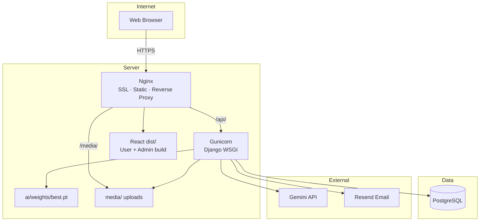

### 3.16.2 Environment tiers

| Tier | Frontend | Backend | Database |
|------|----------|---------|----------|
| **Development** | Vite `:5173` + `:5174` | `runserver :8000` | SQLite |
| **Production** | Nginx serves `dist/` | Gunicorn `:8000` | PostgreSQL |

### 3.16.3 Deployment checklist

| Variable | Production value |
|----------|------------------|
| `DEBUG` | `False` |
| `SECRET_KEY` | Strong random key |
| `USE_SQLITE` | `False` |
| `AI_USE_MOCK` | `False` |
| `ALLOWED_HOSTS` | Your domain |
| `CORS_ALLOWED_ORIGINS` | `https://yourdomain.com` |
| SSL | Certbot + Nginx |

### 3.16.4 Optional Docker layout

```text
docker-compose:
  postgres  → PostgreSQL container
  backend   → Django + Gunicorn (mount media/, ai/weights/)
  frontend  → Nginx (mount dist/)
```

---

## 3.17 User Interface Design

### 3.17.1 UI technology stack

| Layer | Technology |
|-------|------------|
| Framework | React 18 + TypeScript |
| Build | Vite 6 |
| Styling | Tailwind CSS 4 |
| Components | Radix UI, MUI icons |
| Charts | Recharts |
| i18n | Khmer + English (`shared/i18n/translations.ts`) |
| HTTP | Axios + JWT interceptors |

### 3.17.2 Portal structure

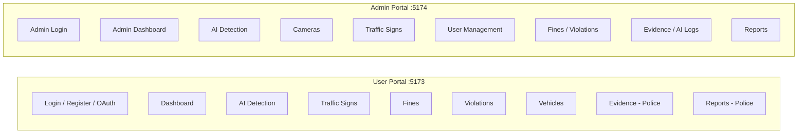

### 3.17.3 Page map by role

#### Admin portal (`frontend-admin/`)

| Route | Page | Purpose |
|-------|------|---------|
| `/` | AdminLoginPage | Admin login |
| `/admin/dashboard` | AdminDashboard | Analytics KPIs |
| `/admin/ai-detection` | AIDetectionPage | Upload + webcam detection |
| `/admin/cameras` | CamerasPage | Road & camera management |
| `/admin/signs` | TrafficSignsPage | Sign catalog CRUD |
| `/admin/fines` | FineManagement | Issue & track fines |
| `/admin/violations` | ViolationsPage | Violation records |
| `/admin/vehicles` | VehiclesPage | All vehicles |
| `/admin/users` | UsersPage | User CRUD |
| `/admin/ai-logs` | AILogsPage | Detection history |
| `/admin/evidence` | EvidenceArchivePage | Unified evidence search |
| `/admin/reports` | ReportsPage | PDF / analytics export |

#### User portal (`frontend-user/`)

| Route | Page | Role |
|-------|------|------|
| `/` | LoginPage | Police, Driver |
| `/register` | RegisterPage | Driver |
| `/dashboard` | DashboardPage | Police, Driver |
| `/dashboard/ai-detection` | AIDetectionPage | Driver |
| `/dashboard/signs` | TrafficSignsPage | Police, Driver |
| `/dashboard/fines` | FineManagement | Police, Driver |
| `/dashboard/violations` | ViolationsPage | Police, Driver |
| `/dashboard/vehicles` | VehiclesPage | Driver |
| `/dashboard/ai-logs` | AILogsPage | Police |
| `/dashboard/evidence` | EvidenceArchivePage | Police |
| `/dashboard/reports` | ReportsPage | Police |

### 3.17.4 UI design principles

| Principle | Implementation |
|-----------|----------------|
| Responsive | Mobile sidebar, Tailwind breakpoints |
| Bilingual | KM/EN toggle, Khmer sign names |
| Accessibility | Radix UI primitives |
| Role-based nav | Sidebar filters items by `user.role` |
| Dark/light theme | Theme context |
| Live feedback | Toast (Sonner), detection pipeline steps |

### 3.17.5 Key UI components

| Component | File | Purpose |
|-----------|------|---------|
| LiveWebcamPanel | `shared/components/ai/LiveWebcamPanel.tsx` | Webcam detection |
| DetectionDisplayImage | `shared/components/ai/DetectionDisplayImage.tsx` | Result overlay |
| SignNameLabels | `shared/components/signs/SignNameLabels.tsx` | Bilingual sign names |
| TablePagination | `shared/components/ui/TablePagination.tsx` | List pagination |
| useSpeech | `shared/hooks/useSpeech.ts` | Khmer/EN TTS |

---

## 3.18 Traffic Law Enforcement Workflow

### 3.18.1 End-to-end workflow diagram

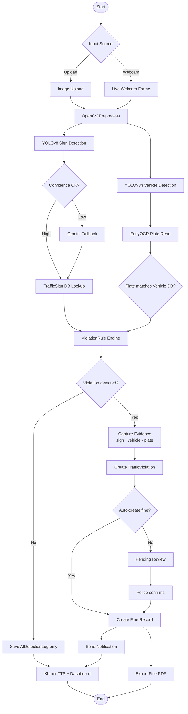

### 3.18.2 Workflow steps (detailed)

| Step | Actor | Action | System response |
|------|-------|--------|-----------------|
| 1 | Driver/Police/Admin | Upload image or open webcam | Receive image via API |
| 2 | System | OpenCV preprocess | Resize, enhance image |
| 3 | System | YOLOv8 detect sign | Return sign + confidence |
| 4 | System | (If conf &lt; 70%) Gemini fallback | Alternative sign label |
| 5 | System | Lookup TrafficSign DB | Khmer/EN name, rules, guidance |
| 6 | System | YOLOv8n detect vehicles | Bounding boxes, vehicle type |
| 7 | System | EasyOCR read plate | Plate text e.g. `2A-1234` |
| 8 | System | Match plate to Vehicle DB | Link to driver if found |
| 9 | System | ViolationRule engine | sign_class_key + action → violation? |
| 10 | System | Capture evidence snapshots | Store in `media/violations/` |
| 11 | System | Create TrafficViolation | Status: draft or confirmed |
| 12 | Police/Admin | Review & confirm | Update violation status |
| 13 | Police/Admin | Issue fine | Create Fine linked to violation |
| 14 | System | Notify driver | In-app notification |
| 15 | Driver | View fine & pay offline | Update status manually |
| 16 | Any | Export PDF | `GET /api/fines/{id}/pdf/` |

### 3.18.3 Expert system rule example

```text
Detected sign:  NO_LEFT_TURN  (class_key)
Observed action: LEFT_TURN
        │
        ▼
ViolationRule match:
  sign_class_key = NO_LEFT_TURN
  prohibited_action = LEFT_TURN
        │
        ▼
Violation type: ILLEGAL_LEFT_TURN
Default fine:   $25.00
```

**Code:** `backend/violations/services.py` → `evaluate_violation()`

### 3.18.4 Violation status flow

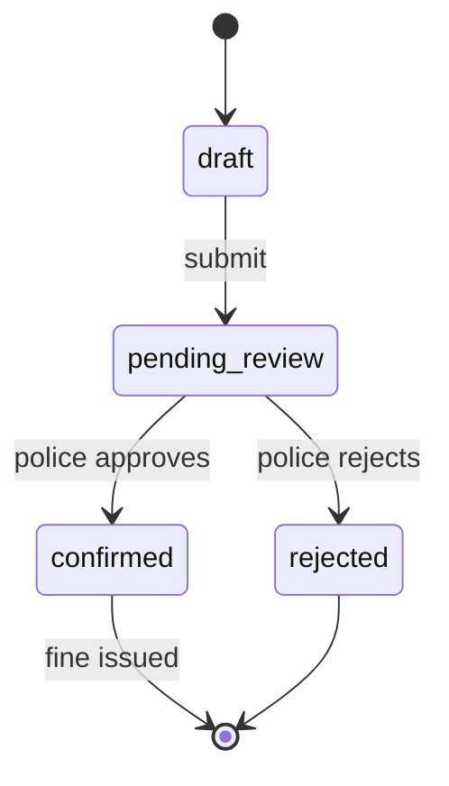

### 3.18.5 Fine status flow

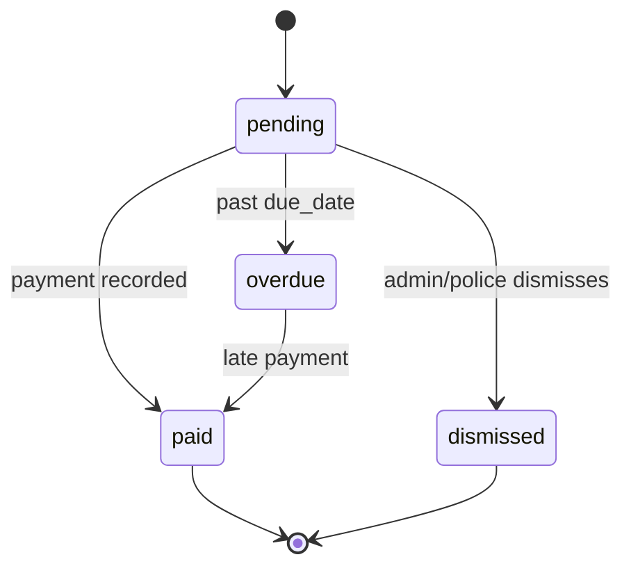

---

## Appendix A — Figure list for Chapter 3

| Section | Figure | Export from |
|---------|--------|-------------|
| 3.10 | Use Case Diagram | Section 3.10.2 Mermaid |
| 3.11 | DFD Level 0 & 1 | Sections 3.11.1–3.11.2 |
| 3.12 | ERD | Section 3.12.1 or [ERD.md](./ERD.md) |
| 3.13 | AI Processing Architecture | Section 3.13.1 or [AI_ARCHITECTURE.md](./AI_ARCHITECTURE.md) |
| 3.14 | Database table diagram | Section 3.14.2 tables |
| 3.15 | Security architecture | Section 3.15.1 |
| 3.16 | Deployment architecture | Section 3.16.1 |
| 3.17 | UI portal map | Section 3.17.2 |
| 3.18 | Enforcement workflow | Section 3.18.1 |

## Appendix B — Source code index

| Topic | Path |
|-------|------|
| Models | `backend/**/models.py` |
| AI pipeline | `backend/ai_detection/pipeline.py` |
| Violation rules | `backend/violations/services.py` |
| Admin routes | `frontend-admin/routes.tsx` |
| User routes | `frontend-user/routes.tsx` |
| API docs | `docs/API.md` |
| Requirements | `PRD.md` |

---

*Chapter 3 System Design — CamTraffic thesis documentation.*
