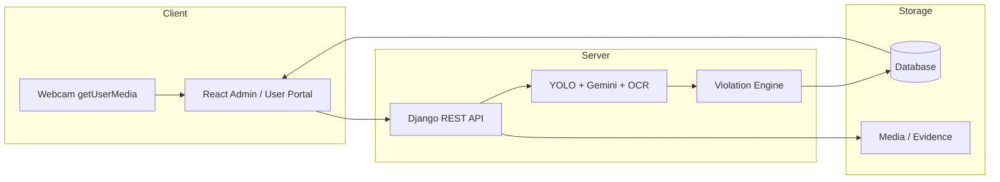

# Chapter 4 — System Implementation (CamTraffic)

**Thesis:** Design and Development of an AI-Based Traffic Sign Detection and Traffic Law Enforcement System in Cambodia

This document maps thesis Chapter 4 sections to the actual codebase. Use with `docs/CHAPTER5_RESULTS.md`, `docs/DEFENSE_SLIDES.md`, and `DEMO_SCRIPT.md`.

---

## 4.0 System Architecture Overview

CamTraffic follows a **client–server** architecture: React SPAs call Django REST APIs; AI inference runs on the server; results persist in PostgreSQL (or SQLite for development).



**Defense demo pipeline:**

```text
Camera/Upload → OpenCV-style preprocess → YOLO Sign → Vehicle YOLO → Plate OCR
  → Violation Rules → Evidence Capture → Database → Dashboard
```

---

## 4.1 Development Environment

| Component | Technology | Location |
|-----------|------------|----------|
| Backend | Django 4.2+ / DRF | `backend/` |
| Frontend (Admin) | React 18 + Vite + Tailwind | `frontend-admin/` |
| Frontend (User) | React 18 + Vite + Tailwind | `frontend-user/` |
| Database | SQLite (dev) / PostgreSQL (prod) | `backend/camtraffic/settings.py` |
| AI training | YOLOv8 (Ultralytics) | `ai/train.py`, `ai/weights/best.pt` |

---

## 4.2 OpenCV & Image Processing

- Browser webcam capture: `frontend-*/shared/hooks/useWebcamDetection.ts`
- Live panel UI: `frontend-*/shared/components/ai/LiveWebcamPanel.ts`
- Server-side resize/crop/enhance: `backend/ai_detection/services.py`, `backend/traffic_signs/sign_image_processing.py`
- Evidence snapshots (frame, vehicle, plate): `backend/ai_detection/evidence_capture.py`
- Unified evidence archive: `backend/dashboard/evidence_archive.py`, `GET /api/dashboard/evidence/`
- Evidence Archive UI: `frontend-*/shared/pages/EvidenceArchivePage.tsx`

---

## 4.3 AI Traffic Sign Detection (YOLOv8)

- Dataset builder: `ai/build_dataset.py`, `ai/data.yaml`
- Sign metadata: `ai/sign_catalog.json` (236 signs), `ai/reference_sign_meta.json`
- Hybrid detection pipeline: `backend/ai_detection/pipeline.py`
- YOLO inference: `backend/ai_detection/services.py` → `_yolo_detect()`
- Gemini Vision fallback: `backend/ai_detection/gemini_service.py`
- Confidence threshold for uploads: ≥ 70% (weak guesses rejected)

**Training evidence:** `docs/thesis_evidence/AI-06/` (metrics, confusion matrix, prediction samples)

---

## 4.4 Vehicle Detection

- COCO YOLOv8n vehicle classes: `backend/ai_detection/vehicle_detection.py`
- Wired into detect API: `POST /api/ai/detect/`
- Bounding boxes on live UI overlay

---

## 4.5 License Plate OCR

- EasyOCR integration: `backend/ai_detection/plate_ocr.py`
- Cambodia Latin plate format (e.g. `2A-1234`)
- Enabled via `AI_PLATE_OCR_ENABLED` in `backend/.env`
- Test sample: `ai/test_samples/car_with_plate_2A-1234.jpg`

---

## 4.6 Violation Rule Engine (Expert System)

- Rule model: `backend/violations/models.py` → `ViolationRule`
- Inference logic: `backend/violations/services.py` → `evaluate_violation()`
- API: `POST /api/violations/evaluate/`
- Auto-enforcement on detect: `backend/ai_detection/pipeline_enforcement.py`

Example rule: `NO_LEFT_TURN` sign + `LEFT_TURN` action → `ILLEGAL_LEFT_TURN` violation.

---

## 4.7 Digital Records & Evidence

- Detection logs: `AIDetectionLog` model, `GET /api/ai/logs/`
- Violations: `TrafficViolation` with evidence image FK
- Fines: `Fine` model with PDF export `GET /api/fines/{id}/pdf/`
- PDF generation: `backend/fines/views.py` → `FinePDFExportView` (ReportLab)

---

## 4.8 Web Dashboard (React)

| Feature | Page / Component |
|---------|------------------|
| Admin dashboard stats | `frontend-admin/admin/pages/AdminDashboard.tsx` |
| AI Detection (upload + webcam) | `frontend-*/shared/pages/AIDetectionPage.tsx` |
| Traffic Signs catalog | `frontend-*/shared/pages/TrafficSignsPage.tsx` |
| Violations | `frontend-*/shared/pages/ViolationsPage.tsx` |
| Fine Management | `frontend-*/shared/pages/FineManagement.tsx` |
| Cameras | `frontend-*/shared/pages/CamerasPage.tsx` |

---

## 4.9 Khmer Localization & Neural TTS

- Bilingual sign names/descriptions: `ai/khmer_speech.py`, `ai/sign_khmer_overrides.json`
- Sync script: `scripts/sync_all_signs_bilingual.py`
- Frontend overrides: `frontend-*/shared/data/sign_khmer_overrides.json`
- Neural TTS (Edge voices): `backend/ai_detection/tts.py`, `POST /api/ai/tts/`
- Khmer voice: `km-KH-SreymomNeural` · English: `en-US-JennyNeural`
- Frontend speech hook: `frontend-*/shared/hooks/useSpeech.ts`

---

## 4.10 REST API

Full API reference: `docs/API.md`

Key endpoints for defense demo:

```
POST /api/auth/login/
POST /api/ai/detect/
GET  /api/ai/logs/
GET  /api/ai/stats/
POST /api/ai/tts/
POST /api/violations/evaluate/
GET  /api/dashboard/admin/
GET  /api/dashboard/admin/report/pdf/
GET  /api/dashboard/police/reports/pdf/
GET  /api/signs/
GET  /api/fines/{id}/pdf/
```

---

## 4.11 Integration Testing

- E2E test suite: `backend/tests/test_e2e_pipeline.py` (23 tests)
- Run: `cd backend && python manage.py test tests.test_e2e_pipeline -v 1`
- One-command validator: `python scripts/run_defense_integration.py`
- Demo script: `DEMO_SCRIPT.md`

---

## 4.12 Database Design (Core Tables)

| Table | Purpose | Django app |
|-------|---------|------------|
| `users` | Admin, police, driver accounts | `users` |
| `traffic_signs` | 236-sign catalog with bilingual fields | `traffic_signs` |
| `ai_detection_logs` | Detection history + evidence paths | `ai_detection` |
| `violation_rules` | Expert-system rule definitions | `violations` |
| `traffic_violations` | Violation records + evidence | `violations` |
| `fines` | Fine records linked to violations | `fines` |
| `vehicles` | Vehicle registry + plate lookup | `vehicles` |
| `cameras`, `roads` | Infrastructure monitoring | `infrastructure` |
| `notifications` | In-app alerts | `notifications` |

Schema reference: `docs/SCHEMA.sql`

---

## 4.13 Security & Authentication

- JWT access + refresh tokens (`rest_framework_simplejwt`)
- Role-based access: `admin`, `police`, `driver`
- Google OAuth optional (`docs/GOOGLE_OAUTH_SETUP.md`)
- CORS configured for Vite dev ports (`backend/camtraffic/settings.py`)
- Media uploads validated by extension and size in `ai_detection/image_utils.py`

---

## 4.14 Deployment

Production guide: `docs/DEPLOYMENT.md`

- Backend: Gunicorn + Nginx
- Frontend: static build (`npm run build`)
- Database: PostgreSQL with `USE_SQLITE=False`
- Environment: `backend/.env.example` template

---

## Related Documents

| Document | Use |
|----------|-----|
| `docs/CHAPTER5_RESULTS.md` | Testing results & metrics |
| `docs/DEFENSE_SLIDES.md` | Presentation slide outline |
| `docs/hybrid_detection_flow.md` | YOLO + Gemini flow |
| `docs/API.md` | Full REST API reference |
| `docs/thesis_evidence/AI-06/` | Training plots & predictions |
| `docs/thesis_evidence/TS-03/` | Held-out accuracy evaluation |
