# CamTraffic Complete System Workflow

**Topic:** Design and Develop of an AI-Based Traffic Sign Detection and Traffic Law Enforcement System in Cambodia

**Source:** CamTraffic Master Build Prompt  
**Roles:** Admin · Police Officer · Driver  
**Core flow:** camera/upload → AI detection → officer review → fine → driver notification → payment/appeal → reporting

**Aligned implementation:** Admin portal (`src/web/admin`) · User portal (`src/web/user`) · Django API + `ai_detection` · PostgreSQL

**Thesis use:** Convert sections below into UML Activity / Sequence / DFD / BPMN for Chapter 3–4.

**Related:** [`SYSTEM-WORKFLOW.md`](SYSTEM-WORKFLOW.md) · [`PRODUCTION-WORKFLOW-AND-DEMO.md`](PRODUCTION-WORKFLOW-AND-DEMO.md) · [`final-year-project/diagrams/`](final-year-project/diagrams/)

---

## 1. Role entry (Visitor → Portals)

```text
                         ┌────────────────────────┐
                         │       Visitor          │
                         └──────────┬─────────────┘
                                    │
                                    ▼
                           Login / Register
                                    │
                           JWT Authentication
                                    │
                     Role-Based Access Control
                                    │
        ┌───────────────────────────┼──────────────────────────┐
        │                           │                          │
        ▼                           ▼                          ▼
     Admin                     Police Officer               Driver
  (admin portal)              (user portal)              (user portal)
```

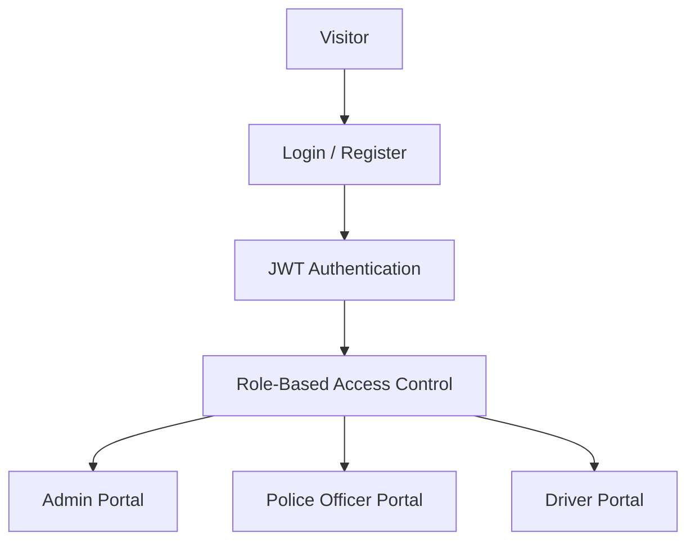

| Role | Portal | Primary job |
|------|--------|-------------|
| Admin | `:5174` admin | Master data, AI ops, oversight, reports, settings |
| Police Officer | `:5173` police | Detect, review, violate, fine, review appeals |
| Driver | `:5173` citizen/driver | View evidence, pay, appeal, notifications |

---

## 2. Overall system workflow

```text
Start → User Login → Authentication → Role Verification
   → Dashboard (Admin | Police | Driver)
```

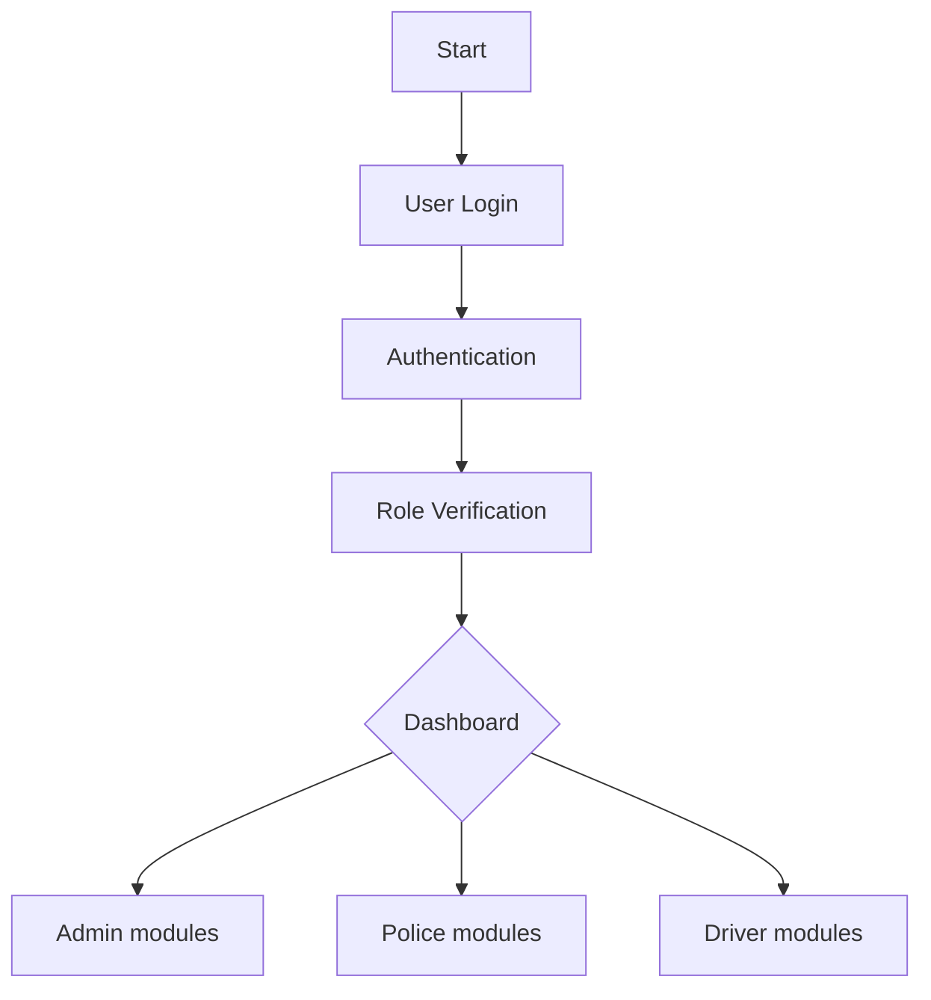

---

## 3. AI Detection workflow

**Runtime inference pipeline** (Master Build + CamTraffic `pipeline.py`):

```text
Image / Video / Webcam / Live Camera
        │
        ▼
Upload Frame
        │
        ▼
AI Detection API
        │
        ▼
Vehicle Detection (YOLO)
        │
        ▼
Traffic Sign Detection
        │
        ▼
License Plate Detection
        │
        ▼
OCR Read Plate
        │
        ▼
Violation Rule Engine
        │
        ▼
Detection Log
        │
        ▼
Officer Review
```

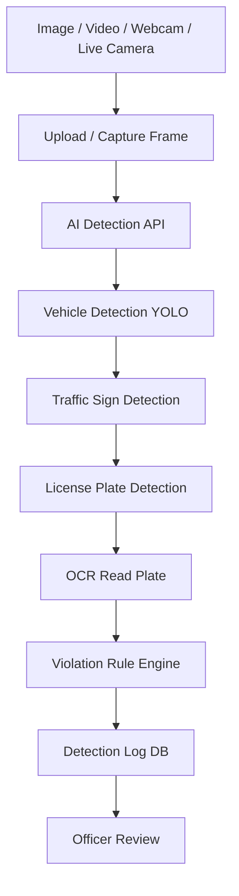

| Stage | CamTraffic module |
|-------|-------------------|
| Upload / frame | `ai_detection/views.py`, video utils, frame capture |
| Vehicle / sign / plate | YOLO weights in `ai/weights/` |
| OCR | EasyOCR plate crop path |
| Rule engine | `pipeline_enforcement.py` |
| Log | `AIDetectionLog` |
| Review | Officer AI Detection / Violations UI |

**Honest runtime note:** OCR is assistive; officer confirms plate/violation before fine issue. Live RTSP requires real `frame_source_url` / `rtsp_url`.

---

## 4. Police Officer workflow

```text
Login → Dashboard → Select Detection Source
   → Upload Image | Upload Video | Webcam | Live Camera
   → Run AI Detection → Detection Result
   → Review Bounding Boxes → Review OCR Plate
   → Approve?
        Yes → Create Violation → Create Fine → Send Notification → End
        No  → Reject Detection → Save Rejected Log → End
```

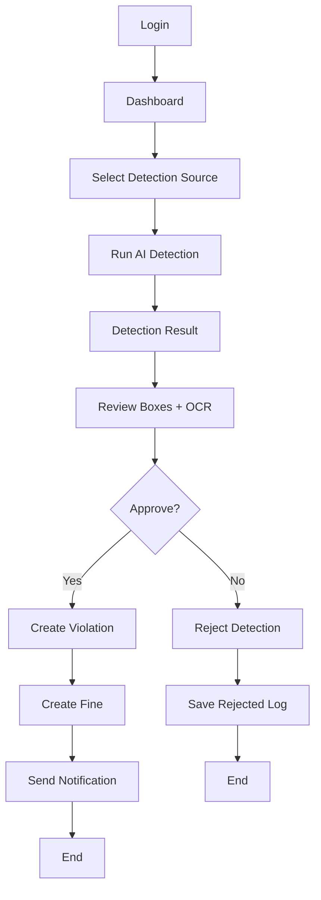

---

## 5. Driver workflow

```text
Login → Dashboard → Receive Notification
   → View Violation → View Evidence → View Fine
   → Pay Fine | Appeal Fine
   → If Appeal: Submit → Officer Review → Approved/Rejected → Notify Driver
   → If Pay: Payment Completed
```

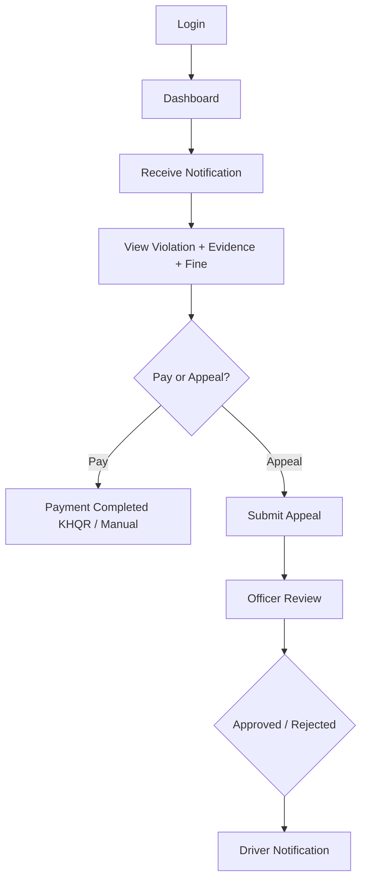

---

## 6. Admin workflow

```text
Login → Admin Dashboard
   ├── User Management
   ├── Police Management
   ├── Driver Management
   ├── Vehicle Management
   ├── Traffic Sign Management
   ├── Road Management
   ├── Camera Management
   ├── AI Model Management
   ├── Dataset Management
   ├── AI Training
   ├── AI Detection Logs
   ├── Violation Management
   ├── Fine Management
   ├── Appeal Management
   ├── Notification Management
   ├── Reports & Analytics
   ├── Audit Logs
   ├── Backup & Restore
   └── System Settings
```

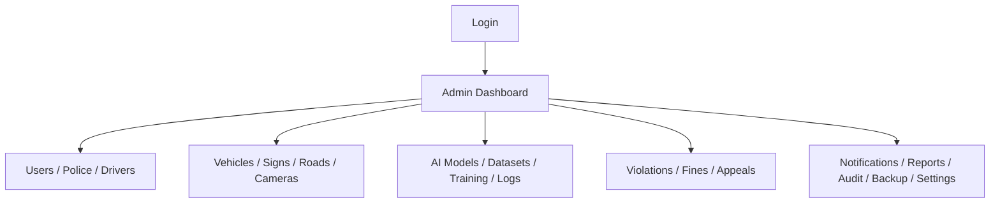

---

## 7. Violation workflow

```text
AI Detection → Suggested Violation → Officer Review
   → Reject → Rejected Log
   → Approve → Create Violation → Assign Driver → Create Fine → Notify Driver
```

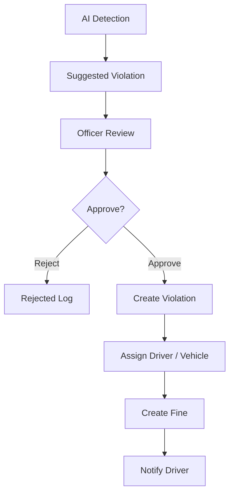

---

## 8. Fine workflow

```text
Violation Created → Fine Generated → Pending → Driver Action
   → Pay → Paid
   → Appeal → Officer Review → Approve (Fine Waived) | Reject (Fine Remains)
```

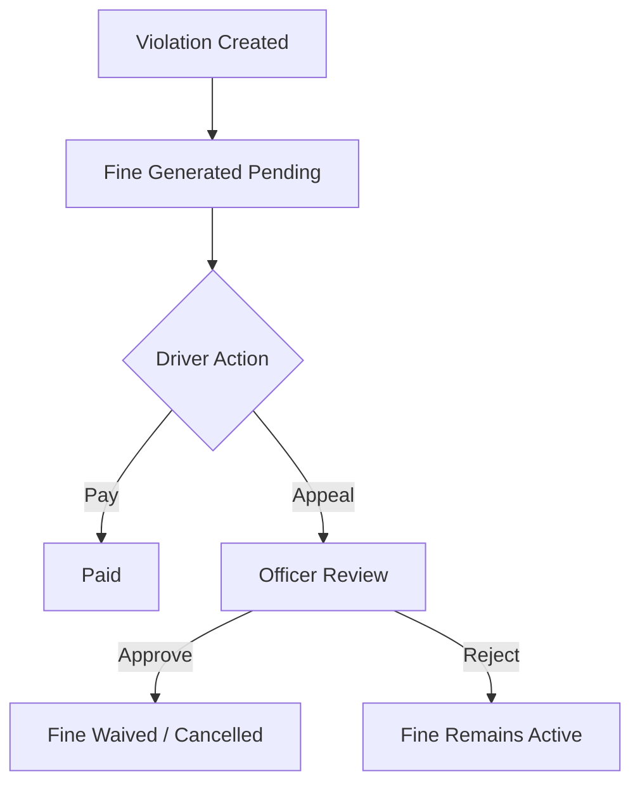

---

## 9. Appeal workflow

```text
Driver Submit Appeal → Pending → Police Review
   → Approve → Fine Cancelled → Notify Driver
   → Reject → Fine Active → Notify Driver
```

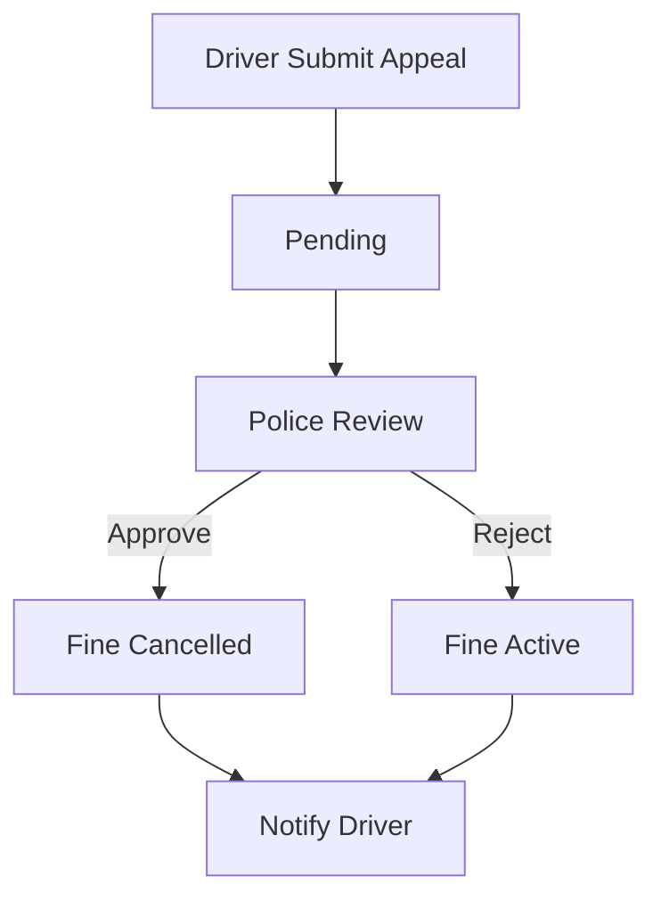

---

## 10. Notification workflow

```text
Triggers: Fine Created | Appeal Approved | Appeal Rejected | Password Reset | System Broadcast
   → Notification Service → In-App (always) | Email (when configured)
```

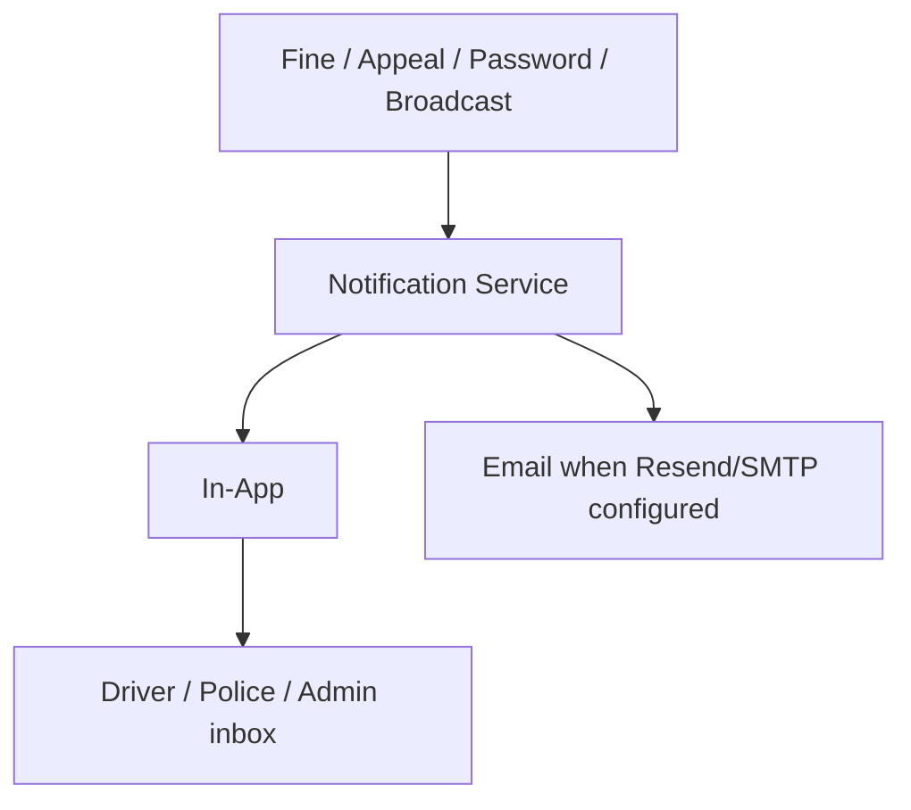

---

## 11. AI Model workflow

```text
Upload Dataset → Training → Validation → Evaluation → mAP Metrics
   → Upload Weight → Activate Model → Production Detection
```

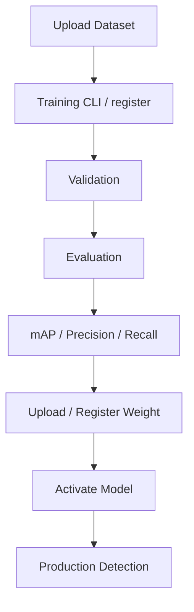

**Thesis note:** Training Center registers weights and shows history; remote GPU Start/Stop job server is optional — CLI training is the production thesis path.

---

## 12. Reporting workflow

```text
System Data → Dashboard Analytics → Generate Charts
   → PDF | Excel | Live Dashboard
```

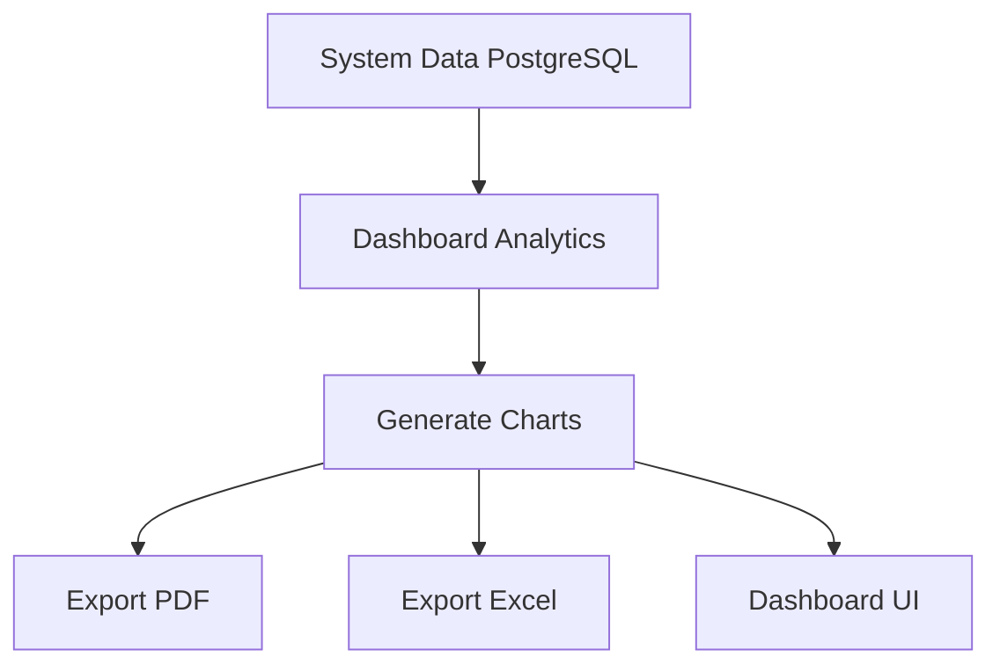

---

## 13. Complete end-to-end workflow

```text
Camera / Image / Video / Webcam
                │
                ▼
        AI Detection Engine
                │
                ▼
     Vehicle + Traffic Sign + OCR
                │
                ▼
      Violation Rule Engine
                │
                ▼
      Detection Log Database
                │
                ▼
        Police Review Screen
                │
      ┌─────────┴─────────┐
      │                   │
  Reject              Approve
      │                   │
      ▼                   ▼
 Rejected Log     Create Violation
                          │
                          ▼
                     Create Fine
                          │
                          ▼
                  Notify Driver
                          │
                          ▼
                 Driver Dashboard
                          │
              ┌───────────┴───────────┐
              │                       │
          Pay Fine              Submit Appeal
              │                       │
              ▼                       ▼
          Payment              Police Review
              │                       │
              └───────────┬───────────┘
                          ▼
                   Final Report
                          │
                          ▼
                    Admin Dashboard
```

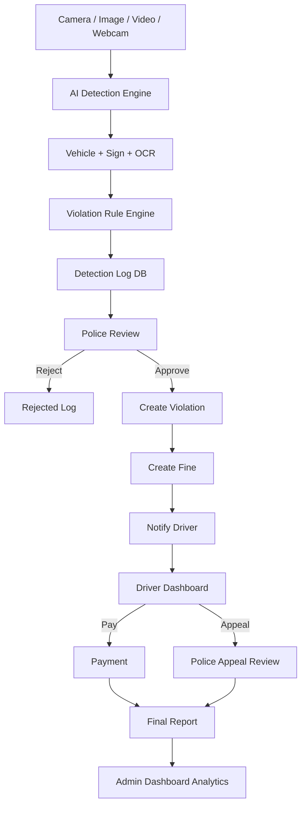

---

## 14. DFD Level 0 (Context)

```text
                    ┌──────────────────────────────────────┐
   Admin ──────────►│                                      │
   Officer ────────►│         CamTraffic System            │◄──── Cameras / Files
   Driver ─────────►│   (Web portals + API + AI + DB)      │
                    │                                      ├─────► Notifications
                    └──────────────────────────────────────┘
                                      │
                                      ▼
                                 PostgreSQL
```

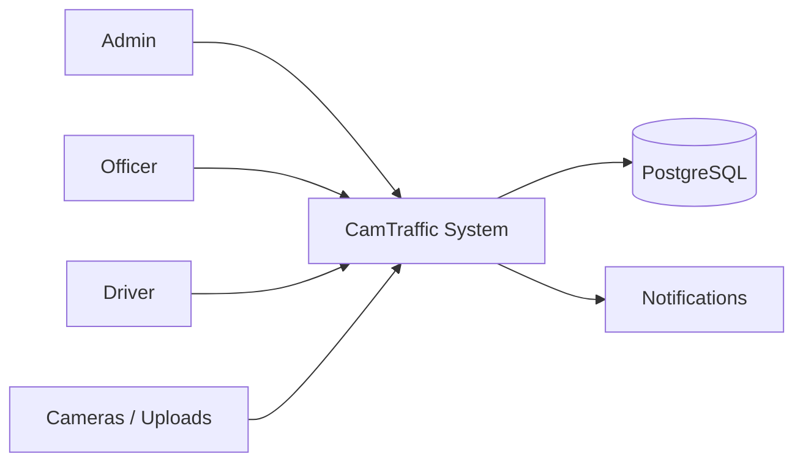

---

## 15. DFD Level 1 (Major processes)

| # | Process | Inputs | Outputs |
|---|---------|--------|---------|
| 1.0 | Authenticate & Authorize | credentials | JWT + role |
| 2.0 | Manage Master Data | admin CRUD | users, signs, cameras, vehicles |
| 3.0 | Detect & Enforce | frames/media | detection logs, draft violations |
| 4.0 | Review & Fine | officer decisions | violations, fines |
| 5.0 | Driver Respond | pay/appeal | payments, appeals |
| 6.0 | Notify & Report | events + queries | notifications, PDF/Excel |

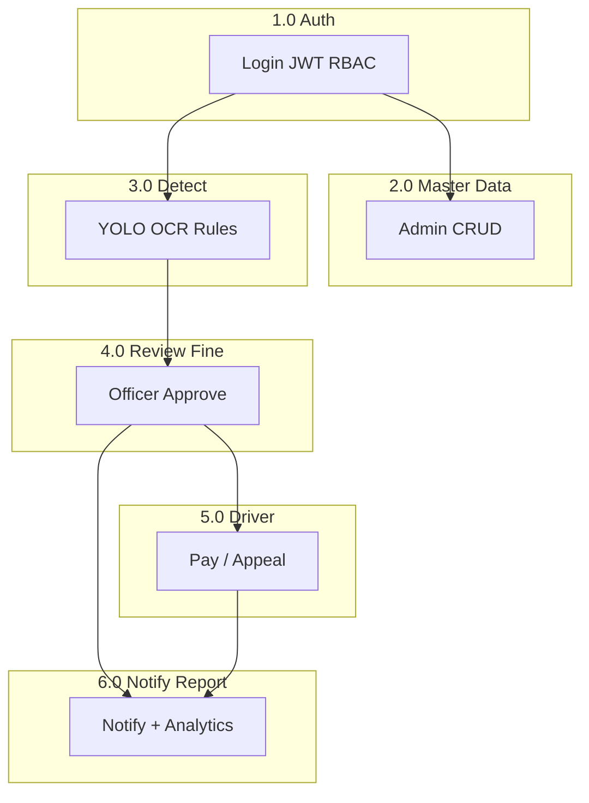

---

## 16. BPMN-style lane summary (thesis)

| Lane | Activities |
|------|------------|
| **AI Engine** | Ingest frame → detect vehicle/sign/plate → OCR → suggest violation → write log |
| **Police** | Select source → run detect → review → approve/reject → issue fine → review appeal |
| **Driver** | Receive notice → view evidence → pay or appeal → receive outcome |
| **Admin** | Configure data/AI → oversee violations/fines → report → backup/settings |
| **System** | JWT/RBAC · notifications · audit · exports |

---

## 17. Demo path (follow this workflow live)

1. **Admin** — login → dashboard KPIs → signs/cameras/AI metrics  
2. **Police** — upload image/video or webcam → review boxes + OCR → approve → issue fine  
3. **Driver** — notification → evidence → KHQR/manual pay **or** appeal  
4. **Police** (if appeal) — approve/reject → notify driver  
5. **Admin** — reports PDF/Excel + audit log  

**Flags:** `AI_USE_MOCK=False`, all `VITE_*` demo/mock flags `false`.

---

*Master Build Prompt system workflow — documented for CamTraffic thesis Chapter 3–4.*
