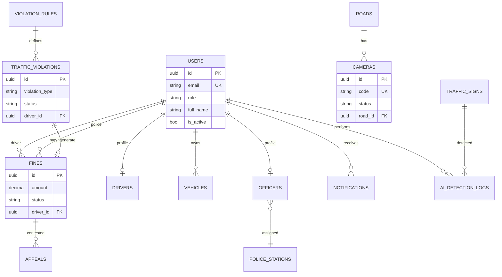

# CamTraffic — Database Documentation

**Version:** 1.0 · **Date:** July 2026  
**Authoritative source:** Django migrations in `backend/*/migrations/`  
**SQL reference:** `docs/SCHEMA.sql` (legacy overview; UUID keys in production)

---

## 1. Overview

| Item | Value |
|------|-------|
| Engine (dev) | SQLite (`USE_SQLITE=True`) |
| Engine (prod) | PostgreSQL 16 |
| Primary keys | UUID (`users`, violations, fines, cameras, …) |
| Apps | 16 Django apps with models |

---

## 2. Entity-Relationship Diagram



---

## 3. Core tables

### 3.1 Identity & access

| Table | Model | Description |
|-------|-------|-------------|
| `users` | `users.User` | Central account (admin, police, driver) |
| `officers` | `users.Officer` | Police profile extension |
| `drivers` | `users.Driver` | Driver profile + license |
| `roles` | `rbac.Role` | RBAC role definitions |
| `permissions` | `rbac.Permission` | Fine-grained permissions |
| `user_roles` | `rbac.UserRole` | User ↔ role assignment |

### 3.2 Enforcement

| Table | Description |
|-------|-------------|
| `violation_rules` | Sign class → prohibited action → default fine |
| `traffic_violations` | Detected violation records with evidence |
| `fines` | Monetary penalties linked to driver/police |
| `appeals` | Driver contest of fines |
| `unknown_vehicles` | Unregistered plate sightings |

### 3.3 AI & infrastructure

| Table | Description |
|-------|-------------|
| `ai_detection_logs` | Upload/webcam detection history |
| `ai_model_versions` | Registered YOLO weight versions |
| `roads` | Road segments with speed limits |
| `cameras` | Fixed cameras with frame source URLs |
| `police_stations` | Officer station registry |

### 3.4 Reference & ops

| Table | Description |
|-------|-------------|
| `traffic_signs` | Sign catalog (Khmer/English metadata) |
| `vehicles` | Registered vehicles by driver |
| `notifications` | In-app alerts per user |
| `audit_logs` | Admin action audit trail |
| `system_settings` | Key-value system configuration |

---

## 4. Key relationships

```
User (driver) ──1:N── Vehicle
User (driver) ──1:N── Fine
User (police) ──1:N── Fine (issued_by)
TrafficViolation ──0:1── Fine
Fine ──1:N── Appeal
Road ──1:N── Camera
ViolationRule ──1:N── TrafficViolation (via sign_class_key)
```

---

## 5. Indexes & performance

- `users`: `(role, is_active)`, `email`
- `users.license_no`, `vehicles.plate_number` — plate lookup
- `fines`: `(driver_id)`, `(status)`
- Foreign keys enforced at DB level in PostgreSQL

---

## 6. Migrations

```bash
cd backend
python manage.py migrate
python manage.py showmigrations
```

Seed reference data:

```bash
python manage.py seed_data          # traffic signs
python manage.py seed_violation_rules # violation rules
```

---

## 7. Backup

- Admin ZIP backup: `python manage.py backup_system`
- PostgreSQL dump: `deploy/scripts/backup_postgres.sh`
- See `deploy/env/BACKUP.md`
