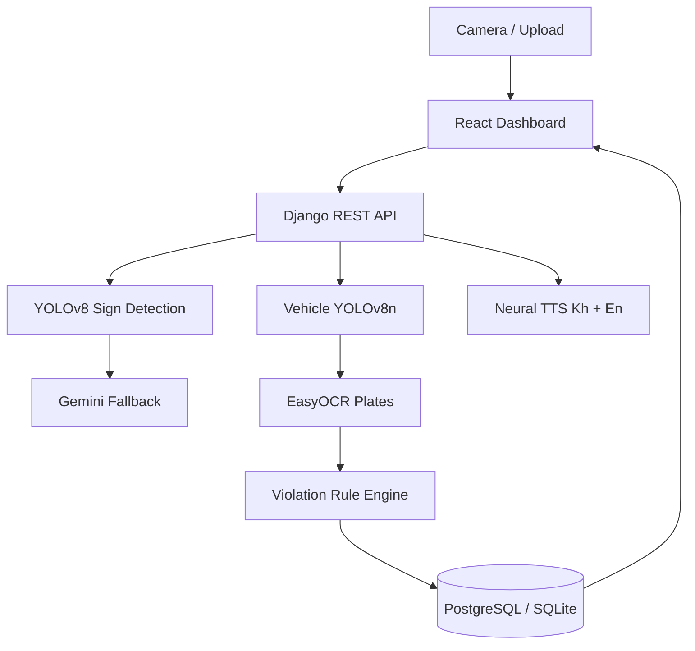

# CamTraffic — Defense Presentation Outline

**Thesis title:** Design and Development of an AI-Based Traffic Sign Detection and Traffic Law Enforcement System in Cambodia  
**Duration:** 15–20 minutes presentation + 10 minutes Q&A  
**Live demo:** Follow `DEMO_SCRIPT.md` (~10 min)

---

## Slide 1 — Title

- Thesis title (Khmer + English)
- Student name, supervisor, institution
- Date of defense

---

## Slide 2 — Problem Statement

- Cambodian roads use many official sign types; drivers need instant guidance
- Manual enforcement is slow; evidence and fines are hard to link digitally
- Need: automated sign recognition + rule-based violation detection + bilingual UI

---

## Slide 3 — Objectives

1. Build YOLOv8 model for Cambodia traffic signs
2. Integrate hybrid AI (YOLO + Gemini fallback)
3. Detect vehicles and read license plates (OCR)
4. Implement expert-system violation rules
5. Deliver React dashboard + Django API + PostgreSQL records

---

## Slide 4 — System Architecture



Reference: `docs/hybrid_detection_flow.md`, `docs/CHAPTER4_IMPLEMENTATION.md`

---

## Slide 5 — Technology Stack

| Layer | Stack |
|-------|-------|
| Frontend | React 18, Vite, Tailwind CSS, TypeScript |
| Backend | Django 4.2+, Django REST Framework, JWT |
| AI | YOLOv8 (Ultralytics), Google Gemini Vision, EasyOCR |
| Database | PostgreSQL (prod) / SQLite WAL (dev) |
| Speech | edge-tts (Khmer + English neural voices) |

---

## Slide 6 — Dataset & Sign Catalog

- **236** Cambodian traffic signs in catalog
- Categories: warning, prohibitory, mandatory, informative
- Metadata: `ai/sign_catalog.json`, `ai/reference_sign_meta.json`
- Bilingual Khmer + English names, descriptions, guidance
- Training subset: **19 enforcement-critical classes** (AI-06)

Screenshot: Traffic Signs page (grid view)

---

## Slide 7 — YOLOv8 Training (AI-06)

| Metric | Value |
|--------|-------|
| mAP@0.5 | **90.6%** |
| Precision | 76.4% |
| Recall | 78.0% |
| Epochs | 30 |

**Figures to insert:**
- `docs/thesis_evidence/AI-06/training/results.png`
- `docs/thesis_evidence/AI-06/training/confusion_matrix.png`
- Sample prediction: `NO_LEFT_TURN_No Left Turn_03_prediction.jpg`

---

## Slide 8 — Hybrid Detection Pipeline

1. Image received (webcam or upload)
2. YOLO sign detection (primary)
3. If confidence low → Gemini Vision fallback
4. Catalog + DB lookup for sign meaning
5. Vehicle detection (COCO YOLOv8n)
6. Plate OCR (EasyOCR)
7. Violation rule evaluation
8. ByteTrack vehicle IDs on live webcam (`track_session`)
9. Evidence saved → dashboard

Reference: `backend/ai_detection/pipeline.py`

---

## Slide 9 — Expert System (Violation Rules)

- **ViolationRule** table maps `(sign_class_key, prohibited_action)` → violation type
- Example: `NO_LEFT_TURN` + `LEFT_TURN` → `ILLEGAL_LEFT_TURN`
- API: `POST /api/violations/evaluate/`
- Auto-enforcement on detect when `observed_action` is provided

Screenshot: Violations page

---

## Slide 10 — OCR & Vehicle Detection

- YOLOv8n detects car, motorcycle, bus, truck
- EasyOCR reads Latin Cambodia plates (e.g. `2A-1234`)
- Demo image: `ai/test_samples/car_with_plate_2A-1234.jpg`
- Future: Khmer-script plate training

---

## Slide 11 — Web Dashboard

- Admin portal: stats, users, signs, violations, fines, AI logs
- User portal: driver fines, notifications
- AI Detection: webcam live scan + upload + pipeline steps panel
- Evidence Archive: unified search by plate (detections, violations, fines)
- Khmer/English language toggle

Screenshots: Dashboard, AI Detection result, Evidence Archive, Fine PDF

---

## Slide 12 — Integration Testing

- **130 backend tests** — all pass (28 E2E pipeline)
- Covers: auth, detect pipeline, violations, fines PDF, signs, TTS, evidence archive, ByteTrack session

```bash
python scripts/run_defense_integration.py --full-tests
```

Screenshot: terminal showing `Ran 130 tests` / `READY`

---

## Slide 13 — Results Summary

| Area | Result |
|------|--------|
| Sign training mAP@0.5 | 90.6% (19 classes) |
| Catalog coverage | 236 signs bilingual |
| Pipeline latency | < 3 s (CPU) |
| Integration tests | 130/130 pass |

Reference: `docs/CHAPTER5_RESULTS.md`

---

## Slide 14 — Limitations & Future Work

- Full 236-class YOLO retraining
- Khmer plate OCR
- ByteTrack vehicle tracking *(done — live webcam)*
- Native mobile app + FCM push *(mockup below)*
- Camera ROI spatial violations

Screenshot: Driver mobile flow — alert → violation detail → fine (`docs/screenshots/mobile_mockup_triptych.png`)

---

## Slide 15 — Conclusion

CamTraffic delivers an end-to-end AI + expert-system pipeline for Cambodian traffic enforcement: detect sign → detect vehicle → read plate → evaluate violation → store evidence → issue fine.

**Thank you / Q&A**

---

## Live Demo Checklist (after slides)

See `DEMO_SCRIPT.md` — run backend + frontend, then:

1. Login → Dashboard
2. AI Detection → webcam or upload
3. Full pipeline image (`car_with_plate_2A-1234.jpg`)
4. Violations + Fine PDF
5. (Optional) Run integration tests in terminal
