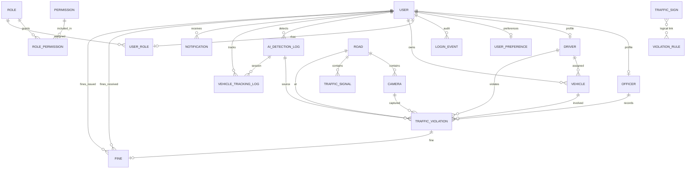

# CamTraffic — Entity Relationship Diagram (ERD)

**Thesis:** Design and Development of an AI-Based Traffic Sign Detection and Traffic Law Enforcement System in Cambodia

This document describes the **complete database ERD** for CamTraffic, based on Django models in `backend/`. Use it for thesis sections **2.6.4–2.6.6** (Relationship, ER Model, Data Dictionary).

> **Updating your thesis ERD.pdf?** See **[ERD_UPDATED.md](./ERD_UPDATED.md)** — side-by-side comparison with your original PDF, field fixes, and 7 entities to add.

> **Note:** `docs/SCHEMA.sql` is a **partial** schema (7 tables). The full system has **20 entities** — use this document as the authoritative ERD reference.

---

## 1. ERD Overview

CamTraffic uses a **relational database** (PostgreSQL in production, SQLite in development) with Django ORM. Entities group into six domains:

| Domain | Entities |
|--------|----------|
| **Users & security** | User, Officer, Driver, UserPreference, LoginEvent, Role, Permission, RolePermission, UserRole |
| **Traffic knowledge** | TrafficSign, ViolationRule |
| **Vehicles** | Vehicle |
| **Enforcement** | TrafficViolation, Fine |
| **AI & detection** | AIDetectionLog, VehicleTrackingLog |
| **Infrastructure** | Road, Camera, TrafficSignal |
| **Notifications** | Notification |

---

## 2. Core ERD (Recommended for Thesis Figure)

Use this **simplified diagram** in Chapter 3/4 — it shows the main business flow without RBAC detail.

```mermaid
erDiagram
    USER ||--o| OFFICER : "has profile"
    USER ||--o| DRIVER : "has profile"
    USER ||--o{ VEHICLE : "owns"
    DRIVER ||--o{ VEHICLE : "assigned to"

    USER ||--o{ AI_DETECTION_LOG : "performs"
    AI_DETECTION_LOG ||--o{ TRAFFIC_VIOLATION : "may trigger"

    DRIVER ||--o{ TRAFFIC_VIOLATION : "committed by"
    OFFICER ||--o{ TRAFFIC_VIOLATION : "recorded by"
    VEHICLE ||--o{ TRAFFIC_VIOLATION : "involves"
    CAMERA ||--o{ TRAFFIC_VIOLATION : "captured at"
    ROAD ||--o{ TRAFFIC_VIOLATION : "located on"

    TRAFFIC_VIOLATION ||--o| FINE : "generates"
    USER ||--o{ FINE : "driver receives"
    USER ||--o{ FINE : "police issues"

    ROAD ||--o{ CAMERA : "has"
    ROAD ||--o{ TRAFFIC_SIGNAL : "has"

    USER ||--o{ NOTIFICATION : "receives"

    TRAFFIC_SIGN }o..o{ VIOLATION_RULE : "linked by sign_class_key"

    USER {
        bigint id PK
        string email UK
        string full_name
        enum role "admin|police|driver"
        string license_no
        string auth_provider
    }

    DRIVER {
        bigint id PK
        bigint user_id FK UK
        string license_no UK
        date license_expiry
        enum status
    }

    OFFICER {
        bigint id PK
        bigint user_id FK UK
        string badge_no UK
        string rank
        enum status
    }

    VEHICLE {
        bigint id PK
        bigint owner_id FK
        bigint driver_id FK
        string plate_number UK
        enum vehicle_type
        enum status
    }

    TRAFFIC_SIGN {
        bigint id PK
        string sign_name
        string sign_code UK
        string sign_name_km
        enum category
        json rules
    }

    VIOLATION_RULE {
        bigint id PK
        string sign_class_key
        string prohibited_action
        string violation_type UK
        decimal default_fine_amount
    }

    AI_DETECTION_LOG {
        bigint id PK
        bigint user_id FK
        string detected_sign
        float confidence
        string detected_plate
        json detected_vehicles
    }

    TRAFFIC_VIOLATION {
        bigint id PK
        bigint driver_id FK
        bigint vehicle_id FK
        bigint officer_id FK
        bigint camera_id FK
        bigint road_id FK
        bigint ai_detection_log_id FK
        string violation_type
        enum status
        datetime violation_date
    }

    FINE {
        bigint id PK
        bigint driver_id FK
        bigint police_id FK
        bigint violation_id FK UK
        decimal amount
        enum status
        date due_date
    }

    ROAD {
        bigint id PK
        string name
        enum road_type
        int speed_limit
    }

    CAMERA {
        bigint id PK
        bigint road_id FK
        string code UK
        enum camera_type
        enum status
    }

    NOTIFICATION {
        bigint id PK
        bigint user_id FK
        string title
        enum type
        bool is_read
    }
```

---

## 3. Full ERD (All Entities)



---

## 4. Entity Descriptions & Relationships

### 4.1 User domain

| Entity | Table | Description | Key relationships |
|--------|-------|-------------|-------------------|
| **User** | `users` | Central account (admin, police, driver) | 1:1 Officer, Driver, UserPreference, UserRole; 1:N Vehicle, Fine, Notification, AIDetectionLog |
| **Officer** | `officers` | Police profile extension | 1:1 User; 1:N TrafficViolation |
| **Driver** | `drivers` | Driver profile extension | 1:1 User; 1:N Vehicle, TrafficViolation |
| **UserPreference** | `user_preferences` | Notification & security settings | 1:1 User |
| **LoginEvent** | `login_events` | Login audit trail | N:1 User |

**Cardinality:**
- One `User` has **at most one** `Officer` OR `Driver` profile (depending on role)
- One `User` owns **many** `Vehicle` records

---

### 4.2 RBAC domain

| Entity | Table | Description | Key relationships |
|--------|-------|-------------|-------------------|
| **Role** | `rbac_roles` | Named role (e.g. admin) | N:M Permission via RolePermission |
| **Permission** | `rbac_permissions` | Action on resource | N:M Role via RolePermission |
| **RolePermission** | `rbac_role_permissions` | Junction table | N:1 Role, N:1 Permission |
| **UserRole** | `rbac_user_roles` | User ↔ Role assignment | 1:1 User, N:1 Role |

> **Note:** CamTraffic also uses `User.role` field directly for portal access. RBAC tables provide extended permission modeling.

---

### 4.3 Traffic knowledge domain

| Entity | Table | Description | Key relationships |
|--------|-------|-------------|-------------------|
| **TrafficSign** | `traffic_signs` | 236+ Cambodia sign catalog (bilingual) | **No FK** — linked logically to ViolationRule |
| **ViolationRule** | `violation_rules` | Expert-system rules (sign + action → violation) | **No FK** — uses `sign_class_key` string |

**Logical relationship (Expert System knowledge base):**

```text
TrafficSign.sign_code / class_key  ←──matches──→  ViolationRule.sign_class_key
```

Example: Sign `NO_LEFT_TURN` + action `LEFT_TURN` → violation `ILLEGAL_LEFT_TURN`

---

### 4.4 Vehicle domain

| Entity | Table | Description | Key relationships |
|--------|-------|-------------|-------------------|
| **Vehicle** | `vehicles` | Registered vehicle | N:1 User (owner), N:1 Driver (optional); 1:N TrafficViolation |

**Cardinality:** 1 User → 0..N Vehicles; 1 Vehicle → 0..N Violations

---

### 4.5 Enforcement domain

| Entity | Table | Description | Key relationships |
|--------|-------|-------------|-------------------|
| **TrafficViolation** | `traffic_violations` | Recorded violation with evidence | N:1 Driver, Vehicle, Officer, Camera, Road, AIDetectionLog; 1:1 Fine |
| **Fine** | `fines` | Monetary penalty | N:1 User (driver), N:1 User (police); 1:1 TrafficViolation |

**Enforcement flow:**

```text
AIDetectionLog → evaluate_violation() → TrafficViolation → Fine
```

---

### 4.6 AI detection domain

| Entity | Table | Description | Key relationships |
|--------|-------|-------------|-------------------|
| **AIDetectionLog** | `ai_detection_logs` | Each sign detection session | N:1 User; 1:N VehicleTrackingLog; 1:N TrafficViolation |
| **VehicleTrackingLog** | `vehicle_tracking_logs` | ByteTrack IDs during live webcam | N:1 User, N:1 AIDetectionLog |

---

### 4.7 Infrastructure domain

| Entity | Table | Description | Key relationships |
|--------|-------|-------------|-------------------|
| **Road** | `roads` | Road segment / location | 1:N Camera, TrafficSignal, TrafficViolation |
| **Camera** | `cameras` | Traffic camera on a road | N:1 Road; 1:N TrafficViolation |
| **TrafficSignal** | `traffic_signals` | Signal timing at intersection | N:1 Road |

---

### 4.8 Notification domain

| Entity | Table | Description | Key relationships |
|--------|-------|-------------|-------------------|
| **Notification** | `notifications` | In-app alerts (fine, detection, system) | N:1 User |

---

## 5. Relationship Summary Table

| From | To | Type | Cardinality | On delete |
|------|-----|------|-------------|-----------|
| User | Officer | One-to-One | 1 : 0..1 | CASCADE |
| User | Driver | One-to-One | 1 : 0..1 | CASCADE |
| User | Vehicle | One-to-Many | 1 : N | CASCADE |
| User | Fine (driver) | One-to-Many | 1 : N | CASCADE |
| User | Fine (police) | One-to-Many | 1 : N | SET NULL |
| User | AIDetectionLog | One-to-Many | 1 : N | CASCADE |
| User | Notification | One-to-Many | 1 : N | CASCADE |
| Driver | TrafficViolation | One-to-Many | 1 : N | PROTECT |
| Officer | TrafficViolation | One-to-Many | 1 : N | SET NULL |
| Vehicle | TrafficViolation | One-to-Many | 1 : N | SET NULL |
| Camera | TrafficViolation | One-to-Many | 1 : N | SET NULL |
| Road | TrafficViolation | One-to-Many | 1 : N | SET NULL |
| Road | Camera | One-to-Many | 1 : N | PROTECT |
| AIDetectionLog | TrafficViolation | One-to-Many | 1 : N | SET NULL |
| TrafficViolation | Fine | One-to-One | 1 : 0..1 | SET NULL |
| TrafficSign | ViolationRule | Logical | N : M | (no FK) |
| Role | Permission | Many-to-Many | N : M | via RolePermission |

---

## 6. Main Business Flow (for DFD / ER narrative)

```text
                    ┌─────────────┐
                    │ TrafficSign │  (Knowledge base — 236 signs)
                    └──────┬──────┘
                           │ sign_class_key
                    ┌──────▼──────┐
                    │ViolationRule│  (Expert rules)
                    └──────┬──────┘
                           │
┌──────┐    detect    ┌────▼────────────┐    evaluate    ┌──────────────────┐
│ User │─────────────►│ AIDetectionLog  │───────────────►│ TrafficViolation │
└──┬───┘              └─────────────────┘                └────────┬─────────┘
   │ owns                                                          │ 1:1
   ▼                                                               ▼
┌─────────┐                                                  ┌─────────┐
│ Vehicle │◄──────────────── plate match ──────────────────│  Fine   │
└─────────┘                                                  └─────────┘
   ▲
   │ located on
┌──┴───┐    ┌────────┐
│ Road │───►│ Camera │
└──────┘    └────────┘
```

---

## 7. What Your Thesis ERD Might Be Missing

If you only used `docs/SCHEMA.sql`, these **11 entities are missing**:

| Missing entity | Why it matters for thesis |
|----------------|---------------------------|
| **officers** | Police profile (badge, rank) |
| **drivers** | Driver profile (license expiry) |
| **violation_rules** | **Expert system knowledge base** |
| **traffic_violations** | Core enforcement record |
| **roads** | Location / infrastructure |
| **cameras** | Camera monitoring module |
| **traffic_signals** | Road infrastructure |
| **vehicle_tracking_logs** | Live webcam vehicle tracking |
| **user_preferences** | User settings |
| **login_events** | Security audit |
| **rbac_*** (4 tables) | Role-based access control |

Also missing from old schema: bilingual fields on `traffic_signs` (`sign_name_km`, `description_en`), evidence fields on violations, OCR fields on AI logs.

---

## 8. Core Tables for Data Dictionary (Thesis 2.6.5)

### User (`users`)

| Field | Type | Description |
|-------|------|-------------|
| id | BIGINT PK | Primary key |
| email | VARCHAR(254) UK | Login email |
| full_name | VARCHAR(255) | Display name |
| role | ENUM | admin, police, driver |
| license_no | VARCHAR(50) | Optional driver license |
| auth_provider | ENUM | email, google, github |
| profile_image | FILE | Avatar path |
| created_at | TIMESTAMP | Registration date |

### TrafficSign (`traffic_signs`)

| Field | Type | Description |
|-------|------|-------------|
| id | BIGINT PK | Primary key |
| sign_name | VARCHAR(150) | Default name |
| sign_name_km | VARCHAR(200) | Khmer name |
| sign_name_en | VARCHAR(200) | English name |
| sign_code | VARCHAR(20) UK | e.g. P-030, W-022 |
| category | ENUM | warning, prohibitory, mandatory, informative |
| rules | JSON | Traffic rules list |
| image | FILE | Sign image |

### ViolationRule (`violation_rules`)

| Field | Type | Description |
|-------|------|-------------|
| id | BIGINT PK | Primary key |
| sign_class_key | VARCHAR(80) | e.g. NO_LEFT_TURN |
| prohibited_action | VARCHAR(50) | e.g. LEFT_TURN |
| violation_type | VARCHAR(50) | e.g. ILLEGAL_LEFT_TURN |
| default_fine_amount | DECIMAL | Default penalty amount |
| is_active | BOOLEAN | Rule enabled |

### AIDetectionLog (`ai_detection_logs`)

| Field | Type | Description |
|-------|------|-------------|
| id | BIGINT PK | Primary key |
| user_id | FK → users | Who ran detection |
| uploaded_image | FILE | Input image |
| detected_sign | VARCHAR(150) | Predicted sign name |
| confidence | FLOAT | Model confidence % |
| detected_plate | VARCHAR(30) | OCR plate text |
| detected_vehicles | JSON | Vehicle bounding boxes |
| model_version | VARCHAR(50) | YOLO weights version |

### TrafficViolation (`traffic_violations`)

| Field | Type | Description |
|-------|------|-------------|
| id | BIGINT PK | Primary key |
| driver_id | FK → drivers | Offending driver |
| vehicle_id | FK → vehicles | Vehicle involved |
| officer_id | FK → officers | Recording officer |
| ai_detection_log_id | FK → ai_detection_logs | Source detection |
| violation_type | VARCHAR(50) | Type of violation |
| status | ENUM | draft, pending_review, confirmed, rejected |
| evidence_image | FILE | Sign evidence snapshot |
| vehicle_evidence_image | FILE | Vehicle crop |
| plate_evidence_image | FILE | Plate crop |

### Fine (`fines`)

| Field | Type | Description |
|-------|------|-------------|
| id | BIGINT PK | Primary key |
| driver_id | FK → users | Driver fined |
| police_id | FK → users | Issuing officer |
| violation_id | FK UK → traffic_violations | Linked violation |
| amount | DECIMAL | Fine amount |
| status | ENUM | pending, paid, overdue, dismissed |
| due_date | DATE | Payment deadline |

---

## 9. How to Draw ERD for Word / Draw.io

### Recommended layout (left → right)

```text
[User] ── [Officer/Driver] ── [Vehicle]
   │
   ├── [AIDetectionLog] ── [VehicleTrackingLog]
   │         │
   │         └── [TrafficViolation] ── [Fine]
   │
   ├── [Notification]
   └── [LoginEvent]

[Road] ── [Camera]
   └── [TrafficSignal]

[TrafficSign] ··· [ViolationRule]   (dashed line = logical link)

[Role] ── [RolePermission] ── [Permission]
   └── [UserRole] ── [User]
```

### Symbols for thesis

| Symbol | Meaning |
|--------|---------|
| Rectangle | Entity |
| Diamond | Relationship (if using Chen notation) |
| Line 1 — N | One-to-many |
| Line 1 — 1 | One-to-one |
| Dashed line | Logical / non-FK relationship |
| PK | Primary key (underlined) |
| FK | Foreign key |
| UK | Unique key |

---

## 10. Suggested Thesis Figure Captions

**English:**
> Figure X: Entity Relationship Diagram of the CamTraffic database showing users, traffic signs, AI detection logs, violation rules, traffic violations, fines, vehicles, and road infrastructure.

**Khmer:**
> រូបភាព X៖ គំរូ Entity Relationship Diagram (ERD) នៃមូលដ្ឋានទិន្នន័យ CamTraffic បង្ហាញអ្នកប្រើប្រាស់ សញ្ញាចរាចរណ៍ កំណត់ត្រាការរកឃើញ AI � правилаរំលោភ កំរិតពិន័យ យានយន្ត និងហេដ្ឋារចនាសម្ព័ន្ធផ្លូវ។

---

## 11. Source Files

| Entity | Django model file |
|--------|-------------------|
| User, Officer, Driver | `backend/users/models.py` |
| TrafficSign | `backend/traffic_signs/models.py` |
| ViolationRule, TrafficViolation | `backend/violations/models.py` |
| Fine | `backend/fines/models.py` |
| Vehicle | `backend/vehicles/models.py` |
| AIDetectionLog, VehicleTrackingLog | `backend/ai_detection/models.py` |
| Road, Camera, TrafficSignal | `backend/infrastructure/models.py` |
| Notification | `backend/notifications/models.py` |
| Role, Permission, etc. | `backend/rbac/models.py` |

---

## 12. Related Documents

| Document | Purpose |
|----------|---------|
| [SYSTEM_ARCHITECTURE.md](./SYSTEM_ARCHITECTURE.md) | System architecture (complement to ERD) |
| [SCHEMA.sql](./SCHEMA.sql) | Partial SQL schema (legacy — 7 tables) |
| [CHAPTER4_IMPLEMENTATION.md](./CHAPTER4_IMPLEMENTATION.md) | Section 4.12 database tables |
| [content.md](./content.md) | Chapter 2 theory outline review |
| [ERD_UPDATED.md](./ERD_UPDATED.md) | Update guide from thesis ERD.pdf |

---

*CamTraffic ERD — 20 entities, aligned with Django models.*
