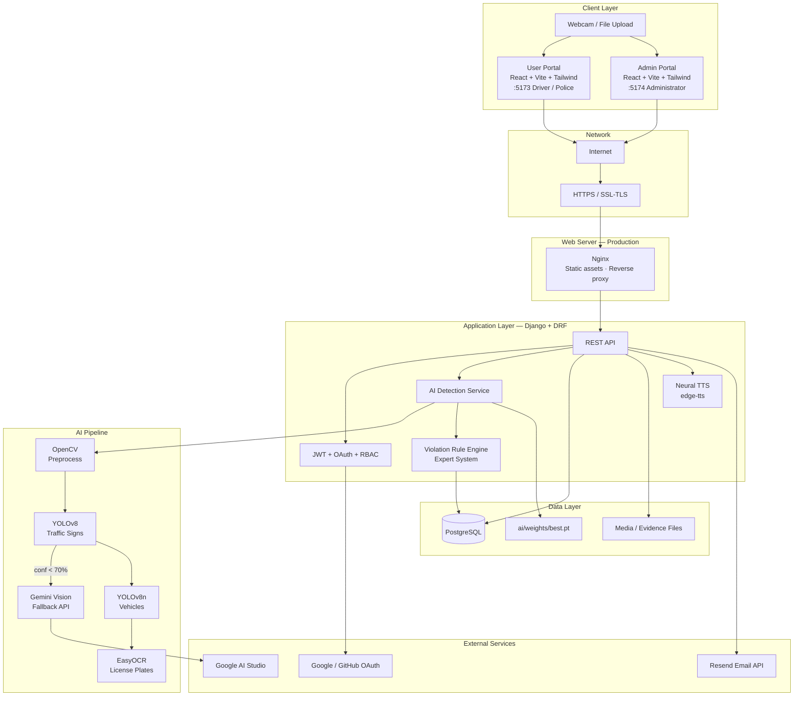
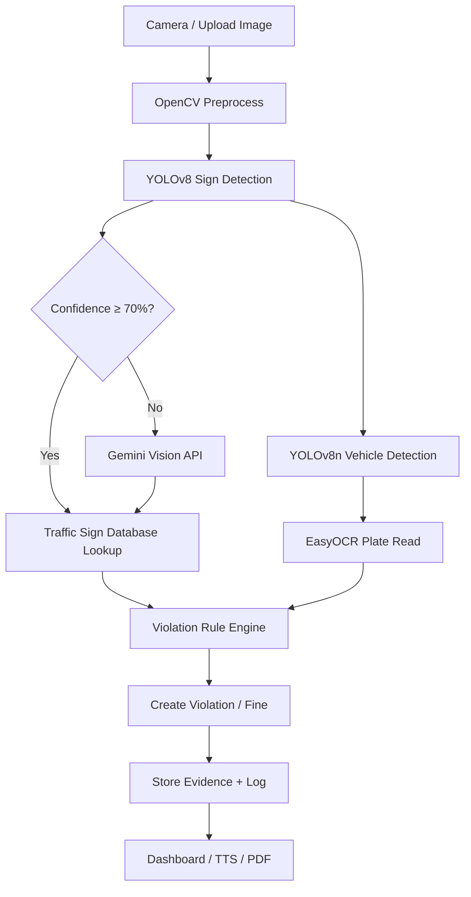

# CamTraffic — System Architecture Review

**Thesis:** Design and Development of an AI-Based Traffic Sign Detection and Traffic Law Enforcement System in Cambodia

This document compares your **thesis system architecture diagram** with the **actual CamTraffic implementation**, lists what is missing, what to fix, and provides an **updated architecture** you can use in Chapter 3 or Chapter 4.

---

## 1. Your Current Diagram — What It Shows

Your diagram (thesis architecture figure) includes:


| Layer          | Components in your diagram                                   |
| -------------- | ------------------------------------------------------------ |
| **Clients**    | Laptop (Web Client), Desktop Application, Mobile Application |
| **Network**    | Internet, HTTPS, SSL/TLS                                     |
| **Web server** | Nginx (static assets, reverse proxy, SSL)                    |
| **Frontend**   | ReactJS — UI, Dashboard, Admin Panel, PWA, Authentication    |
| **Backend**    | Django + REST API, YOLO, Traffic Law Logic, DPIA, User Auth  |
| **Data**       | PostgreSQL, Redis (cache/sessions), SMTP (email)             |


---

## 2. Comparison: Diagram vs Actual CamTraffic

### ✅ Correct — already in your diagram and in the project


| Component             | In diagram | In CamTraffic    | Evidence                                 |
| --------------------- | ---------- | ---------------- | ---------------------------------------- |
| Web browser client    | Yes        | Yes              | React SPA in browser                     |
| Internet / HTTPS      | Yes        | Yes (production) | `docs/DEPLOYMENT.md`, Certbot + Nginx    |
| Nginx                 | Yes        | Yes (production) | Serves `dist/`, proxies `/api/`          |
| React frontend        | Yes        | Yes              | `frontend-user/`, `frontend-admin/`      |
| Django backend        | Yes        | Yes              | `backend/`                               |
| REST API              | Yes        | Yes              | DRF — `docs/API.md`                      |
| YOLO object detection | Yes        | Yes              | YOLOv8 — `ai/weights/best.pt`            |
| Traffic law logic     | Yes        | Yes              | `ViolationRule` + `evaluate_violation()` |
| User authentication   | Yes        | Yes              | JWT + login/register                     |
| PostgreSQL            | Yes        | Yes              | Production DB — `docs/SCHEMA.sql`        |
| SMTP email            | Yes        | Yes (fallback)   | `backend/.env` SMTP settings             |


---

### ⚠️ Partially correct — needs update in diagram


| Component                  | In diagram               | Actual CamTraffic                                            | What to change                                                                  |
| -------------------------- | ------------------------ | ------------------------------------------------------------ | ------------------------------------------------------------------------------- |
| **ReactJS**                | Single app               | **Two portals**: User (`:5173`) + Admin (`:5174`)            | Show 2 React apps or label “User Portal + Admin Portal”                         |
| **YOLO**                   | Generic YOLO             | **YOLOv8 (Ultralytics)** + separate **YOLOv8n** for vehicles | Label “YOLOv8 Sign Model” and “YOLOv8n Vehicle Model”                           |
| **Mobile / Desktop apps**  | Separate boxes           | **Responsive web only** — no native desktop or mobile app    | Change to “Responsive Web (mobile-friendly)” or remove Desktop/Mobile app boxes |
| **Reverse proxy → Django** | uWSGI                    | **Gunicorn** (WSGI) in deployment docs                       | Replace “uWSGI” with “Gunicorn”                                                 |
| **Email**                  | SMTP only                | **Resend API** (primary) + SMTP (fallback)                   | Add “Resend API” box                                                            |
| **PWA**                    | Listed in React features | Not fully implemented as installable PWA                     | Remove PWA or mark as “future work”                                             |
| **DPIA**                   | Listed in Django         | Privacy concept only — not a code module                     | Move to “Security & Privacy” note, not a runtime component                      |


---

### ❌ Missing from your diagram — but implemented in CamTraffic

Add these to make the architecture match the real system.

#### A. AI & Computer Vision (high priority)


| Missing component         | Role                                   | Location                                       |
| ------------------------- | -------------------------------------- | ---------------------------------------------- |
| **Gemini Vision API**     | Fallback when YOLO confidence < 70%    | `backend/ai_detection/gemini_service.py`       |
| **OpenCV**                | Image resize, crop, preprocess         | `backend/ai_detection/services.py`             |
| **EasyOCR**               | License plate reading (e.g. `2A-1234`) | `backend/ai_detection/plate_ocr.py`            |
| **AI module (`ai/`)**     | Training, weights, dataset             | `ai/train.py`, `ai/build_dataset.py`           |
| **Webcam (browser)**      | Live sign detection                    | `useWebcamDetection.ts`, `LiveWebcamPanel.tsx` |
| **Hybrid detection flow** | YOLO → Gemini → DB lookup              | `docs/hybrid_detection_flow.md`                |


#### B. Expert System & Enforcement


| Missing component         | Role                                       | Location                                   |
| ------------------------- | ------------------------------------------ | ------------------------------------------ |
| **Violation Rule Engine** | Rule-based expert system                   | `backend/violations/services.py`           |
| **ViolationRule model**   | Knowledge base (sign + action → violation) | `backend/violations/models.py`             |
| **Evidence capture**      | Store frame, vehicle, plate snapshots      | `backend/ai_detection/evidence_capture.py` |
| **Fine / PDF export**     | Digital enforcement records                | ReportLab — `backend/fines/views.py`       |


#### C. Security & Authentication


| Missing component   | Role                             | Location                                |
| ------------------- | -------------------------------- | --------------------------------------- |
| **JWT (SimpleJWT)** | Stateless API tokens             | `rest_framework_simplejwt`              |
| **RBAC**            | Admin / Police / Driver roles    | `backend/rbac/`, role checks on portals |
| **OAuth 2.0**       | Google + GitHub login            | `backend/authentication/`               |
| **CORS**            | Cross-origin API for 2 frontends | `django-cors-headers`                   |


#### D. Frontend stack (not shown in diagram)


| Missing component          | Role                    | Location                         |
| -------------------------- | ----------------------- | -------------------------------- |
| **Vite**                   | Build tool + dev server | `vite.config.ts`                 |
| **TypeScript**             | Typed frontend code     | All `.tsx` / `.ts` files         |
| **Tailwind CSS 4**         | Styling (not Bootstrap) | `shared/styles/dashboard.css`    |
| **Axios**                  | HTTP client to REST API | `shared/services/axiosClient.ts` |
| **i18n (Khmer + English)** | Bilingual UI            | `shared/i18n/translations.ts`    |


#### E. External services


| Missing component         | Role                        | Location                                 |
| ------------------------- | --------------------------- | ---------------------------------------- |
| **Resend API**            | Password reset emails       | `backend/authentication/resend_email.py` |
| **Google AI Studio**      | Gemini API key              | `GEMINI_API_KEY` in `.env`               |
| **edge-tts**              | Khmer/English neural speech | `backend/ai_detection/tts.py`            |
| **Google / GitHub OAuth** | Social login providers      | OAuth env vars                           |


#### F. Storage (beyond PostgreSQL)


| Missing component        | Role                                  | Location                                    |
| ------------------------ | ------------------------------------- | ------------------------------------------- |
| **Media / file storage** | Uploads, evidence images, sign images | `backend/media/`                            |
| **SQLite (development)** | Local dev database                    | `backend/db.sqlite3` when `USE_SQLITE=True` |
| **Model weights**        | Trained YOLO files                    | `ai/weights/best.pt`                        |


#### G. Other features


| Missing component        | Role                      | Location                   |
| ------------------------ | ------------------------- | -------------------------- |
| **Traffic sign chatbot** | Q&A about signs           | `POST /api/signs/chatbot/` |
| **Notifications**        | In-app alerts             | `backend/notifications/`   |
| **AI detection logs**    | Audit trail of detections | `AIDetectionLog` model     |
| **Cameras module**       | Camera management UI      | `CamerasPage.tsx`          |


---

### ❌ In your diagram but NOT in CamTraffic

Remove or mark as “planned / optional” so the thesis matches the code.


| Component               | Status in CamTraffic                                  | Recommendation                                   |
| ----------------------- | ----------------------------------------------------- | ------------------------------------------------ |
| **Redis**               | Not used — no Redis in `requirements.txt` or settings | Remove from diagram OR label “Optional / Future” |
| **Desktop Application** | No separate desktop app                               | Replace with “Web Browser (Desktop)”             |
| **Mobile Application**  | No native app — responsive web only                   | Replace with “Web Browser (Mobile)”              |
| **uWSGI**               | Uses **Gunicorn** instead                             | Change label to Gunicorn                         |
| **PWA**                 | Not implemented                                       | Remove or “Future enhancement”                   |
| **DPIA module**         | Not a software component                              | Mention in privacy section, not architecture box |


---

## 3. Updated System Architecture (Recommended for Thesis)

Use this version — it matches the **current CamTraffic codebase**.

### 3.1 Text diagram

```text
┌─────────────────────────────────────────────────────────────────────────┐
│                         CLIENT LAYER                                     │
│  Web Browser (Desktop / Mobile — Responsive)                             │
│  ├── User Portal (React + Vite)     :5173  — Driver, Police             │
│  └── Admin Portal (React + Vite)    :5174  — Administrator             │
│       Webcam (getUserMedia) · Upload · Axios · JWT · i18n (KM/EN)         │
└───────────────────────────────┬─────────────────────────────────────────┘
                                │ HTTPS
                                │ REST API (JSON) + Bearer JWT
┌───────────────────────────────▼─────────────────────────────────────────┐
│                    WEB SERVER (Production)                               │
│  Nginx — SSL/TLS · Static (dist/) · Reverse proxy /api/ · /media/       │
└───────────────────────────────┬─────────────────────────────────────────┘
                                │ Gunicorn (WSGI)
┌───────────────────────────────▼─────────────────────────────────────────┐
│                    APPLICATION LAYER — Django 4.2 + DRF                    │
│  ┌─────────────┐ ┌──────────────┐ ┌────────────────┐ ┌─────────────────┐ │
│  │ Auth        │ │ RBAC         │ │ REST API       │ │ Notifications   │ │
│  │ JWT · OAuth │ │ Admin/Police │ │ Signs·Fines·   │ │ Email (Resend)  │ │
│  │             │ │ /Driver      │ │ Violations·AI  │ │                 │ │
│  └─────────────┘ └──────────────┘ └────────────────┘ └─────────────────┘ │
│                                                                          │
│  ┌──────────────────────── AI DETECTION PIPELINE ──────────────────────┐ │
│  │ Upload / Webcam → OpenCV → YOLOv8 (Signs) → [Gemini if conf < 70%]  │ │
│  │                → YOLOv8n (Vehicles) → EasyOCR (Plates)              │ │
│  │                → Sign DB Lookup → Violation Rule Engine           │ │
│  │                → Evidence Capture → TTS (edge-tts)                  │ │
│  └─────────────────────────────────────────────────────────────────────┘ │
└───────────────┬─────────────────────────────┬───────────────────────────┘
                │                             │
┌───────────────▼──────────────┐   ┌──────────▼──────────────────────────┐
│ DATA LAYER                    │   │ EXTERNAL SERVICES                    │
│ PostgreSQL (prod)             │   │ Google Gemini Vision API             │
│ SQLite (dev)                  │   │ Resend (email) · OAuth (Google/GitHub)│
│ Media storage (uploads)       │   │ Microsoft Edge TTS (edge-tts)      │
│ AI weights (ai/weights/)      │   │                                      │
└──────────────────────────────┘   └──────────────────────────────────────┘
```

### 3.2 Mermaid diagram (for thesis / Markdown)




### 3.3 Detection pipeline (add as second figure)




---

## 4. Checklist — Update Your Thesis Diagram

Use this when editing your architecture figure in Word/PowerPoint/Draw.io.

### Remove or relabel

- [ ] Remove **Redis** (or mark Optional/Future)
- [ ] Replace **Desktop App** and **Mobile App** with **Responsive Web Browser**
- [ ] Replace **uWSGI** with **Gunicorn**
- [ ] Remove **PWA** unless you implement it
- [ ] Move **DPIA** out of runtime architecture (privacy chapter instead)

### Add to diagram

- [ ] **Two React portals** (User + Admin)
- [ ] **Vite + TypeScript + Tailwind CSS**
- [ ] **JWT + RBAC** (Admin / Police / Driver)
- [ ] **OAuth 2.0** (Google, GitHub)
- [ ] **Gemini Vision** (hybrid AI fallback)
- [ ] **EasyOCR** (license plates)
- [ ] **YOLOv8n** (vehicle detection)
- [ ] **Violation Rule Engine** (Expert System)
- [ ] **Media / evidence storage**
- [ ] **Resend API** (email)
- [ ] **edge-tts** (Khmer/English speech)
- [ ] **OpenCV** (image processing)
- [ ] **Webcam** input from browser

### Keep as-is

- [ ] Internet, HTTPS, SSL/TLS
- [ ] Nginx
- [ ] React, Django, REST API
- [ ] YOLO (upgrade label to YOLOv8)
- [ ] PostgreSQL
- [ ] SMTP (as fallback alongside Resend)

---

## 5. Layer Summary Table (for thesis)


| Layer             | Technologies in CamTraffic                                      |
| ----------------- | --------------------------------------------------------------- |
| **Presentation**  | React 18, TypeScript, Vite, Tailwind CSS 4, Axios, i18n (KM/EN) |
| **Web server**    | Nginx (prod), Vite dev server (dev)                             |
| **Application**   | Django 4.2, DRF, SimpleJWT, django-cors-headers, django-filter  |
| **AI / CV**       | YOLOv8, YOLOv8n, OpenCV, Ultralytics, Gemini Vision, EasyOCR    |
| **Expert system** | ViolationRule, evaluate_violation(), pipeline_enforcement       |
| **Data**          | PostgreSQL, SQLite (dev), Django ORM, file media storage        |
| **External APIs** | Resend, Google/GitHub OAuth, Google Gemini, edge-tts            |
| **Deployment**    | Gunicorn, Nginx, Certbot (SSL)                                  |


---

## 6. Development vs Production Architecture


| Aspect   | Development (current)        | Production (thesis target)  |
| -------- | ---------------------------- | --------------------------- |
| Frontend | Vite `:5173` + `:5174`       | Nginx serves `dist/`        |
| Backend  | `python manage.py runserver` | Gunicorn on port 8000       |
| Database | SQLite (`USE_SQLITE=True`)   | PostgreSQL                  |
| SSL      | HTTP localhost               | HTTPS + Certbot             |
| AI model | Local `ai/weights/best.pt`   | Same path on server         |
| Email    | Resend or SMTP from `.env`   | Resend with verified domain |


---

## 7. Related Documentation


| File                              | Purpose                                |
| --------------------------------- | -------------------------------------- |
| `README.md`                       | Project overview + simple architecture |
| `docs/DEPLOYMENT.md`              | Nginx + Gunicorn production setup      |
| `docs/hybrid_detection_flow.md`   | YOLO + Gemini decision rules           |
| `docs/API.md`                     | REST API endpoints                     |
| `docs/SCHEMA.sql`                 | Database schema                        |
| `docs/CHAPTER4_IMPLEMENTATION.md` | Chapter 4 code mapping                 |
| `docs/content.md`                 | Chapter 2 theory outline review        |
| `PRD.md`                          | Requirements and scope                 |


---

## 8. Conclusion

Your current architecture diagram covers the **core skeleton** (Client → Nginx → React → Django → YOLO → PostgreSQL) correctly.

To fully match CamTraffic, you should **add ~15 components** (Gemini, EasyOCR, Expert System, dual portals, JWT/RBAC, OAuth, Resend, TTS, media storage, etc.) and **remove or fix ~5 items** (Redis, native mobile/desktop apps, uWSGI, PWA, DPIA as a code box).

The **updated diagrams in Section 3** are ready to copy into your thesis Chapter 3 (System Design) or Chapter 4 (Implementation).

---

*CamTraffic system architecture review — aligned with codebase as of 2026.*