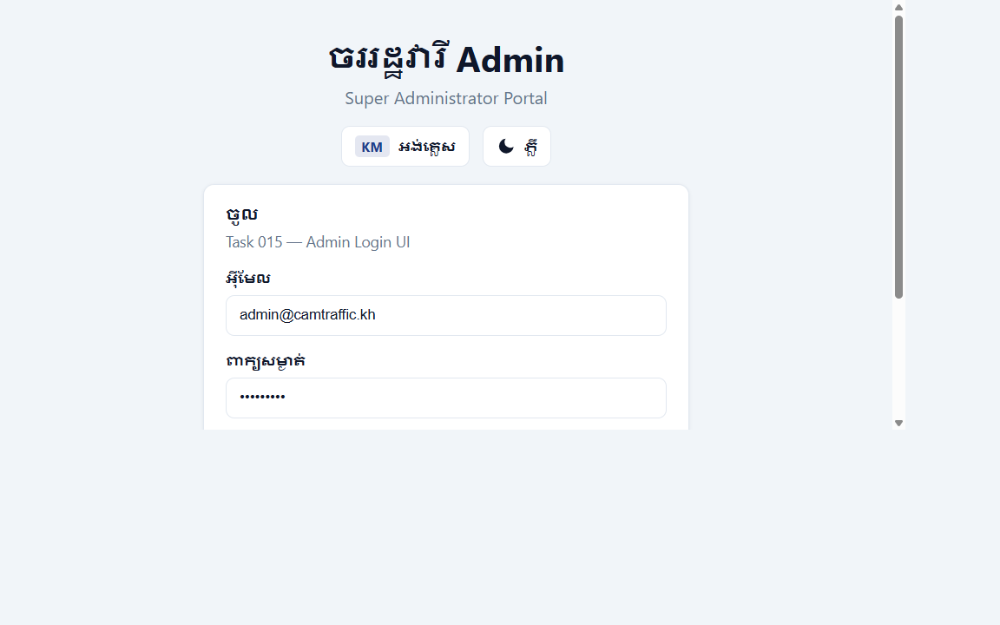
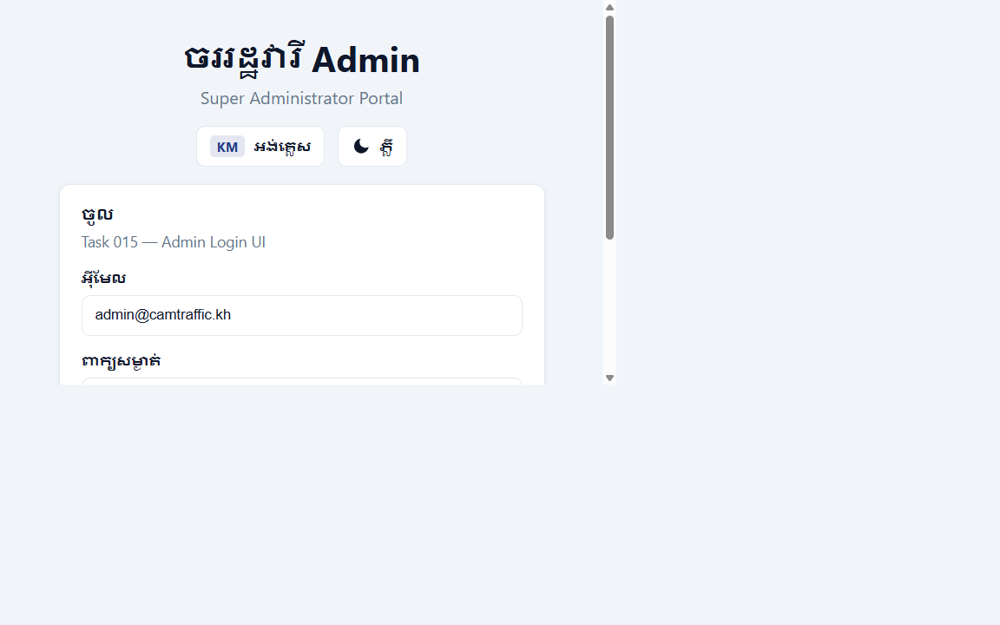

# CamTraffic User Manual

**Version**: 1.0 | **Audience**: Traffic Officers, Drivers, Administrators
**Language**: English (Khmer version available in-app)

---

## Part 1 — Getting Started

### 1.1 Accessing the System

| Portal | URL | For |
|--------|-----|-----|
| Admin Portal | `https://admin.camtraffic.kh` | Super Admin / Admin |
| Officer & Driver Portal | `https://app.camtraffic.kh` | Officers and Drivers |
| API Base | `https://api.camtraffic.kh/api/v1/` | API clients |

### 1.2 Logging In

1. Open the portal in your browser.
2. Enter your **email** and **password**.
3. Click **Sign In**.
4. The system will redirect you to your role-specific dashboard.

> If you have forgotten your password, click **Forgot Password** and follow the email link.

### 1.3 Language

Click the language toggle (🌐) in the top-right corner to switch between **English** and **Khmer**.

### 1.4 Real Screenshots (Deployed Stack)

Captured from the deployed CamTraffic web portal (local production validation run):





Additional capture artifacts:
- `docs/assets/screenshots/admin-cameras.png`
- `docs/assets/screenshots/admin-reports.png`
- `docs/assets/screenshots/admin-monitoring.png`

---

## Part 2 — For Traffic Officers

### 2.1 Dashboard

After login, the officer dashboard shows:
- **Today's detections** at your station's cameras.
- **Pending violations** awaiting your review.
- **Active cameras** and their status.
- **Unread notifications**.

### 2.2 Reviewing Violations

1. Navigate to **Violations → Review Queue**.
2. Click a violation to see:
   - Detection image with bounding box.
   - Detected traffic sign and confidence score.
   - License plate (OCR result).
   - Vehicle and driver details.
3. Click **Approve** or **Reject**.
4. Add officer notes (required for rejection).
5. Approved violations auto-generate a fine.

### 2.3 Live Detection Monitor

1. Go to **Detections → Live Monitor**.
2. Select a camera from the dropdown.
3. New detections appear automatically (refreshed every few seconds).
4. Click any detection row for full details.

### 2.4 Managing Drivers and Vehicles

- **Drivers → Management**: Create, search, and update driver profiles.
- **Vehicles → Management**: Register vehicles, link to drivers, view violation history.

### 2.5 Notifications

- The bell icon (🔔) shows your unread notification count.
- Click a notification to view the related detection.
- Use **Mark All Read** to clear the badge.

### 2.6 Reports

1. Go to **Reports**.
2. Select report type (violations, fines, detections).
3. Set date range and filters.
4. Click **Generate** → download as CSV or PDF.

---

## Part 3 — For Drivers

### 3.1 Dashboard

Your dashboard shows:
- Active violations awaiting payment or appeal.
- Recent fine history.
- Registered vehicles.

### 3.2 Viewing Violations

1. Go to **Violations → My Violations**.
2. Each violation shows:
   - Location (camera), date and time.
   - Traffic sign violated.
   - Attached evidence image.
   - Status (Pending, Approved, Rejected, Appealed).

### 3.3 Paying a Fine

1. Go to **Fines → My Fines**.
2. Select an unpaid fine.
3. Review the amount and due date.
4. Click **Pay Now** and confirm.
5. A receipt is available under **Fines → Payment History**.

### 3.4 Submitting an Appeal

1. Go to **Violations → My Violations**.
2. Select an approved violation (appeals must be submitted before the appeal deadline).
3. Click **Submit Appeal**.
4. Enter your reason and attach supporting documents (optional).
5. Track appeal status under **Appeals**.

### 3.5 Managing Vehicles

1. Go to **My Vehicles**.
2. View registered vehicles and their violation history.
3. Contact your station officer to register a new vehicle.

### 3.6 Profile Settings

- Go to **Profile** to update your phone number and notification preferences.
- Enable/disable email and in-app notifications.

---

## Part 4 — For Administrators

### 4.1 User Management

- **Users → Management**: Create, edit, and deactivate user accounts.
- Assign roles: `super_admin`, `admin`, `officer`, `driver`.

### 4.2 Camera Management

1. Go to **Cameras → Management**.
2. Create a camera: set code, location, station, and RTSP stream URL.
3. Use **Health Check** to verify camera connectivity.
4. Deactivate cameras that are offline for extended periods.

### 4.3 AI Model Management

1. Go to **AI Models**.
2. View active model versions and accuracy metrics.
3. After training a new model, deploy weights using the integration CLI:
   ```bash
   python ai-service/training/integrate/deploy_models.py --yolo-weights path/to/best.pt
   ```

### 4.4 System Settings

- Go to **System → Settings** to configure:
  - Default currency (KHR/USD)
  - Fine due days (default: 30)
  - Backup retention policies

### 4.5 Audit Logs

- Go to **Audit** to view a full log of all system actions.
- Filter by user, action type, and date.

---

## Part 5 — Troubleshooting

| Problem | Solution |
|---------|---------|
| Cannot log in | Check email/password; use Forgot Password if needed |
| Detection not appearing | Verify the camera is ONLINE and AI service is running |
| Fine not generated | Check that the violation was Approved by an officer |
| Live feed not updating | Refresh the page; check browser SSE support |
| AI service shows "mock mode" | Deploy trained weights and set `AI_DETECTION_MODE=yolo` |

---

## Part 6 — Glossary

| Term | Definition |
|------|-----------|
| Detection | An AI-identified object (traffic sign / vehicle) captured by a camera |
| OCR | Automatic license plate text recognition |
| Violation | A confirmed traffic law infringement linked to a detected sign + vehicle |
| Fine | Financial penalty automatically issued for an approved violation |
| Appeal | A formal dispute submitted by a driver against a violation |
| Station | A traffic police station that oversees one or more cameras |
