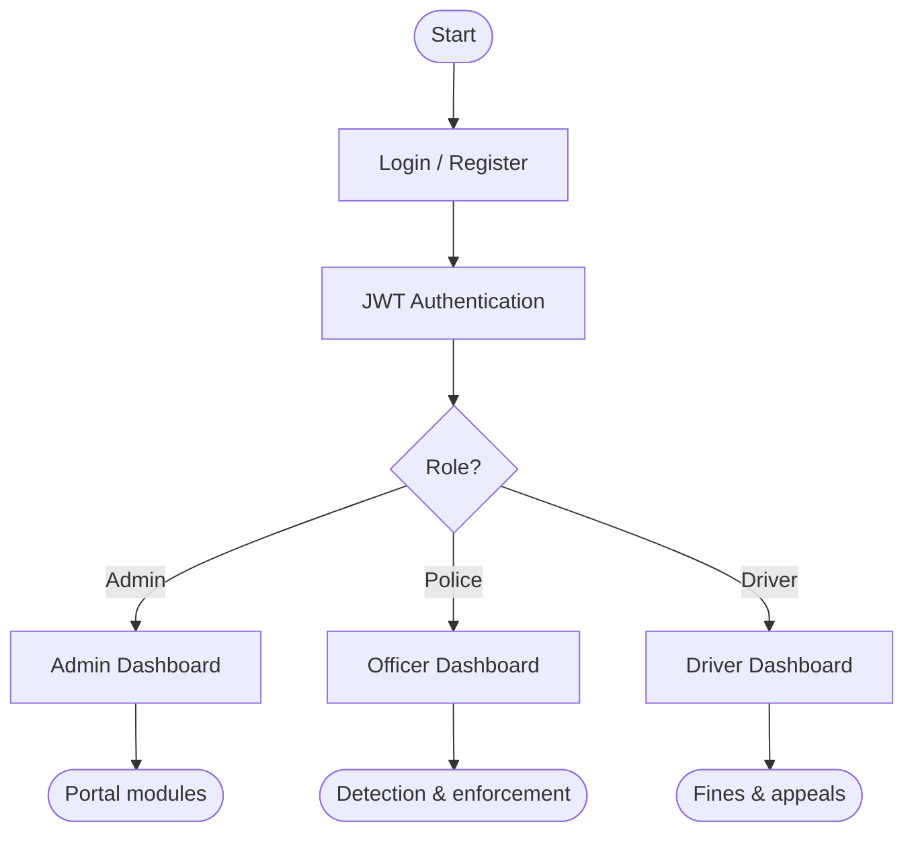
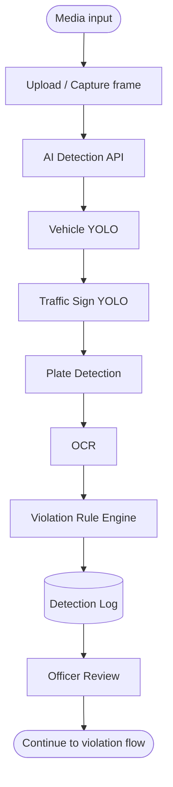
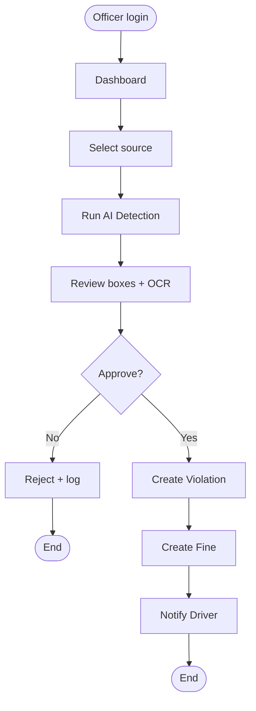
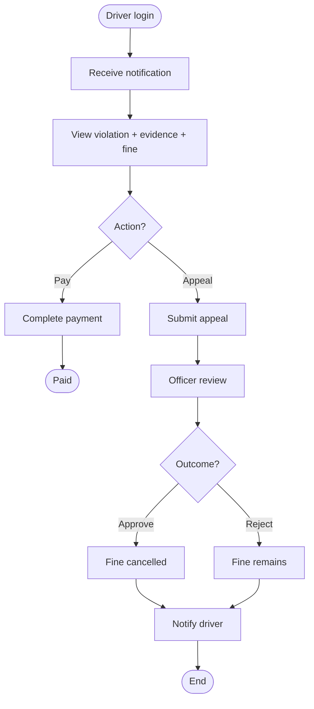
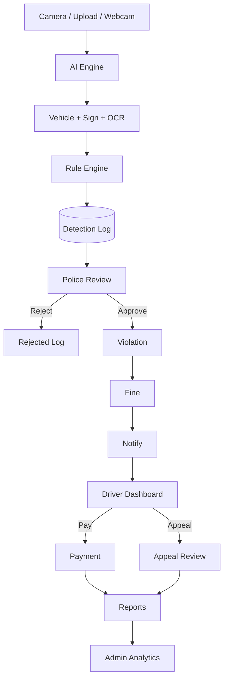
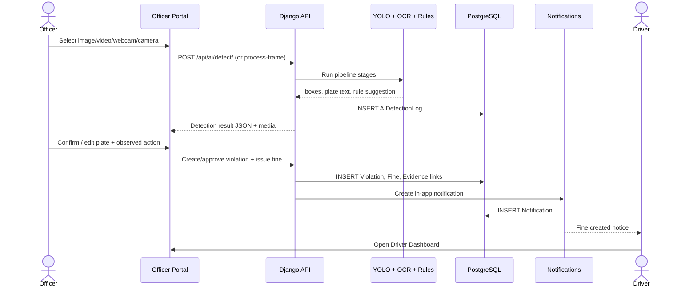
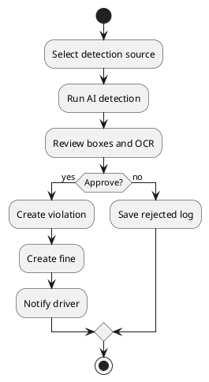

# Activity Diagrams — Master Build Workflows

**Thesis:** AI-Based Traffic Sign Detection and Traffic Law Enforcement System in Cambodia  
**Chapter:** 3–4 (System Analysis & Design)  
**Source:** [`docs/COMPLETE-SYSTEM-WORKFLOW.md`](../../COMPLETE-SYSTEM-WORKFLOW.md)

Paste Mermaid into draw.io, PlantUML converters, or thesis Markdown exporters.

---

## A1 — Role entry

---

## A2 — AI detection pipeline

---

## A3 — Police detection → fine

---

## A4 — Driver pay / appeal

---

## A5 — End-to-end enforcement

---

## Sequence — Officer detect to notify (refined)

---

## PlantUML activity (optional export)

---

*Use with COMPLETE-SYSTEM-WORKFLOW.md for full ASCII + Mermaid + DFD Level 0–1.*
