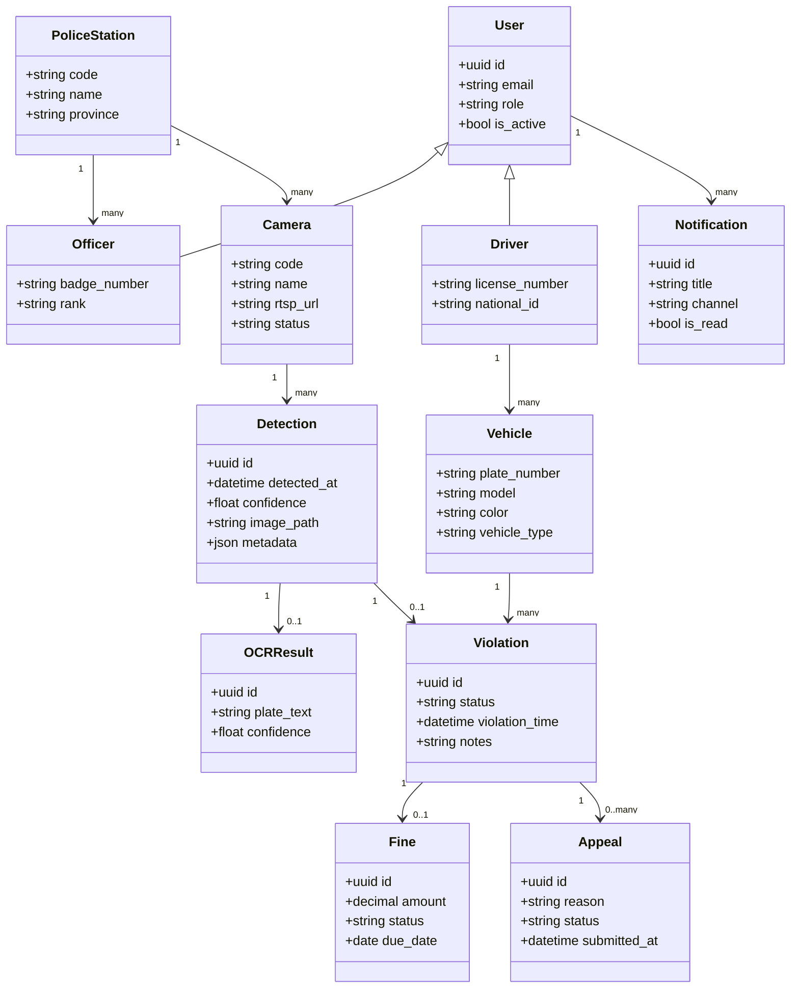

# Class Diagram (Task 226)

```mermaid
classDiagram
    class User {
      +uuid id
      +string email
      +string role
      +bool is_active
    }

    class Officer {
      +string badge_number
      +string rank
    }

    class Driver {
      +string license_number
      +string national_id
    }

    class PoliceStation {
      +string code
      +string name
      +string province
    }

    class Camera {
      +string code
      +string name
      +string rtsp_url
      +string status
    }

    class Detection {
      +uuid id
      +datetime detected_at
      +float confidence
      +string image_path
      +json metadata
    }

    class OCRResult {
      +uuid id
      +string plate_text
      +float confidence
    }

    class Vehicle {
      +string plate_number
      +string model
      +string color
      +string vehicle_type
    }

    class Violation {
      +uuid id
      +string status
      +datetime violation_time
      +string notes
    }

    class Fine {
      +uuid id
      +decimal amount
      +string status
      +date due_date
    }

    class Appeal {
      +uuid id
      +string reason
      +string status
      +datetime submitted_at
    }

    class Notification {
      +uuid id
      +string title
      +string channel
      +bool is_read
    }

    User <|-- Officer
    User <|-- Driver
    PoliceStation "1" --> "many" Officer
    PoliceStation "1" --> "many" Camera
    Camera "1" --> "many" Detection
    Detection "1" --> "0..1" OCRResult
    Detection "1" --> "0..1" Violation
    Driver "1" --> "many" Vehicle
    Vehicle "1" --> "many" Violation
    Violation "1" --> "0..1" Fine
    Violation "1" --> "0..many" Appeal
    User "1" --> "many" Notification
```
