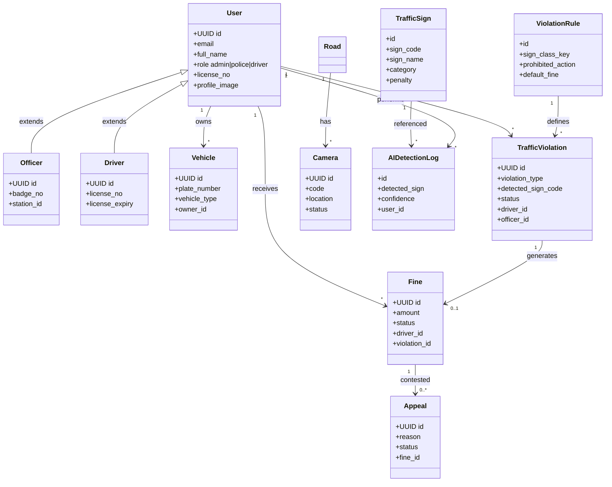

# Class Diagram — CamTraffic Core Domain

**Task:** 372 · **Ref:** P012 · **Parent:** `docs/ARCHITECTURE-DIAGRAMS.md` §6

---

## Domain classes

Core entities map to Django models in `backend/*/models.py`.

| Class | App | Key fields |
|-------|-----|------------|
| `User` | `users` | id, email, role, full_name |
| `Officer` | `users` | badge_no, station_id |
| `Driver` | `users` | license_no, license_expiry |
| `Vehicle` | `vehicles` | plate_number, vehicle_type |
| `TrafficSign` | `traffic_signs` | sign_code, category, penalty |
| `ViolationRule` | `violations` | sign_class_key, prohibited_action |
| `TrafficViolation` | `violations` | violation_type, status, evidence |
| `Fine` | `fines` | amount, status, due_date |
| `Appeal` | `appeals` | reason, status, decision |
| `Camera` | `infrastructure` | code, frame_url, status |
| `Road` | `infrastructure` | name, speed_limit |
| `AIDetectionLog` | `ai_detection` | detected_sign, confidence |
| `Notification` | `notifications` | title, message, read |
| `AuditLog` | `audit` | action, actor, timestamp |

---

## Diagram

---

## Service layer (non-persistent)

| Service | Module | Responsibility |
|---------|--------|----------------|
| `DetectionPipeline` | `ai_detection.pipeline_enforcement` | YOLO + OCR + rule match |
| `AuditService` | `core.audit_service` | Log admin mutations |
| `EmailVerification` | `authentication.email_verification` | Send/confirm emails |
