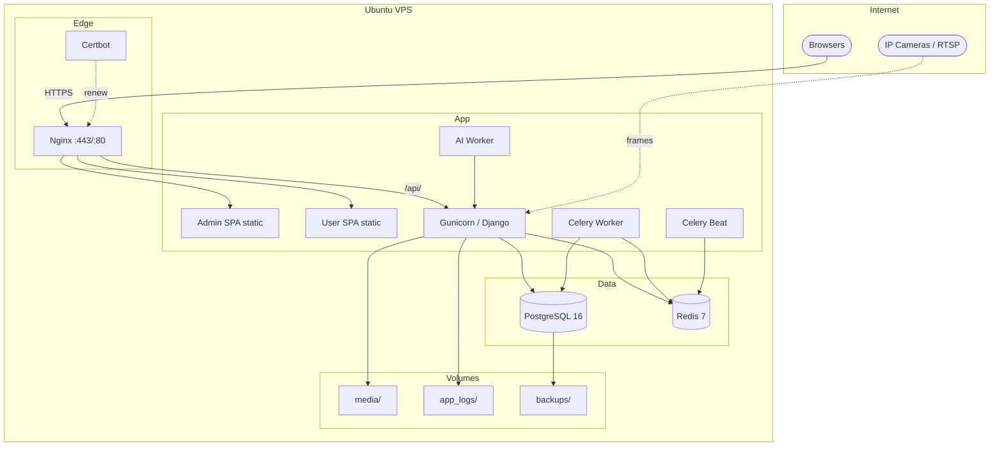

# Deployment Diagram — CamTraffic Production

**Task:** 374 · **Ref:** Phase 13 · **Parent:** `deploy/README.md`

---

## Production topology

8-service Docker Compose stack on Ubuntu VPS.



---

## Service matrix

| Service | Image / build | Port | Purpose |
|---------|---------------|------|---------|
| `nginx` | `Dockerfile.nginx.prod` | 80, 443 | Reverse proxy, static SPA, SSL |
| `backend` | `Dockerfile.backend.prod` | 8000 (internal) | Django REST + Gunicorn |
| `ai-worker` | `Dockerfile.ai-service.prod` | — | GPU/CPU inference queue |
| `celery-worker` | `Dockerfile.worker` | — | Async tasks |
| `celery-beat` | `Dockerfile.worker` | — | Scheduled jobs |
| `postgres` | `postgres:16-alpine` | 5432 (internal) | Primary database |
| `redis` | `redis:7-alpine` | 6379 (internal) | Cache + Celery broker |
| `certbot` | `certbot/certbot` | — | Let's Encrypt renewal |

---

## Nginx virtual hosts

| Host | Serves |
|------|--------|
| `admin.<domain>` | Admin portal |
| `app.<domain>` | User portal |
| `api.<domain>` | Backend API |
| `www.<domain>` | Redirect to app |

Config: `deploy/nginx/camtraffic.conf`

---

## Development vs production

| Aspect | Development | Production |
|--------|-------------|------------|
| Database | SQLite or local PG | PostgreSQL container |
| Frontend | Vite dev server :5173/:5174 | Nginx static build |
| Backend | `runserver` | Gunicorn 4 workers |
| AI | In-process local YOLO | Dedicated ai-worker |
| SSL | None | Let's Encrypt |
| Env | `backend/.env` | `deploy/env/.env.production` |

---

## Health checks

| Endpoint | Use |
|----------|-----|
| `GET /health/` | Liveness |
| `GET /health/ready/` | DB + Redis readiness |
| `GET /health/status/` | Monitoring dashboard |

---

## Deploy commands

```bash
bash deploy/scripts/provision_vps_ubuntu.sh   # first-time VPS
bash deploy/scripts/deploy_production.sh        # build + migrate + seed
npm run docker:prod:up                        # from dev machine
```

Full runbook: `deploy/README.md`  
Report: `docs/final-year-project/STAGE10-PRODUCTION-DEPLOYMENT-REPORT.md`
