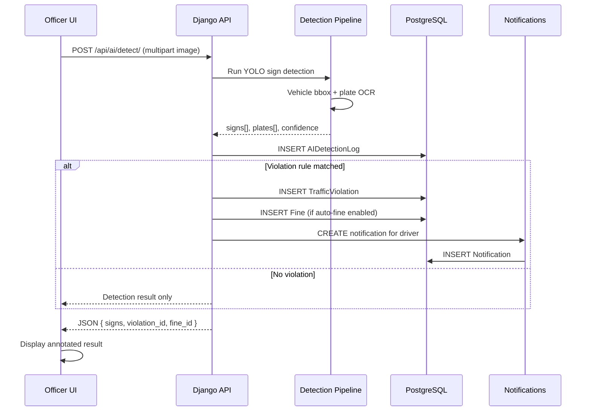
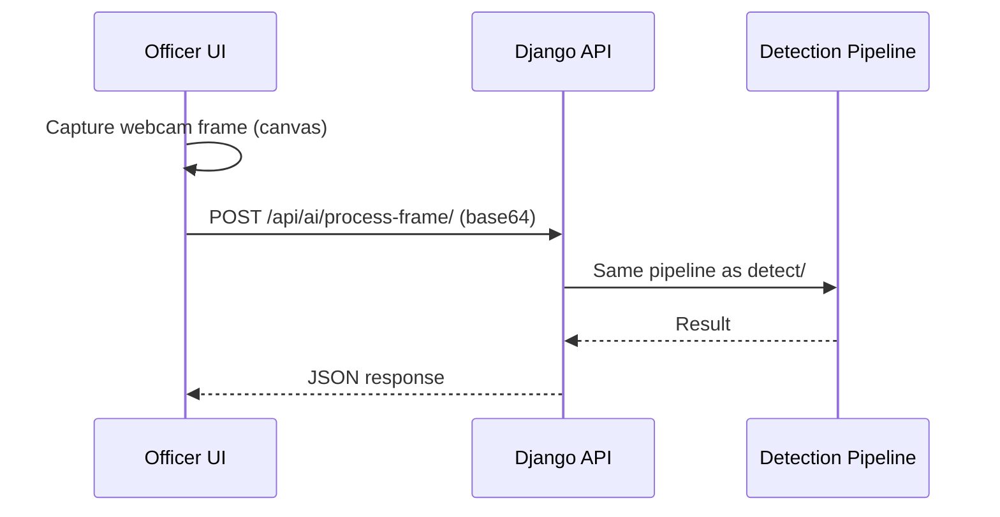

# Sequence Diagram — Violation Detection to Notification

**Task:** 373 · **Ref:** P011 · **Parent:** `docs/ARCHITECTURE-DIAGRAMS.md` §4

---

## Scenario

An officer uploads a traffic scene image. The system detects a sign, evaluates violation rules, creates records, and notifies the driver if applicable.

---

## Participants

| Participant | Component |
|-------------|-----------|
| Officer UI | `frontend-user` — AI Detection page |
| Django API | `backend/ai_detection/views.py` |
| Detection Pipeline | YOLO + OCR + rule engine |
| PostgreSQL | Violations, fines, logs |
| Notifications | `notifications` app |

---

## Sequence

---

## API endpoints involved

| Step | Endpoint |
|------|----------|
| Detection | `POST /api/ai/detect/` |
| Rule evaluation | Internal — `pipeline_enforcement.evaluate_violation()` |
| Violation create | `POST /api/violations/` (optional manual confirm) |
| Fine create | `POST /api/fines/` |
| Notification | Auto-created on fine issuance |

---

## Alternate flow — Webcam

---

## Related diagrams

- Activity flow: `docs/ARCHITECTURE-DIAGRAMS.md` §2
- Login sequence: `docs/ARCHITECTURE-DIAGRAMS.md` §5
- Appeal flow: `docs/ARCHITECTURE-DIAGRAMS.md` §3
