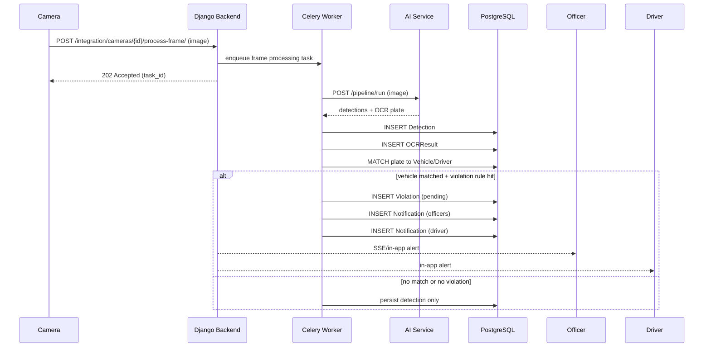

# Sequence Diagram - Violation Creation Flow (Task 227)

```mermaid
sequenceDiagram
    participant C as Camera
    participant BE as Django Backend
    participant Q as Celery Worker
    participant AI as AI Service
    participant DB as PostgreSQL
    participant O as Officer
    participant D as Driver

    C->>BE: POST /integration/cameras/{id}/process-frame/ (image)
    BE->>Q: enqueue frame processing task
    BE-->>C: 202 Accepted (task_id)

    Q->>AI: POST /pipeline/run (image)
    AI-->>Q: detections + OCR plate

    Q->>DB: INSERT Detection
    Q->>DB: INSERT OCRResult
    Q->>DB: MATCH plate to Vehicle/Driver

    alt vehicle matched + violation rule hit
      Q->>DB: INSERT Violation (pending)
      Q->>DB: INSERT Notification (officers)
      Q->>DB: INSERT Notification (driver)
      BE-->>O: SSE/in-app alert
      BE-->>D: in-app alert
    else no match or no violation
      Q->>DB: persist detection only
    end
```
