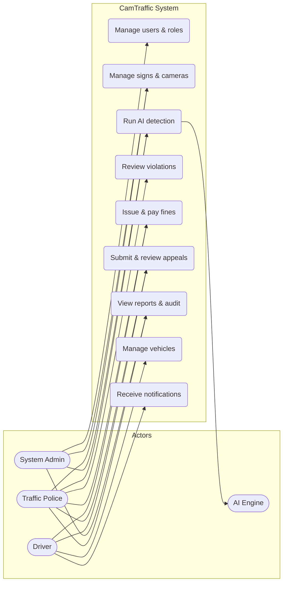

# Use Case Diagram — CamTraffic

**Task:** 371 · **Ref:** P009 · **Parent:** `docs/ARCHITECTURE-DIAGRAMS.md` §1

---

## Actors

| Actor | Description |
|-------|-------------|
| System Admin | Manages users, infrastructure, system settings |
| Traffic Police | Runs detection, reviews violations, issues fines |
| Driver | Views fines, pays, submits appeals, manages vehicles |
| AI Engine | External actor performing sign/vehicle detection |

---

## Use cases

| ID | Use case | Primary actor |
|----|----------|---------------|
| UC-01 | Manage users & roles | Admin |
| UC-02 | Manage signs & cameras | Admin, Police |
| UC-03 | Run AI detection | Admin, Police |
| UC-04 | Review violations | Police |
| UC-05 | Issue & pay fines | Police, Driver |
| UC-06 | Submit & review appeals | Driver, Police |
| UC-07 | View reports & audit | Admin, Police |
| UC-08 | Manage vehicles | Driver |
| UC-09 | Receive notifications | Driver |

---

## Diagram

---

## Actor ↔ use case matrix

| | UC-01 | UC-02 | UC-03 | UC-04 | UC-05 | UC-06 | UC-07 | UC-08 | UC-09 |
|---|:---:|:---:|:---:|:---:|:---:|:---:|:---:|:---:|:---:|
| Admin | ✓ | ✓ | ✓ | | ✓ | ✓ | ✓ | | |
| Police | | ✓ | ✓ | ✓ | ✓ | ✓ | ✓ | | |
| Driver | | | | | ✓ | ✓ | | ✓ | ✓ |
