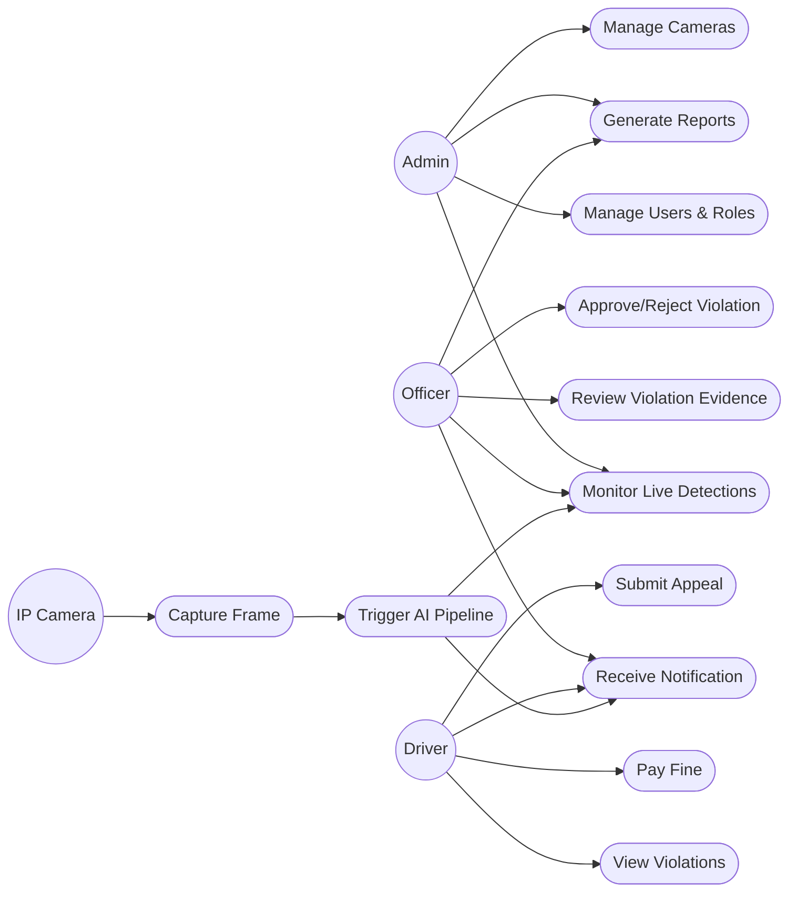

# Use Case Diagram (Task 225)

```mermaid
flowchart LR
    Admin((Admin))
    Officer((Officer))
    Driver((Driver))
    Camera((IP Camera))

    UC1([Manage Users & Roles])
    UC2([Manage Cameras])
    UC3([Monitor Live Detections])
    UC4([Review Violation Evidence])
    UC5([Approve/Reject Violation])
    UC6([Receive Notification])
    UC7([View Violations])
    UC8([Pay Fine])
    UC9([Submit Appeal])
    UC10([Generate Reports])
    UC11([Capture Frame])
    UC12([Trigger AI Pipeline])

    Admin --> UC1
    Admin --> UC2
    Admin --> UC3
    Admin --> UC10

    Officer --> UC3
    Officer --> UC4
    Officer --> UC5
    Officer --> UC10
    Officer --> UC6

    Driver --> UC6
    Driver --> UC7
    Driver --> UC8
    Driver --> UC9

    Camera --> UC11
    UC11 --> UC12
    UC12 --> UC3
    UC12 --> UC6
```
