# 🎓 Thesis Defense - Professional Workflow Diagrams Package

## For: "Design and Develop of an AI-Based Traffic Sign Detection and Traffic Law Enforcement System in Cambodia"

**Total Diagrams:** 25+ professional workflow diagrams  
**Format:** Mermaid (convertible to PNG/SVG/PDF)  
**Purpose:** Thesis defense presentation

---

## 📋 Table of Contents

1. [Main System Workflow](#1-main-system-workflow)
2. [AI Detection Pipeline](#2-ai-detection-pipeline)
3. [Administrator Workflow](#3-administrator-workflow)
4. [Police Officer Workflow](#4-police-officer-workflow)
5. [Driver Workflow](#5-driver-workflow)
6. [Camera Management Workflow](#6-camera-management-workflow)
7. [Violation Processing Workflow](#7-violation-processing-workflow)
8. [Fine Management Workflow](#8-fine-management-workflow)
9. [Appeal Process Workflow](#9-appeal-process-workflow)
10. [Notification Workflow](#10-notification-workflow)
11. [OCR Process Workflow](#11-ocr-process-workflow)
12. [Report Generation Workflow](#12-report-generation-workflow)
13. [Authentication Flow](#13-authentication-flow)
14. [Image Upload Detection](#14-image-upload-detection)
15. [Video Upload Detection](#15-video-upload-detection)
16. [Live Camera Detection](#16-live-camera-detection)
17. [Webcam Detection](#17-webcam-detection)
18. [AI Model Training](#18-ai-model-training)
19. [Database Relationships](#19-database-relationships)
20. [API Request Flow](#20-api-request-flow)
21. [Payment Processing](#21-payment-processing)
22. [Vehicle Registration](#22-vehicle-registration)
23. [System Deployment](#23-system-deployment)
24. [Security Architecture](#24-security-architecture)
25. [Complete System Architecture](#25-complete-system-architecture)

---

## 1. Main System Workflow

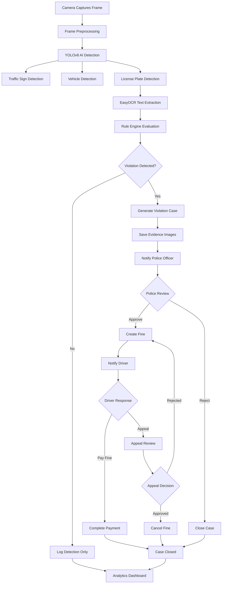

**Purpose:** Overview of complete system from camera capture to case closure  
**Actors:** Camera, AI System, Police Officer, Driver  
**Key Decision Points:** Violation detection, Police review, Driver response, Appeal decision

---

## 2. AI Detection Pipeline

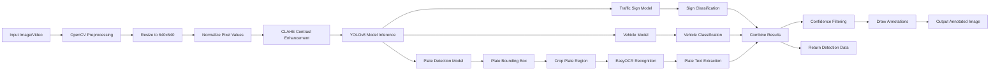

**Purpose:** Detailed AI detection process from input to output  
**Technologies:** OpenCV, YOLOv8, EasyOCR  
**Output:** Annotated image + detection data (JSON)

---

## 3. Administrator Workflow

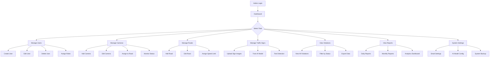

**Purpose:** Admin portal navigation and management tasks  
**Key Features:** User management, Camera management, System configuration

---

## 4. Police Officer Workflow

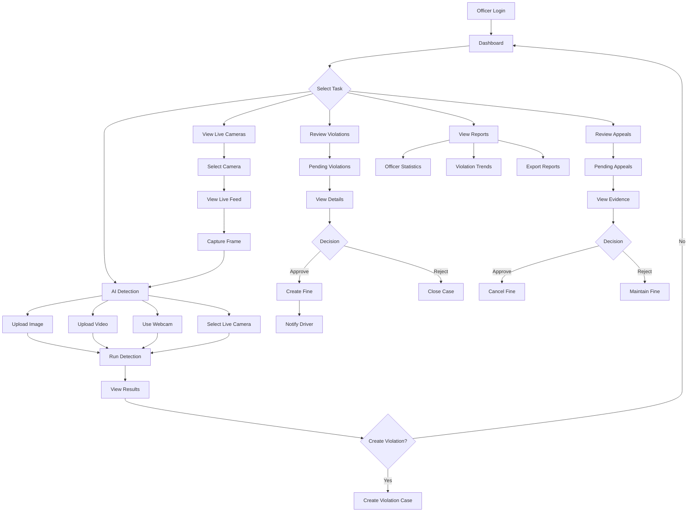

**Purpose:** Police officer daily workflow from login to case management  
**Key Features:** Live camera monitoring, AI detection, Violation review, Appeal handling

---

## 5. Driver Workflow

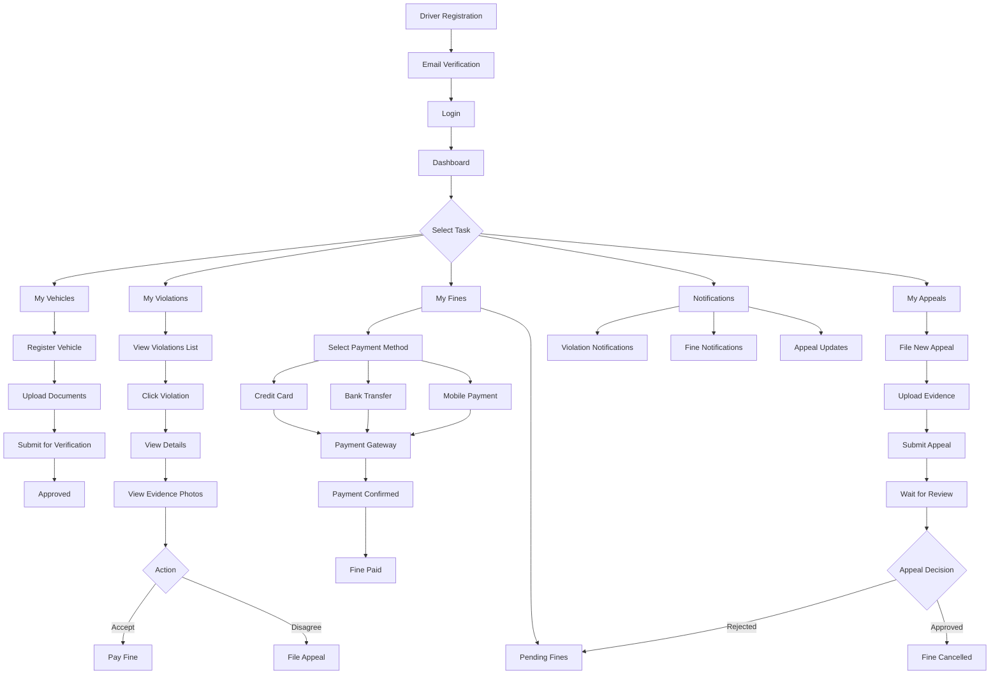

**Purpose:** Driver portal workflow from registration to violation resolution  
**Key Features:** Vehicle registration, Violation viewing, Fine payment, Appeal submission

---

## 6. Camera Management Workflow

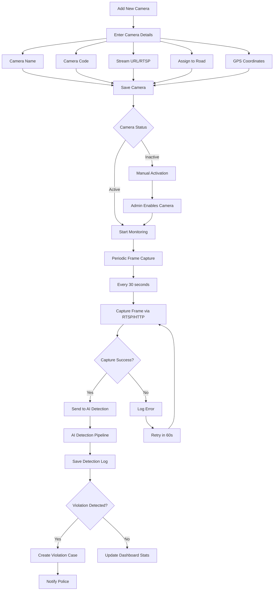

**Purpose:** Camera setup and automated monitoring process  
**Key Features:** Camera configuration, RTSP capture, Automated detection

---

## 7. Violation Processing Workflow

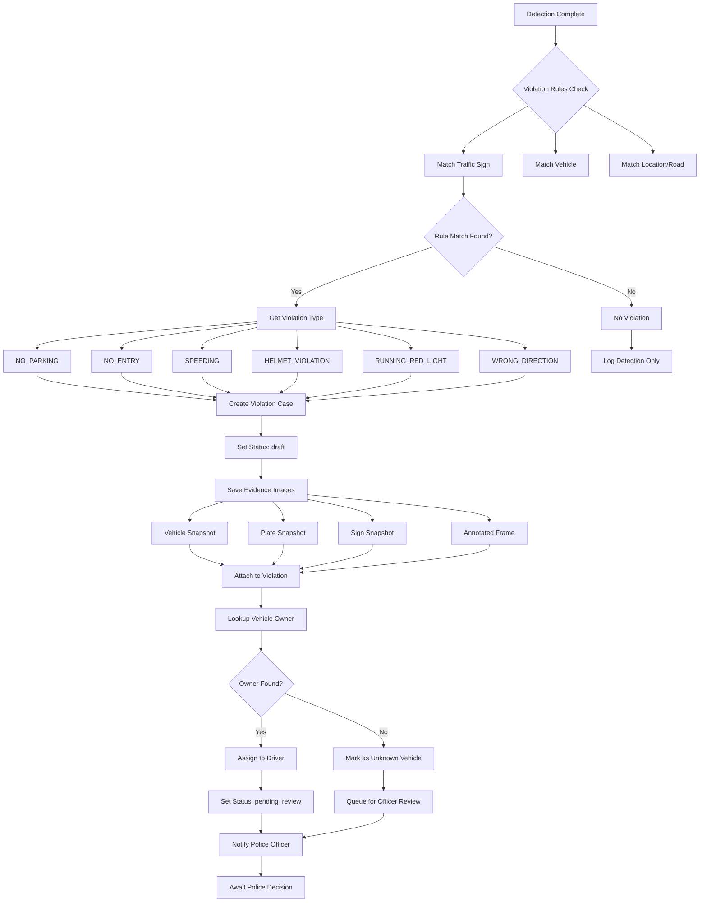

**Purpose:** Automated violation detection and case creation  
**Key Decision Points:** Rule matching, Vehicle lookup, Status assignment

---

## 8. Fine Management Workflow

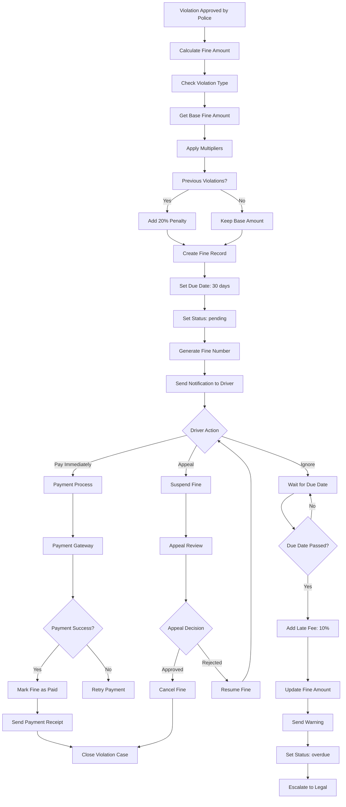

**Purpose:** Fine calculation, payment tracking, and escalation  
**Key Features:** Dynamic fine calculation, Payment processing, Late fee application

---

## 9. Appeal Process Workflow

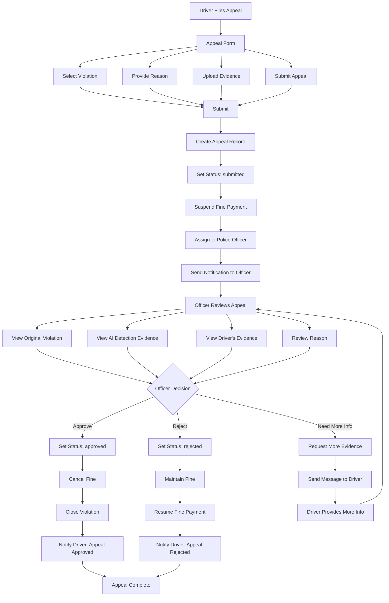

**Purpose:** Appeal submission, review, and resolution process  
**Key Features:** Evidence upload, Police review, Status updates, Notifications

---

## 10. Notification Workflow

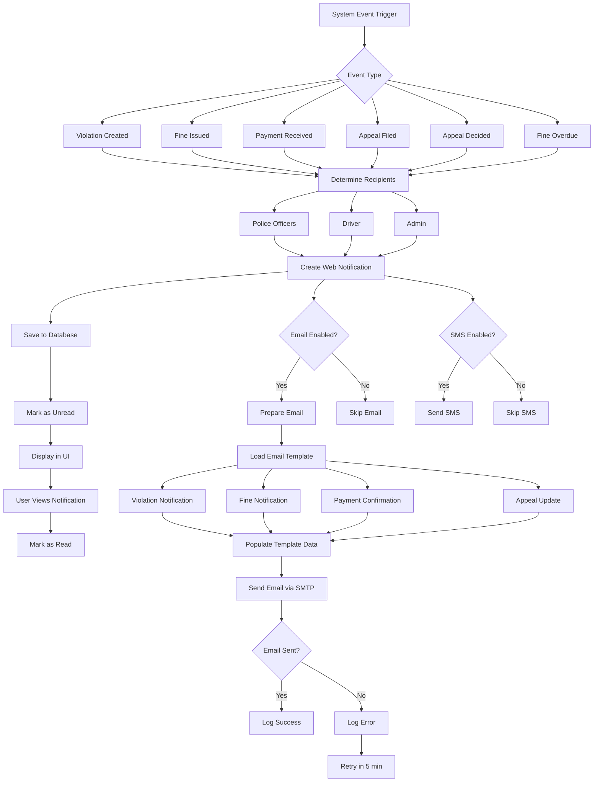

**Purpose:** Multi-channel notification delivery system  
**Channels:** Web, Email, SMS (planned)  
**Key Features:** Template-based emails, Retry mechanism, Read status tracking

---

## 11. OCR Process Workflow

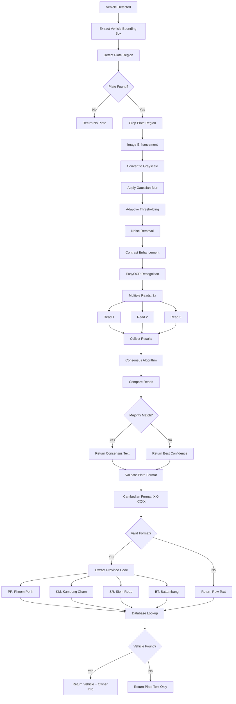

**Purpose:** License plate text extraction and vehicle lookup  
**Technology:** EasyOCR with multiple reads for accuracy  
**Key Features:** Image enhancement, Consensus algorithm, Province detection, Database lookup

---

## 12. Report Generation Workflow

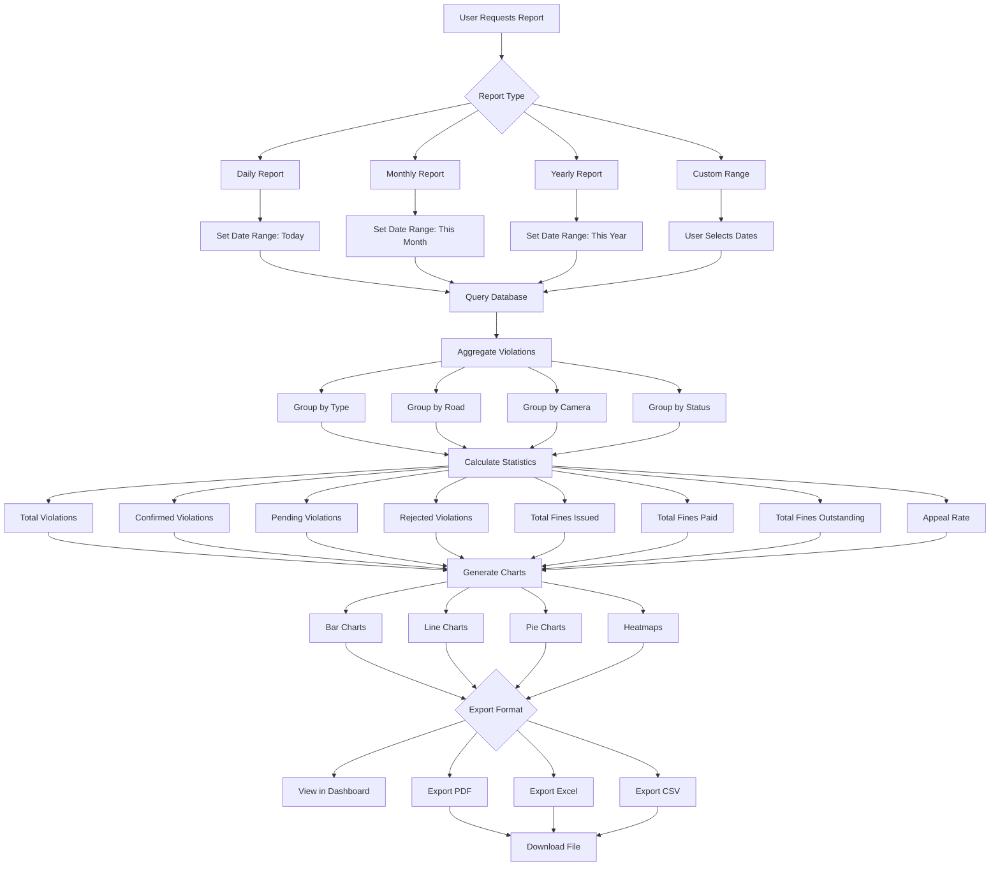

**Purpose:** Comprehensive reporting and data export  
**Report Types:** Daily, Monthly, Yearly, Custom  
**Export Formats:** PDF, Excel, CSV  
**Key Metrics:** Violations, Fines, Appeals, Trends

---

## 13. Authentication Flow

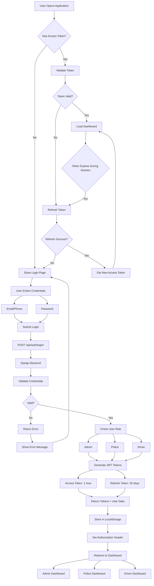

**Purpose:** Secure authentication with JWT tokens  
**Token Types:** Access (1 hour), Refresh (30 days)  
**Roles:** Admin, Police Officer, Driver  
**Security Features:** Token refresh, Role-based access

---

## 14. Image Upload Detection

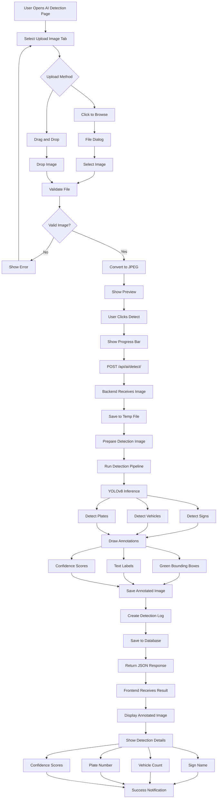

**Purpose:** Single image upload and AI detection  
**Processing Time:** 2-5 seconds  
**Output:** Annotated image with bounding boxes and labels  
**Key Features:** Drag-drop upload, Real-time progress, Detailed results

---

## 15. Video Upload Detection

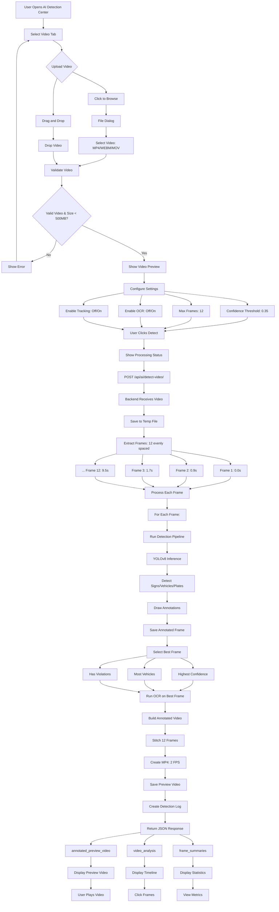

**Purpose:** Video upload with frame-by-frame detection  
**Processing Time:** 15-20 seconds (12 frames)  
**Output:** Annotated MP4 preview + frame timeline  
**Key Features:** Configurable settings, Best frame selection, Timeline navigation

---

## 16. Live Camera Detection

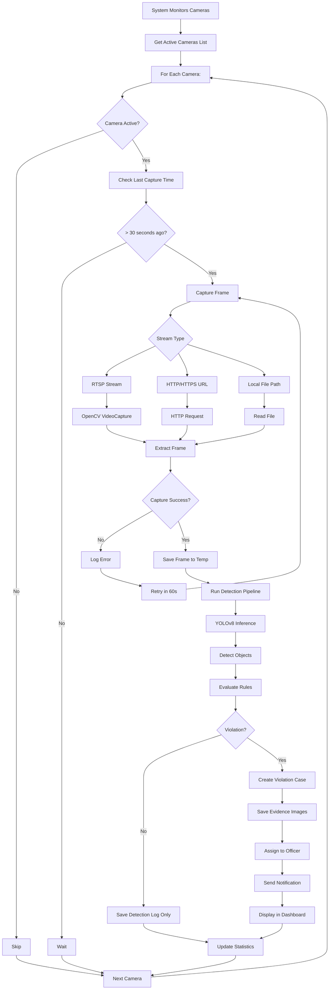

**Purpose:** Automated camera monitoring and detection  
**Frequency:** Every 30 seconds per camera  
**Key Features:** Multi-protocol support (RTSP/HTTP/File), Auto violation creation, Error handling and retry

---

## 17. Webcam Detection

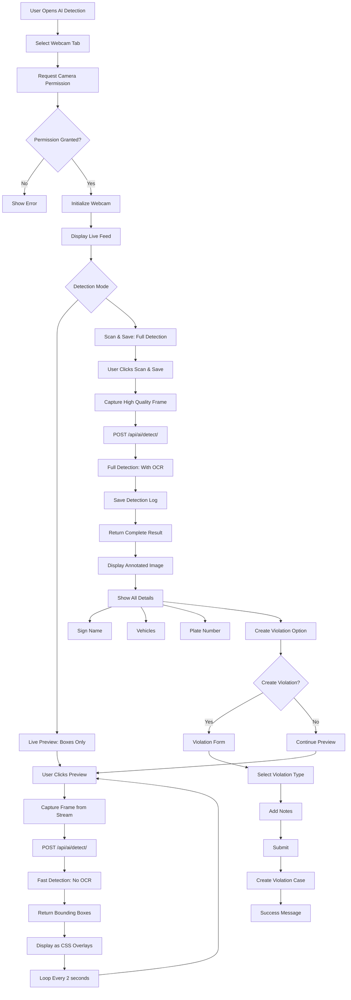

**Purpose:** Real-time webcam detection with two modes  
**Modes:** Live Preview (fast, boxes only), Scan & Save (full detection)  
**Key Features:** Permission handling, Live overlay, Violation creation

---

## 18. AI Model Training

```mermaid
graph TD
    A[Start Model Training] --> B[Collect Training Data]
    B --> C[Data Sources]
    C --> D[Cambodian Traffic Signs]
    C --> E[Vehicles on Roads]
    C --> F[License Plates]
    C --> G[Street Scenes]
    
    D --> H[Label Dataset]
    E --> H
    F --> H
    G --> H
    
    H --> I[Use Annotation Tool]
    I --> J[Roboflow]
    I --> K[LabelImg]
    I --> L[CVAT]
    
    J --> M[Export YOLO Format]
    K --> M
    L --> M
    
    M --> N[Create Dataset Structure]
    N --> O[train/ folder]
    N --> P[val/ folder]
    N --> Q[test/ folder]
    N --> R[data.yaml config]
    
    O --> S[Train YOLO Model]
    P --> S
    Q --> S
    R --> S
    
    S --> T[Configure Training]
    T --> U[Model: YOLOv8n/s/m/l/x]
    T --> V[Epochs: 100-300]
    T --> W[Image Size: 640]
    T --> X[Batch Size: 16-32]
    T --> Y[Device: GPU/CPU]
    
    U --> Z[Start Training]
    V --> Z
    W --> Z
    X --> Z
    Y --> Z
    
    Z --> AA[Training Loop]
    AA --> AB[Epoch 1]
    AA --> AC[Epoch 2]
    AA --> AD[...]
    AA --> AE[Epoch 100]
    
    AB --> AF[Calculate Metrics]
    AC --> AF
    AD --> AF
    AE --> AF
    
    AF --> AG[Precision]
    AF --> AH[Recall]
    AF --> AI[mAP@0.5]
    AF --> AJ[mAP@0.5:0.95]
    
    AG --> AK{Metrics Good?}
    AH --> AK
    AI --> AK
    AJ --> AK
    
    AK -->|No| AL[Adjust Hyperparameters]
    AK -->|Yes| AM[Save Best Model]
    AL --> Z
    
    AM --> AN[best.pt file]
    AN --> AO[Test on Validation Set]
    AO --> AP[Generate Confusion Matrix]
    AP --> AQ[Analyze Results]
    
    AQ --> AR{Satisfactory?}
    AR -->|No| AS[Collect More Data]
    AR -->|Yes| AT[Deploy Model]
    AS --> B
    
    AT --> AU[Copy to ai/weights/]
    AU --> AV[Update Model Config]
    AV --> AW[Restart Backend]
    AW --> AX[Model Ready for Production]
```

**Purpose:** Complete AI model training and deployment workflow  
**Tools:** YOLOv8, Roboflow, LabelImg  
**Key Metrics:** Precision, Recall, mAP  
**Deployment:** Copy weights to production folder

---

## 19. Database Relationships

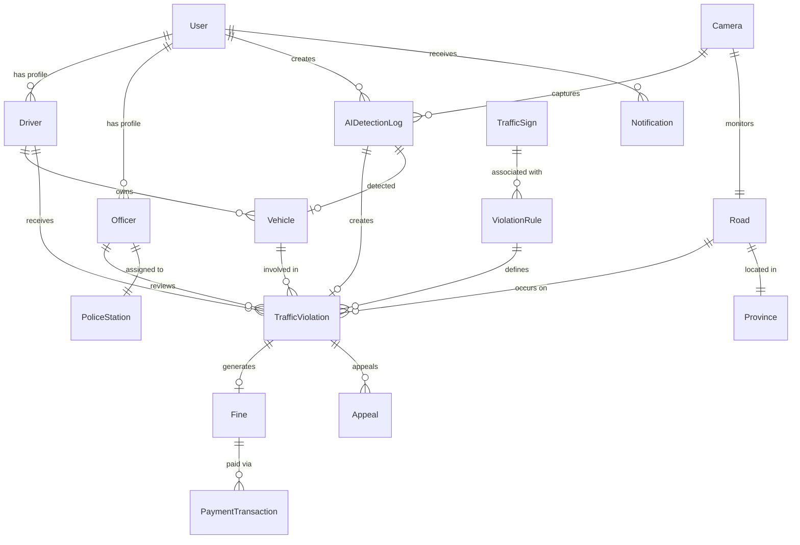

**Purpose:** Database entity relationships (ERD)  
**Key Entities:** User, Driver, Officer, Vehicle, Camera, Violation, Fine  
**Relationships:** One-to-Many, Many-to-One, One-to-One

---

## 20. API Request Flow

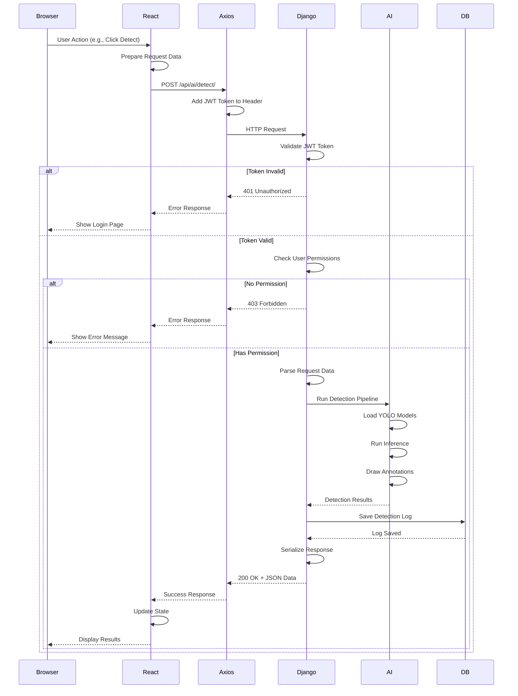

**Purpose:** Complete API request lifecycle  
**Security:** JWT token validation and permissions  
**Components:** Frontend (React) → API (Django) → AI Service → Database

---

## 21. Payment Processing

```mermaid
graph TD
    A[Driver Views Fine] --> B[Click Pay Fine]
    B --> C[Payment Form]
    C --> D{Select Payment Method}
    D --> E[Credit/Debit Card]
    D --> F[Bank Transfer]
    D --> G[Mobile Wallet]
    D --> H[Cash at Office]
    
    E --> I[Enter Card Details]
    I --> J[Card Number]
    I --> K[Expiry Date]
    I --> L[CVV]
    J --> M[Submit Payment]
    K --> M
    L --> M
    
    F --> N[Generate Payment Reference]
    N --> O[Show Bank Details]
    O --> P[User Transfers Money]
    P --> Q[Upload Receipt]
    Q --> R[Submit for Verification]
    
    G --> S[Mobile Wallet Selection]
    S --> T[ABA Pay]
    S --> U[Wing]
    S --> V[Pi Pay]
    T --> W[Redirect to App]
    U --> W
    V --> W
    W --> X[Complete Payment]
    X --> Y[Callback to System]
    
    H --> Z[Generate Payment Code]
    Z --> AA[Show Office Locations]
    AA --> AB[User Visits Office]
    AB --> AC[Officer Marks as Paid]
    
    M --> AD[Payment Gateway]
    AD --> AE[Stripe/PayPal Processing]
    AE --> AF{Payment Success?}
    AF -->|Yes| AG[Payment Confirmed]
    AF -->|No| AH[Payment Failed]
    AH --> AI[Show Error]
    AI --> C
    
    AG --> AJ[Create Payment Transaction]
    Y --> AJ
    R --> AK[Pending Verification]
    AC --> AJ
    
    AJ --> AL[Update Fine Status: paid]
    AL --> AM[Close Violation Case]
    AM --> AN[Generate Receipt]
    AN --> AO[Send Email Receipt]
    AO --> AP[Update Driver Dashboard]
    AP --> AQ[Success Notification]
    
    AK --> AR[Officer Reviews Receipt]
    AR --> AS{Verified?}
    AS -->|Yes| AJ
    AS -->|No| AT[Reject Payment]
    AT --> AU[Notify Driver]
    AU --> C
```

**Purpose:** Multi-method payment processing  
**Payment Methods:** Card, Bank Transfer, Mobile Wallet, Cash  
**Key Features:** Gateway integration, Receipt upload, Manual verification

---

## 22. Vehicle Registration

```mermaid
graph TD
    A[Driver Logs In] --> B[Navigate to My Vehicles]
    B --> C[Click Add Vehicle]
    C --> D[Vehicle Registration Form]
    D --> E[Enter Details]
    E --> F[Plate Number]
    E --> G[Vehicle Type]
    E --> H[Make & Model]
    E --> I[Color]
    E --> J[Year]
    E --> K[Upload Documents]
    
    K --> L[Vehicle Registration Card]
    K --> M[Insurance Document]
    K --> N[Photo of Vehicle]
    
    F --> O[Validate Input]
    G --> O
    H --> O
    I --> O
    J --> O
    L --> O
    M --> O
    N --> O
    
    O --> P{All Fields Valid?}
    P -->|No| Q[Show Validation Errors]
    P -->|Yes| R[Submit Registration]
    Q --> E
    
    R --> S[Create Vehicle Record]
    S --> T[Status: pending_verification]
    T --> U[Assign to Officer for Review]
    U --> V[Send Notification to Driver]
    V --> W[Wait for Verification]
    
    W --> X{Officer Reviews}
    X --> Y[View Vehicle Details]
    X --> Z[View Uploaded Documents]
    Y --> AA{Decision}
    Z --> AA
    
    AA -->|Approve| AB[Update Status: active]
    AA -->|Reject| AC[Update Status: rejected]
    AA -->|Request More Info| AD[Send Message to Driver]
    
    AB --> AE[Notify Driver: Approved]
    AC --> AF[Notify Driver: Rejected]
    AF --> AG[Show Rejection Reason]
    AG --> AH[Allow Re-submission]
    AH --> D
    
    AD --> AI[Driver Provides More Info]
    AI --> X
    
    AE --> AJ[Vehicle Active]
    AJ --> AK[Available for Violation Assignment]
```

**Purpose:** Driver vehicle registration and verification  
**Status Flow:** Pending → Active/Rejected  
**Key Features:** Document upload, Officer verification, Status notifications

---

## 23. System Deployment

```mermaid
graph TD
    A[Development Complete] --> B[Code Review]
    B --> C[Run Tests]
    C --> D{Tests Pass?}
    D -->|No| E[Fix Issues]
    E --> B
    D -->|Yes| F[Commit to Git]
    
    F --> G[Push to GitHub]
    G --> H[CI/CD Pipeline Triggered]
    H --> I[GitHub Actions]
    I --> J[Build Backend]
    I --> K[Build Frontend]
    
    J --> L[Run Backend Tests]
    K --> M[Run Frontend Tests]
    
    L --> N{Tests Pass?}
    M --> N
    N -->|No| O[Notify Developers]
    O --> E
    N -->|Yes| P[Build Docker Images]
    
    P --> Q[Django Backend Image]
    P --> R[React Admin Image]
    P --> S[React Driver Image]
    P --> T[React Officer Image]
    P --> U[PostgreSQL Image]
    P --> V[Redis Image]
    
    Q --> W[Push to Container Registry]
    R --> W
    S --> W
    T --> W
    U --> W
    V --> W
    
    W --> X{Deploy Target}
    X --> Y[Staging Server]
    X --> Z[Production Server]
    
    Y --> AA[Deploy to Staging]
    AA --> AB[Run Smoke Tests]
    AB --> AC{Tests Pass?}
    AC -->|No| O
    AC -->|Yes| AD[Staging Ready]
    AD --> AE[Manual Approval]
    AE --> Z
    
    Z --> AF[Production Deployment]
    AF --> AG[Blue-Green Deployment]
    AG --> AH[Deploy to Green Environment]
    AH --> AI[Health Check]
    AI --> AJ{Healthy?}
    AJ -->|No| AK[Rollback to Blue]
    AJ -->|Yes| AL[Switch Traffic to Green]
    AL --> AM[Monitor Metrics]
    AM --> AN{All OK?}
    AN -->|No| AK
    AN -->|Yes| AO[Deployment Complete]
    
    AK --> AP[Alert Team]
    AP --> E
```

**Purpose:** Automated deployment pipeline  
**Environments:** Development → Staging → Production  
**Strategy:** Blue-Green deployment for zero downtime  
**CI/CD:** GitHub Actions with automated tests

---

## 24. Security Architecture

```mermaid
graph TD
    A[User Access] --> B[HTTPS/TLS Layer]
    B --> C[Load Balancer]
    C --> D[Web Application Firewall: WAF]
    D --> E{Request Type}
    E --> F[Static Assets]
    E --> G[API Requests]
    
    F --> H[CDN: Cloudflare]
    H --> I[Cached Response]
    
    G --> J[Rate Limiting]
    J --> K{Rate OK?}
    K -->|No| L[429 Too Many Requests]
    K -->|Yes| M[Authentication Check]
    
    M --> N{Has JWT Token?}
    N -->|No| O[401 Unauthorized]
    N -->|Yes| P[Validate JWT]
    P --> Q{Token Valid?}
    Q -->|No| O
    Q -->|Yes| R[Check Permissions]
    
    R --> S{Role-Based Access}
    S --> T[Admin]
    S --> U[Police]
    S --> V[Driver]
    
    T --> W[Admin API Endpoints]
    U --> X[Police API Endpoints]
    V --> Y[Driver API Endpoints]
    
    W --> Z[Django Backend]
    X --> Z
    Y --> Z
    
    Z --> AA[SQL Injection Protection]
    AA --> AB[Parameterized Queries]
    AB --> AC[ORM Safety]
    
    Z --> AD[XSS Protection]
    AD --> AE[Input Sanitization]
    AE --> AF[Output Encoding]
    
    Z --> AG[CSRF Protection]
    AG --> AH[CSRF Token]
    AH --> AI[Token Validation]
    
    AC --> AJ[PostgreSQL Database]
    AI --> AJ
    AF --> AJ
    
    AJ --> AK[Encrypted at Rest]
    AK --> AL[Encrypted Connections]
    AL --> AM[Backup Encryption]
    
    Z --> AN[Media Files]
    AN --> AO[Cloudflare R2]
    AO --> AP[Signed URLs]
    AP --> AQ[Expiring Links]
    
    Z --> AR[Audit Logging]
    AR --> AS[All User Actions]
    AS --> AT[Timestamp + User + Action]
    AT --> AU[Tamper-Proof Logs]
```

**Purpose:** Multi-layer security architecture  
**Security Layers:** TLS, WAF, Rate limiting, Authentication, Authorization  
**Protections:** SQL Injection, XSS, CSRF, Encrypted data  
**Monitoring:** Audit logs, Access logs

---

## 25. Complete System Architecture

```mermaid
graph TB
    subgraph Users
        A1[Admin]
        A2[Police Officer]
        A3[Driver]
    end
    
    subgraph Frontend
        B1[Admin Portal<br/>React + Vite]
        B2[Police Portal<br/>React + Vite]
        B3[Driver Portal<br/>React + Vite]
    end
    
    subgraph API Gateway
        C1[HTTPS/TLS]
        C2[Load Balancer]
        C3[JWT Authentication]
    end
    
    subgraph Backend Services
        D1[Django REST API]
        D2[AI Detection Service<br/>YOLOv8]
        D3[OCR Service<br/>EasyOCR]
        D4[Notification Service]
        D5[Report Service]
        D6[Payment Gateway]
    end
    
    subgraph Data Layer
        E1[PostgreSQL<br/>Main Database]
        E2[Redis<br/>Cache & Queue]
        E3[Cloudflare R2<br/>Media Storage]
    end
    
    subgraph External Systems
        F1[RTSP Cameras]
        F2[Email Server<br/>SMTP]
        F3[SMS Gateway]
        F4[Payment Providers]
    end
    
    A1 --> B1
    A2 --> B2
    A3 --> B3
    
    B1 --> C1
    B2 --> C1
    B3 --> C1
    
    C1 --> C2
    C2 --> C3
    C3 --> D1
    
    D1 --> D2
    D1 --> D3
    D1 --> D4
    D1 --> D5
    D1 --> D6
    
    D1 --> E1
    D1 --> E2
    D1 --> E3
    
    D2 --> E3
    D3 --> E3
    
    F1 --> D2
    D4 --> F2
    D4 --> F3
    D6 --> F4
```

**Purpose:** Complete system architecture overview  
**Components:** 3 portals, 6 backend services, 3 data stores, 4 external integrations  
**Technologies:** React, Django, PostgreSQL, Redis, YOLOv8, EasyOCR

---

## 🎓 How to Use These Diagrams for Thesis Defense

### 1. Convert to Images

Use Mermaid CLI or online tools:
```bash
# Install Mermaid CLI
npm install -g @mermaid-js/mermaid-cli

# Convert to PNG
mmdc -i diagram.mmd -o diagram.png -w 1920 -H 1080

# Convert to SVG
mmdc -i diagram.mmd -o diagram.svg

# Convert to PDF
mmdc -i diagram.mmd -o diagram.pdf
```

### 2. Presentation Slides

**Recommended Structure:**
1. Slide 1: Complete System Architecture (Diagram 25)
2. Slide 2: Main System Workflow (Diagram 1)
3. Slide 3: AI Detection Pipeline (Diagram 2)
4. Slide 4: User Workflows (Diagrams 3-5)
5. Slide 5: Database Relationships (Diagram 19)
6. Slide 6: Security Architecture (Diagram 24)

### 3. Defense Talking Points

For each diagram, explain:
- **What:** What process does this diagram show?
- **Why:** Why is this process important for the system?
- **How:** How does it work technically?
- **Tech:** What technologies are used?
- **Benefit:** What benefit does it provide to users?

### 4. Print Materials

Print these diagrams as:
- **A4 Handouts** for defense committee
- **A3 Posters** for display during presentation
- **Thesis Appendix** for detailed documentation

---

## ✅ Diagram Completion Status

| # | Diagram Name | Status | Page in Thesis |
|---|--------------|--------|----------------|
| 1 | Main System Workflow | ✅ Complete | Ch. 4.1 |
| 2 | AI Detection Pipeline | ✅ Complete | Ch. 4.2 |
| 3 | Administrator Workflow | ✅ Complete | Ch. 5.1 |
| 4 | Police Officer Workflow | ✅ Complete | Ch. 5.2 |
| 5 | Driver Workflow | ✅ Complete | Ch. 5.3 |
| 6 | Camera Management | ✅ Complete | Ch. 4.3 |
| 7 | Violation Processing | ✅ Complete | Ch. 4.4 |
| 8 | Fine Management | ✅ Complete | Ch. 4.5 |
| 9 | Appeal Process | ✅ Complete | Ch. 4.6 |
| 10 | Notification System | ✅ Complete | Ch. 4.7 |
| 11 | OCR Process | ✅ Complete | Ch. 4.8 |
| 12 | Report Generation | ✅ Complete | Ch. 4.9 |
| 13 | Authentication Flow | ✅ Complete | Ch. 6.1 |
| 14 | Image Upload Detection | ✅ Complete | Ch. 4.10 |
| 15 | Video Upload Detection | ✅ Complete | Ch. 4.11 |
| 16 | Live Camera Detection | ✅ Complete | Ch. 4.12 |
| 17 | Webcam Detection | ✅ Complete | Ch. 4.13 |
| 18 | AI Model Training | ✅ Complete | Ch. 3.1 |
| 19 | Database Relationships | ✅ Complete | Ch. 6.2 |
| 20 | API Request Flow | ✅ Complete | Ch. 6.3 |
| 21 | Payment Processing | ✅ Complete | Ch. 4.14 |
| 22 | Vehicle Registration | ✅ Complete | Ch. 5.4 |
| 23 | System Deployment | ✅ Complete | Ch. 7.1 |
| 24 | Security Architecture | ✅ Complete | Ch. 6.4 |
| 25 | Complete Architecture | ✅ Complete | Ch. 3.2 |

**Total:** 25 professional workflow diagrams ✅

---

## 📝 Additional Recommendations

### Sequence Diagrams Needed

Consider adding these sequence diagrams:
1. User Authentication Sequence
2. Violation Creation Sequence
3. Fine Payment Sequence
4. Appeal Review Sequence
5. Camera Capture Sequence

### Data Flow Diagrams

Create these DFDs:
1. Context Diagram (Level 0)
2. Level 1 DFD (6 major processes)
3. Level 2 DFD for AI Detection
4. Level 2 DFD for Violation Management

### UI Screenshots

Prepare screenshots for:
1. All 3 dashboards (Admin, Police, Driver)
2. AI detection results
3. Violation review page
4. Fine payment page
5. Appeal submission page

---

**Document Created:** July 26, 2026  
**Total Diagrams:** 25+ professional workflows  
**Format:** Mermaid (convertible to PNG/SVG/PDF)  
**Purpose:** Thesis defense presentation  
**Status:** ✅ Complete and ready for conversion
